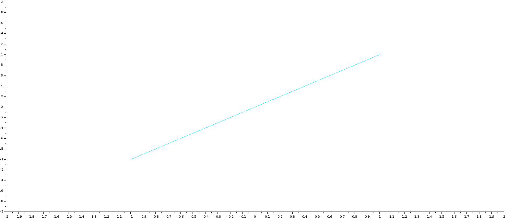
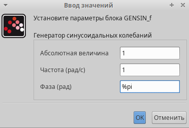
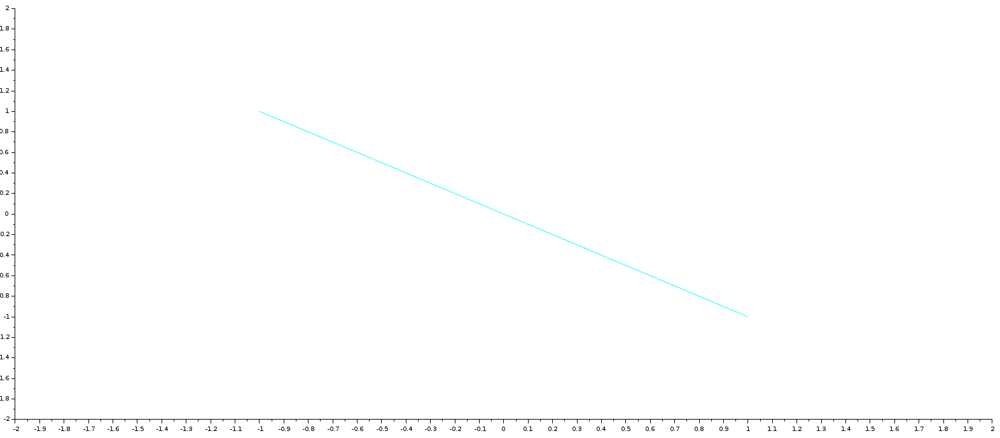
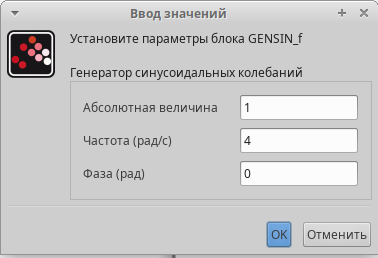
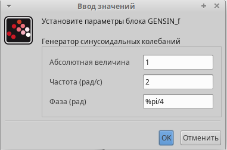
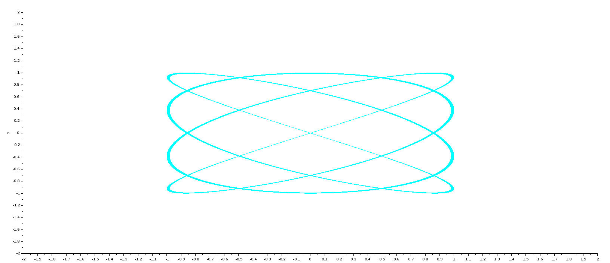
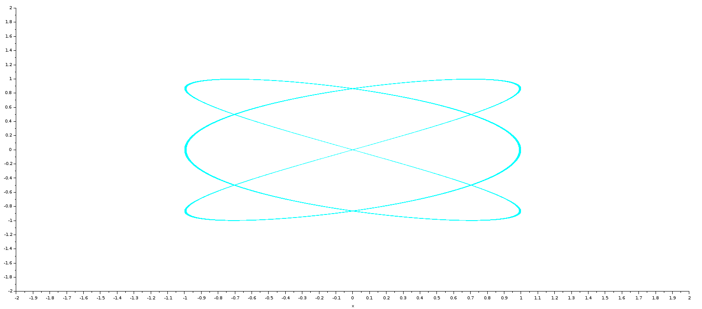

---
## Front matter
lang: ru-RU
title: Фигуры Лиссажу
subtitle: Моделирование в xcos
author:
  - Абу Сувейлим Мухаммед Мунивочи
institute:
  - Российский университет дружбы народов, Москва, Россия
date: 10 мая 2024

## i18n babel
babel-lang: russian
babel-otherlangs: english
mainfont: Arial
##monofont: Courier New
fontsize: 8pt

## Formatting pdf
toc: false
toc-title: Содержание
slide_level: 2
aspectratio: 169
section-titles: true
theme: metropolis
header-includes:
 - \metroset{progressbar=frametitle,sectionpage=progressbar,numbering=fraction}
 - '\makeatletter'
 - '\beamer@ignorenonframefalse'
 - '\makeatother'
---

# Информация

## Докладчик

::::::::::::::: {.columns align=center}
::: {.column width="70%"}

  * Абу Сувейлим Мухаммед Мунифович
  * студент, НКНбд-01-21
  * Российский университет дружбы народов
  * [1032215135@pfur.ru](mailto:1032215135@pfur.ru)
:::
::: {.column width="30%"}

:::
::::::::::::::

# Вводная часть

## Цели 

Цели: 
   - Приобретение навыков математического моделирования в xcos

## Задачи

Построить с помощью xcos фигуры Лиссажу с различными значениями параметров.

## Материалы и методы

- Xcos (через Scilab)

- Королькова, А. В. Моделирование информационных процессов : учебное пособие / А. В. Королькова, Д. С. Кулябов. - М. : РУДН, 2014. -- 191 с. : ил. [1]

- И. Б.М. ЛИССАЖУ ФИГУРЫ [Электронный ресурс]. Большая российская
энциклопедия, 2017. URL: https://old.bigenc.ru/physics/text/2175554. [2]

# Теоретическое введение

## Описание моделируемой сети:

Лиссажу фигуры, замк­ну­тые пло­ские кри­вые, опи­сы­вае­мые точ­кой, дви­же­ние ко­то­рой яв­ля­ет­ся су­пер­по­зи­ци­ей двух вза­им­но пер­пен­ди­ку­ляр­ных ко­ле­ба­ний с от­но­ше­ни­ем час­тот, рав­ным ра­цио­наль­но­му чис­лу. Впер­вые бы­ли под­роб­но изу­че­ны франц. ма­те­ма­ти­ком Ж. А. Лис­са­жу в 1857–58. Л. ф. опи­сы­ва­ют­ся сис­те­мой па­ра­мет­рических урав­не­ний (па­ра­метр – вре­мя t)

$x = A_{1}\cos{\omega_{1}t+\phi}$, $y = A_{2}\cos{\omega_{2}t+\phi}$

[2]

# Выполнение работы

## Scilab 

   1. Во-первых, я открыл scilab.
   2. Далее, я открыл, через инструменты, Визуальное моделирование Xcos.

      {#fig:001 width = 50%}

## Xcos

   3. В Xcos я добавыл регистратор CSCOPXY, два источника сигналов и воздействия GENSEN_f и CLOCK_c. Ниже на рис. 1 показано как это выглядит:

      {#fig:002 width=50%}

## Xcos
  
   4. Получнный график это прямая:

      {#fig:003 width=50%}

## Xcos
  
   5. Если изменить параметры второго источника GENSEN_f так:
   
   {#fig:004 width=50%}

## Xcos

   6. Получаем следующей график:

      {#fig:005 width=70%}

## Xcos

   7. Давайте создадим эллипс/овал используя следующие параметры второго источника GENSEN_f:

      {#fig:006 width=50%}

## Xcos

   8. Получаем следующей график:

      {#fig:007 width=70%}

## Xcos

   9. Если менять параметры двух источников GENSEN_f таким способом:

      {#fig:008 width=50%}

## Xcos
   
   {#fig:009 width=50%}

## Xcos

   10. Получаем следующей график:
      
   {#fig:010 width=70%}

## Xcos

   11. A если менять параметры двух источников GENSEN_f таким способом:

   {#fig:011 width=50%}

## Xcos
   
   {#fig:012 width=50%}

## Xcos

   12. Получаем следующей график:

   {#fig:013 width=70%}

## Вывод

- Изучали как работать с Xcos. [1]
