# Цель работы

- Приобретение навыков математического моделирования в xcos.

# Задание

Построить с помощью xcos фигуры Лиссажу с различными значениями параметров.

# Теоретическое введение

Лиссажу фигуры, замк­ну­тые пло­ские кри­вые, опи­сы­вае­мые точ­кой, дви­же­ние ко­то­рой яв­ля­ет­ся су­пер­по­зи­ци­ей двух вза­им­но пер­пен­ди­ку­ляр­ных ко­ле­ба­ний с от­но­ше­ни­ем час­тот, рав­ным ра­цио­наль­но­му чис­лу. Впер­вые бы­ли под­роб­но изу­че­ны франц. ма­те­ма­ти­ком Ж. А. Лис­са­жу в 1857–58. Л. ф. опи­сы­ва­ют­ся сис­те­мой па­ра­мет­рических урав­не­ний (па­ра­метр – вре­мя t)

$x = A_{1}\cos{\omega_{1}t+\phi}$, $y = A_{2}\cos{\omega_{2}t+\phi}$
[@article]

# Выполнение лабораторной работы

1. Во-первых, я открыл scilab.
2. Далее, я открыл, через инструменты, Визуальное моделирование Xcos.

   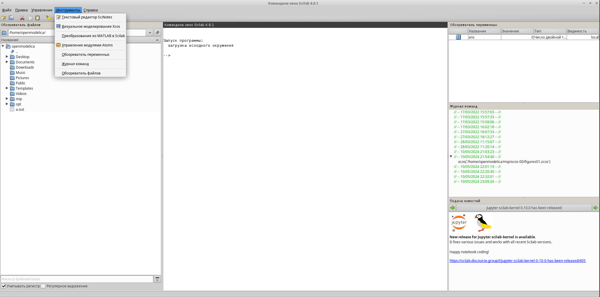{#fig:001 width=70%}

3. В Xcos я добавыл регистратор CSCOPXY, два источника сигналов и воздействия GENSEN_f и CLOCK_c. Ниже на рис. 1 показано как это выглядит:

   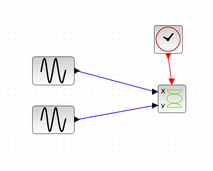{#fig:002 width=70%}

4. Получнный график это прямая:

   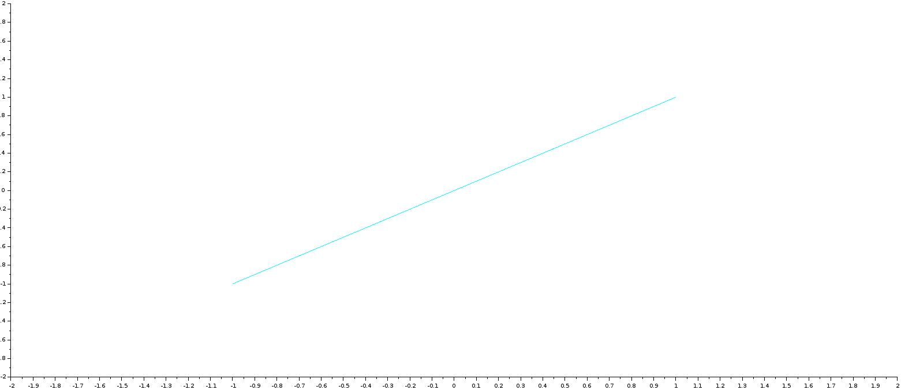{#fig:003 width=70%}

5. Если изменить параметры второго источника GENSEN_f так:
   
   {#fig:004 width=70%}

6. Получаем следующей график:

   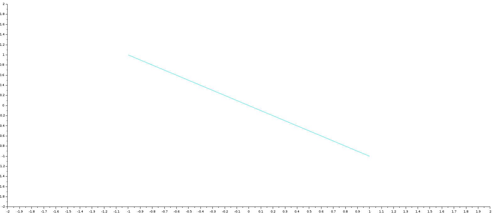{#fig:005 width=70%}

7. Давайте создадим эллипс/овал используя следующие параметры второго источника GENSEN_f:

   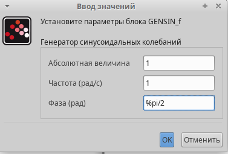{#fig:006 width=70%}

8. Получаем следующей график:

   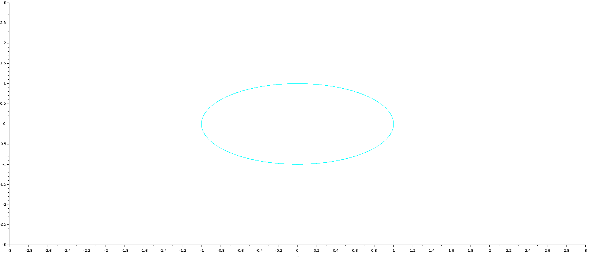{#fig:007 width=70%}

9. Если менять параметры двух источников GENSEN_f таким способом:

   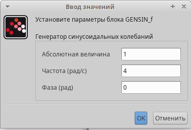{#fig:008 width=70%}
   
   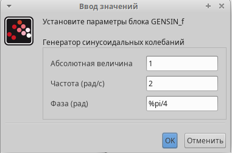{#fig:009 width=70%}

10. Получаем следующей график:
   
   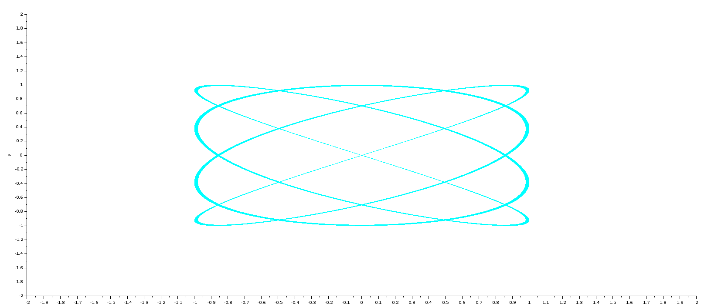{#fig:010 width=70%}

11. A если менять параметры двух источников GENSEN_f таким способом:

   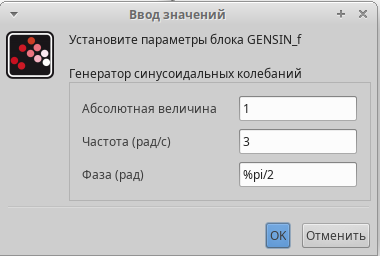{#fig:011 width=70%}
   
   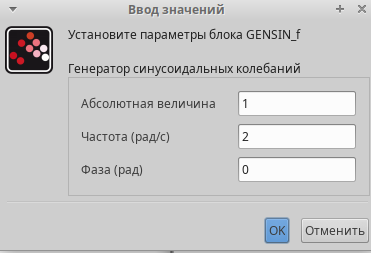{#fig:012 width=70%}

12. Получаем следующей график:

   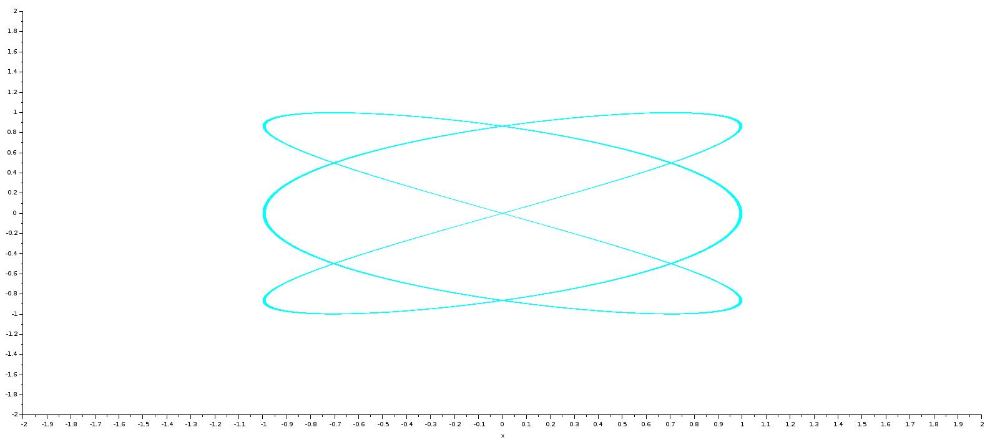{#fig:013 width=70%}

# Вывод

- Изучали как работать с Xcos. [@book]

# Библиография

::: {#refs}
:::