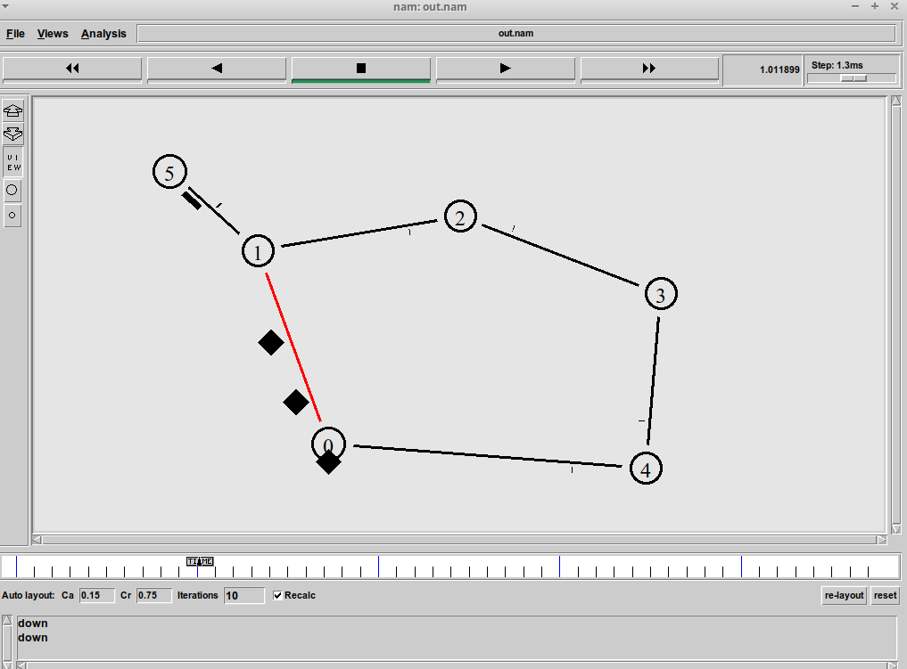
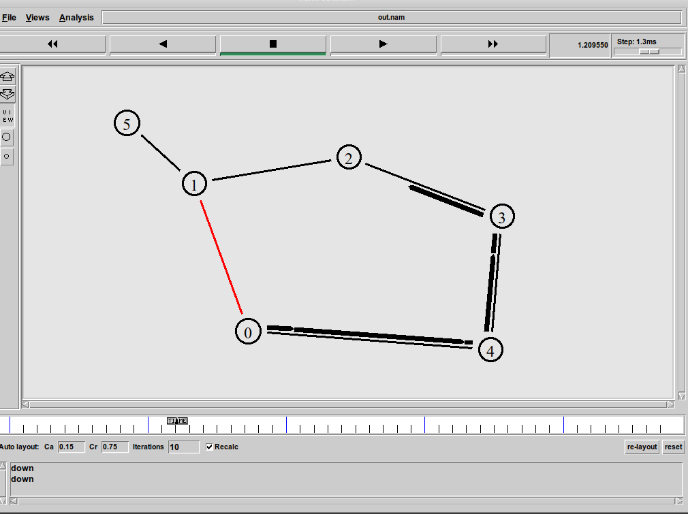

---
## Front matter
lang: ru-RU
title: Лабораторная работа №1
subtitle: Простые модели компьютерной сети
author:
  - Абу Сувейлим Мухаммед Мунивочи
institute:
  - Российский университет дружбы народов, Москва, Россия
date: 20 апреля 2024

## i18n babel
babel-lang: russian
babel-otherlangs: english
##mainfont: Arial
##monofont: Courier New
##fontsize: 8pt

## Formatting pdf
toc: false
toc-title: Содержание
slide_level: 2
aspectratio: 169
section-titles: true
theme: metropolis
header-includes:
 - \metroset{progressbar=frametitle,sectionpage=progressbar,numbering=fraction}
 - '\makeatletter'
 - '\beamer@ignorenonframefalse'
 - '\makeatother'
---

# Информация

## Докладчик

::::::::::::::: {.columns align=center}
::: {.column width="70%"}

  * Абу Сувейлим Мухаммед Мунифович
  * студент, НКНбд-01-21
  * Российский университет дружбы народов
  * [103221315@pfur.ru](mailto:103221315@pfur.ru)
:::
::: {.column width="30%"}

:::
::::::::::::::

# Вводная часть

## Актуальность

- Моделирование функций проводной и беспроводной сети и
протоколы (например, алгоритмы маршрутизации, TCP, UDP) можно реализовать с помощью NS2. В общем, NS2 предоставляет пользователям возможность указывать такие сетевые протоколы и моделировать соответствующее им поведение. [1]

## Объект и предмет исследования

- Объектом и предметом исследования является задние NS-2 как объект и сетевая топология и параметры передачи данных в этой сети как предмет/предметы исследования.

## Цели и задачи

Приобретение навыков моделирования сетей передачи данных с помощью средства имитационного моделирования NS-2, а также анализ полученных результатов
моделирования.[2]

## Материалы и методы

- Issariyakul, T., Hossain, E. (2012). Introduction to Network Simulator 2 (NS2). In: Introduction to Network Simulator NS2. Springer, Boston, MA. https://doi.org/10.1007 978-1-4614-1406-3_2 [1]

- Королькова, А. В. Моделирование информационных процессов : учебное
пособие / А. В. Королькова, Д. С. Кулябов.  М. : РУДН, 2014. -- 191 с. : ил. [2]

# Теоретическое введение

## Network Simulator

Network Simulator (NS-2) - один из программных симуляторов моделирования процессов в компьютерных сетях. NS-2 позволяет описать топологию сети, конфигурацию источников и приёмников трафика, параметры соединений (полосу пропускания, задержку, вероятность потерь пакетов и т.д.) и множество других параметров моделируемой системы. Данные о динамике трафика, состоянии соединений и объектов сети, а также информация о работе протоколов фиксируются в генерируемом trace-файле. [2]

# Выполнение работы

## Реализация на NS-2 
  - Cоздание объекта Simulator
  - Для отправления небольшого количества маленьких пакетов, используемых для обмена информацией, необходимой для маршрутизации между узлами.
  
  ```tcl
    set ns [new Simulator]
    $ns rtproto DV
  ```
## Реализация на NS-2  
  - открытие на запись файла out.nam для визуализатора nam
  - все результаты моделирования будут записаны в переменную nf
  ```tcl
    set nf [open out.nam w]
    $ns namtrace-all $nf
  ```
## Реализация на NS-2   
  - открытие на запись файла трассировки out.tr 
  - для регистрации всех событий
  - все регистрируемые события будут записаны в переменную f
  ```tcl
    set f [open out.tr w]
    $ns trace-all $f
  ```

## Реализация на NS-2   
  - процедура finish закрывает файлы трассировки
  - и запускает визуализатор nam
  ```tcl
    proc finish {} {
      global ns f nf 
      $ns flush-trace 
      close $f 
      close $nf
      exec nam out.nam &
      exit 0
    }
  ```

## Реализация на NS-2   
- Cоздание узлов

  ```tcl
    set N 6
    for {set i 0} {$i < $N} {incr i} {
      set n($i) [$ns node]
    }
  ```
## Реализация на NS-2   

- Cоединим узлы так, чтобы создать круговую топологию:

  ```tcl
    for {set i 0} {$i < ($N-1)} {incr i} {
      $ns duplex-link $n($i) $n([expr ($i+1)%($N-1)]) 1Mb 10ms DropTail
    }
    $ns duplex-link $n(1) $n(5) 1Mb 10ms DropTail
  ```

## Реализация на NS-2 

- Зададим передачу данных от узла n(0) к узлу n(5):

  ```tcl
    set tcp0 [new Agent/TCP/Newreno]
    $ns attach-agent $n(0) $tcp0
  ```
## Реализация на NS-2 
- Создание приложения FTP и присоединение его к агенту tcp0
  ```tcl
    set ftp [new Application/FTP]
    $ftp attach-agent $tcp0
  ```

## Реализация на Julia 
- Cоздание агента-получателя для tcp5
  ```tcl
    set sink5 [new Agent/TCPSink/DelAck]
    $ns attach-agent $n(5) $sink5
    $ns connect $tcp0 $sink5
  ```

## Реализация на Julia 

  - Добавим команду разрыва соединения между узлами n(1) и n(2) на время в одну секунду, а также время начала и окончания передачи данных:

  ```tcl
    $ns at 0.5 "$ftp start"
    $ns rtmodel-at 1.0 down $n(0) $n(1)
    $ns rtmodel-at 2.0 up $n(0) $n(1)
    $ns at 4.5 "$ftp stop"
    $ns at 5.0 "finish"
  ```
## Реализация на Julia 
- at-событие для планировщика событий, которое запускает процедуру finish через 5 с после начала моделирования
  ```tcl
    $ns at 5.0 "finish"
    # запуск модели
    $ns run
  ```

# Результаты 

## Передача данных по сети с кольцевой топологией в случае разрыва соединения

- Передача данных по сети с кольцевой топологией в случае разрыва соединения

  {#fig:001 width=50%}

## Маршрутизация данных по сети с кольцевой топологией в случае разрыва соединения

- Маршрутизация данных по сети с кольцевой топологией в случае разрыва соединения

  {#fig:002 width=50%}


## Вывод

- NS-2 позволяет описать топологию сети, конфигурацию источников и приёмников трафика, параметры соединений (полосу пропускания, задержку, вероятность потерь пакетов и т.д.) и множество других параметров моделируемой системы. [2]