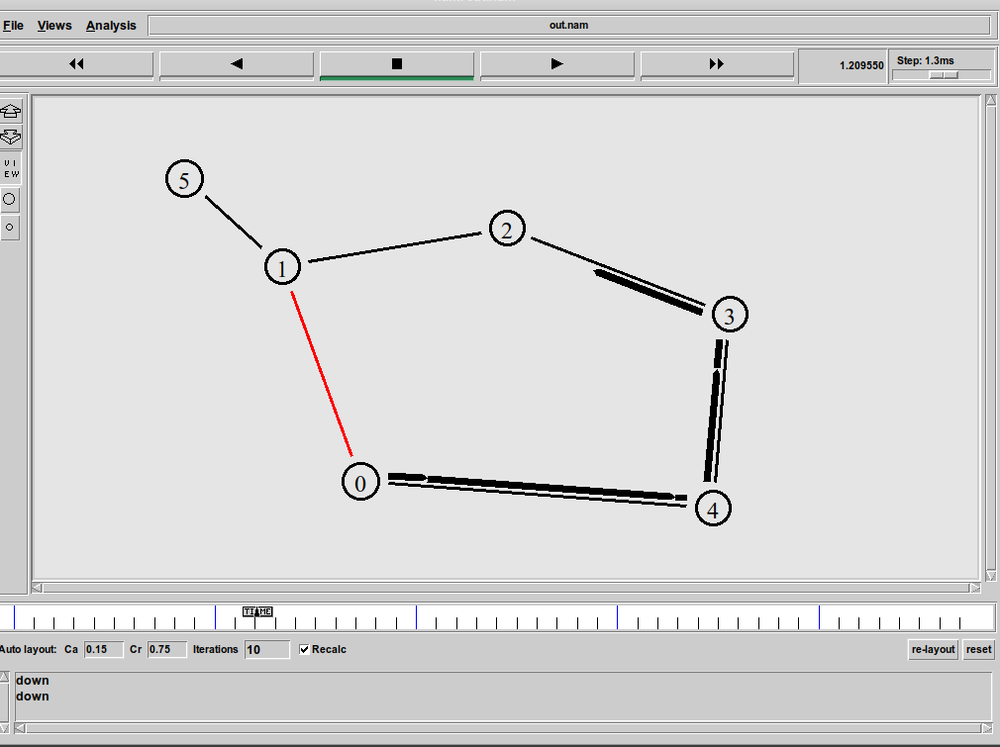

# Цель работы

- Приобретение навыков моделирования сетей передачи данных с помощью средства имитационного моделирования NS-2, а также анализ полученных результатов
моделирования.

# Задание
Внесите следующие изменения в реализацию примера с кольцевой
топологией сети:
- топология сети должна соответствовать представленной на рис. 1

   {#fig:001 width=70%}

- передача данных должна осуществляться от узла n(0) до узла n(5) по кратчайшему пути в течение 5 секунд модельного времени;
- передача данных должна идти по протоколу TCP (тип Newreno), на принимающей стороне используется TCPSink-объект типа DelAck; поверх TCP работает протокол FTP с 0,5 до 4,5 секунд модельного времени;
- с 1 по 2 секунду модельного времени происходит разрыв соединения между узлами n(0) и n(1);
- при разрыве соединения маршрут передачи данных должен измениться на резервный, после восстановления соединения пакеты снова должны пойти по кратчайшему пути.

# Теоретическое введение

Network Simulator (NS-2)  один из программных симуляторов моделирования процессов в компьютерных сетях. NS-2 позволяет описать топологию сети, конфигурацию источников и приёмников трафика, параметры соединений (полосу пропускания, задержку, вероятность потерь пакетов и т.д.) и множество других параметров моделируемой системы. Данные о динамике трафика, состоянии соединений
и объектов сети, а также информация о работе протоколов фиксируются в генерируемом trace-файле.
NS-2 является объектно-ориентированным программным обеспечением. Его ядро реализовано на языке С++. В качестве интерпретатора используется язык скриптов (сценариев) OTcl (Object oriented
Tool Command Language). NS-2 полностью поддерживает иерархию
классов С++ и подобную иерархию классов интерпретатора OTcl. Обе
иерархии обладают идентичной структурой, т.е. существует однозначное соответствие между классом одной иерархии и таким же классом другой. Объединение для совместного функционирования С++
и OTcl производится при помощи TclCl (Classes Tcl). В случае, если
необходимо реализовать какую-либо специфическую функцию, не реализованную в NS-2 на уровне ядра, для этого используется код на
С++. [@book]


# Выполнение лабораторной работы

## Шаблон сценария для NS-2

1. Во-первых, я создал директорию mip, к которой будут выполняться лабораторные работы. Внутри mip создад директорию lab-ns, а в ней файл
shablon.tcl:

   ```sh
      mkdir -p mip/lab-ns
      cd mip/lab-ns
      touch shablon.tcl
   ```

2. Далее открыл на редактирование файл shablon.tcl.

3. Сначала создал объект типа Simulator:

   ```tcl
      # создание объекта Simulator
      set ns [new Simulator]
   ```
4. Далее я создадим переменную nf и укажем, что требуется открыть на запись nam-файл для регистрации выходных 
результатов моделирования:

   ```tcl
   # открытие на запись файла out.nam для визуализатора nam
   set nf [open out.nam w]
   # все результаты моделирования будут записаны в переменную nf
   $ns namtrace-all $nf
   ```

5. Далее создадим переменную f и откроем на запись файл трассировки для регистрации всех событий модели:

   ```tcl
      # открытие на запись файла трассировки out.tr
      # для регистрации всех событий
      set f [open out.tr w]
      # все регистрируемые события будут записаны в переменную f
      $ns trace-all $f
   ```


6. После этого добавим процедуру finish, которая закрывает файлы трассировки
и запускает nam:

   ```tcl
      # процедура finish закрывает файлы трассировки
      # и запускает визуализатор nam
      proc finish {} {
      global ns f nf # описание глобальных переменных
      $ns flush-trace # прекращение трассировки
      close $f # закрытие файлов трассировки
      close $nf
      # запуск nam в фоновом режиме
      exec nam out.nam &
      exit 0
      }
   ```

7. Наконец, с помощью команды at указываем планировщику событий, что процедуру finish следует запустить через 5 с после начала моделирования, после чего запустить симулятор ns:

   ```tcl
      # at-событие для планировщика событий, которое запускает
      # процедуру finish через 5 с после начала моделирования
      $ns at 5.0 "finish"
      # запуск модели
      $ns run
   ```

8. Получившийся шаблон можно использовать в дальнейшем в большинстве разрабатываемых скриптов NS-2, добавляя в него до строки $ns at 5.0 "finish"
описание объектов и действий моделируемой системы.

{#fig:002 width=70%}

## Простой пример описания топологии сети, состоящей из двух узлов и одного соединения

**Постановка задачи.** Требуется смоделировать сеть передачи данных, состоящую из двух узлов, соединённых дуплексной линией связи
с полосой пропускания 2 Мб/с и задержкой 10 мс, очередью с обслуживанием типа DropTail. От одного узла к другому по протоколу UDP осуществляется передача пакетов, размером 500 байт, с постоянной
скоростью 200 пакетов в секунду.

1. Скопируем содержимое созданного шаблона в новый файл:

   ```sh
      cp shablon.tcl example1.tcl
   ```
2. и откроем example1.tcl на редактирование. Добавим в него до строки $ns at 5.0 "finish" описание топологии сети:

   ```tcl
      # создание 2-х узлов:
      set n0 [$ns node]
      set n1 [$ns node]
      # соединение 2-х узлов дуплексным соединением
      # с полосой пропускания 2 Мб/с и задержкой 10 мс,
      # очередью с обслуживанием типа DropTail
      $ns duplex-link $n0 $n1 2Mb 10ms DropTail
   ```
3. Создадим агенты для генерации и приёма трафика:

   ```tcl
      # создание агента UDP и присоединение его к узлу n0
      set udp0 [new Agent/UDP]
      $ns attach-agent $n0 $udp0
      # создание источника трафика CBR (constant bit rate)
      set cbr0 [new Application/Traffic/CBR]
      # устанавливаем размер пакета в 500 байт
      $cbr0 set packetSize_ 500
      #задаем интервал между пакетами равным 0.005 секунды,
      #т.е. 200 пакетов в секунду
      $cbr0 set interval_ 0.005
      # присоединение источника трафика CBR к агенту udp0
      $cbr0 attach-agent $udp0
   ```
4. Далее создадим Null-агент, который работает как приёмник трафика, и прикрепим его к узлу n1:
   
   ```tcl
      # Создание агента-приёмника и присоединение его к узлу n1
      set null0 [new Agent/Null]
      $ns attach-agent $n1 $null0
      # Соединение агентов между собой
      $ns connect $udp0 $null0
   ```
5. Для запуска и остановки приложения CBR добавляются at-события в планировщик событий (перед командой $ns at 5.0 "finish")

    ```tcl
      # запуск приложения через 0,5 с
      $ns at 0.5 "$cbr0 start"
      # остановка приложения через 4,5 с
      $ns at 4.5 "$cbr0 stop"
   ```

6. Сохранив изменения в отредактированном файле и запустив симулятор:

   ```SH
      ns example1.tcl 
   ```
   получим в качестве результата запуск аниматора nam в фоновом режиме (рис 3).

   {#fig:003 width=70%}


## Пример с кольцевой топологией сети

**Постановка задачи.** Требуется построить модель передачи данных по сети с кольцевой топологией и динамической маршрутизацией
пакетов:
- сеть состоит из 7 узлов, соединённых в кольцо;
- данные передаются от узла n(0) к узлу n(3) по кратчайшему пути;
- с 1 по 2 секунду модельного времени происходит разрыв соединения между узлами n(1) и n(2);
- при разрыве соединения маршрут передачи данных должен измениться на резервный.

1. Скопируем содержимое созданного шаблона в новый файл:
   ```sh
      cp shablon.tcl example3.tcl
   ```
2. и откроем example3.tcl на редактирование. Опишем топологию моделируемой сети:
   ```tcl
      for {set i 0} {$i < 7} {incr i} {
         set n($i) [$ns node]
      }
   ```
3. Далее соединим узлы так, чтобы создать круговую топологию:
   ```tcl
      for {set i 0} {$i < 7} {incr i} {
         $ns duplex-link $n($i) $n([expr ($i+1)%7]) 1Mb 10ms DropTail
      }
   ```
4. Зададим передачу данных от узла n(0) к узлу n(3):
   ```tcl
      set udp0 [new Agent/UDP]
      $ns attach-agent $n(0) $udp0
      set cbr0 [new Agent/CBR]
      $ns attach-agent $n(0) $cbr0
      $cbr0 set packetSize_ 500
      $cbr0 set interval_ 0.005
      set null0 [new Agent/Null]
      $ns attach-agent $n(3) $null0
      $ns connect $cbr0 $null0
   ```
5. Добавим команду разрыва соединения между узлами n(1) и n(2) на время в одну секунду:
   ```tcl
      $ns rtmodel-at 1.0 down $n(1) $n(2)
      $ns rtmodel-at 2.0 up $n(1) $n(2)
   ```
6. Добавив в начало скрипта после команды создания объекта Simulator:
   ```tcl
      $ns rtproto DV
   ```
7. Результаты
   - Передача данных по кратчайшему пути сети с кольцевой топологией

   {#fig:004 width=70%}

   - Передача данных по сети с кольцевой топологией в случае разрыва соединения

   {#fig:005 width=70%}


## Упражнение

1. Скопируем содержимое созданного задания 3 в новый файл:
   ```sh
      cp example3.tcl exercise.tcl
   ```
2. и откроем example3.tcl на редактирование. Опишем топологию моделируемой сети:
   ```tcl
      # создать узлы
      set N 6
      for {set i 0} {$i < $N} {incr i} {
         set n($i) [$ns node]
      }
   ```
3. Cоединим узлы так, чтобы создать круговую топологию:
   ```tcl
      for {set i 0} {$i < ($N-1)} {incr i} {
         $ns duplex-link $n($i) $n([expr ($i+1)%($N-1)]) 1Mb 10ms DropTail
      }
      $ns duplex-link $n(1) $n(5) 1Mb 10ms DropTail
   ```
4. Зададим передачу данных от узла n(0) к узлу n(5):

   ```tcl
      set tcp0 [new Agent/TCP/Newreno]
      $ns attach-agent $n(0) $tcp0
   ```
5. Cоздание приложения FTP и присоединение его к агенту tcp0. 
   ```tcl
      set ftp [new Application/FTP]
      $ftp attach-agent $tcp0
   ```
6. Cоздание агента-получателя для tcp5.
   ```tcl
      set sink5 [new Agent/TCPSink/DelAck]
      $ns attach-agent $n(5) $sink5
      $ns connect $tcp0 $sink5
   ```
7. Добавим команду разрыва соединения между узлами n(0) и n(1) на время в одну секунду, а также время начала и окончания передачи данных:
   ```tcl
      $ns at 0.5 "$ftp start"
      $ns rtmodel-at 1.0 down $n(0) $n(1)
      $ns rtmodel-at 2.0 up $n(0) $n(1)
      $ns at 4.5 "$ftp stop"
      $ns at 5.0 "finish"
   ```
8. Сохранив изменения в отредактированном файле и запустив симулятор:

   {#fig:006 width=70%}


## Исходный код

### Управжение

   ```tcl
      # создание объекта Simulator
      set ns [new Simulator]

      $ns rtproto DV
      # открытие на запись файла out.nam для визуализатора nam
      set nf [open out.nam w]
      # все результаты моделирования будут записаны в переменную nf
      $ns namtrace-all $nf

      # открытие на запись файла трассировки out.tr
      # для регистрации всех событий
      set f [open out.tr w]
      # все регистрируемые события будут записаны в переменную f
      $ns trace-all $f

      # процедура finish закрывает файлы трассировки
      # и запускает визуализатор nam
      proc finish {} {
         global ns f nf 
         $ns flush-trace 
         close $f 
         close $nf
         exec nam out.nam &
         exit 0
      }

      # создать узлы
      set N 6
      for {set i 0} {$i < $N} {incr i} {
         set n($i) [$ns node]
      }

      # соединим узлы так, чтобы создать круговую топологию:
      for {set i 0} {$i < ($N-1)} {incr i} {
         $ns duplex-link $n($i) $n([expr ($i+1)%($N-1)]) 1Mb 10ms DropTail
      }

      $ns duplex-link $n(1) $n(5) 1Mb 10ms DropTail

      #Зададим передачу данных от узла n(0) к узлу n(5):

      set tcp0 [new Agent/TCP/Newreno]
      $ns attach-agent $n(0) $tcp0

      # создание приложения FTP
      # и присоединение его к агенту tcp0
      set ftp [new Application/FTP]
      $ftp attach-agent $tcp0

      # создание агента-получателя для tcp5
      set sink5 [new Agent/TCPSink/DelAck]
      $ns attach-agent $n(5) $sink5


      $ns connect $tcp0 $sink5

      # Добавим команду разрыва соединения между узлами n(1) и n(2) на время в одну
      # секунду, а также время начала и окончания передачи данных:
      $ns at 0.5 "$ftp start"
      $ns rtmodel-at 1.0 down $n(0) $n(1)
      $ns rtmodel-at 2.0 up $n(0) $n(1)
      $ns at 4.5 "$ftp stop"
      $ns at 5.0 "finish"


      # at-событие для планировщика событий, которое запускает
      # процедуру finish через 5 с после начала моделирования
      $ns at 5.0 "finish"
      # запуск модели
      $ns run
   ```

# Вывод

- NS-2 позволяет описать топологию сети, конфигурацию источников и приёмников трафика, параметры соединений (полосу пропускания, задержку, вероятность потерь пакетов и т.д.) и множество других параметров моделируемой системы. [@book]

# Библиография

::: {#refs}
:::