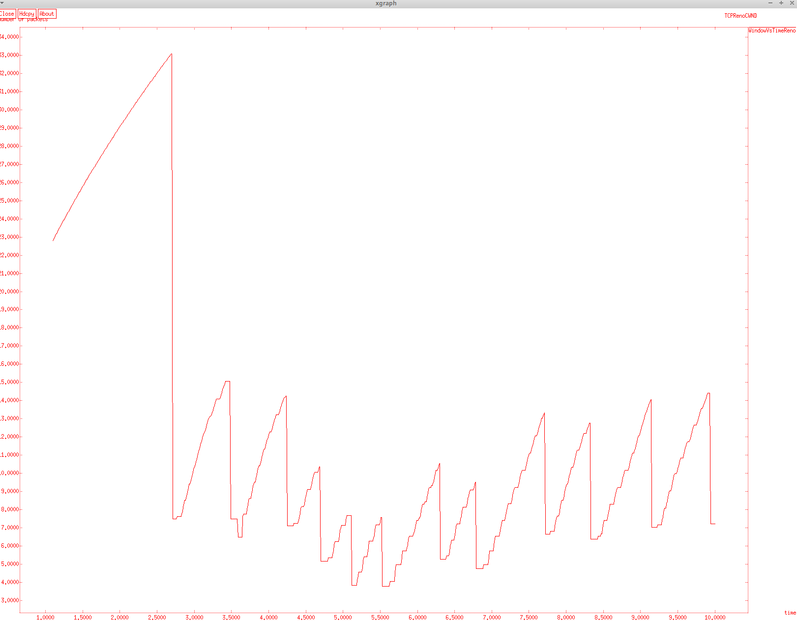

---
## Front matter
lang: ru-RU
title: Лабораторная работа №2
subtitle: Исследование протокола TCP и алгоритма управления очередью RED
author:
  - Абу Сувейлим Мухаммед Мунивочи
institute:
  - Российский университет дружбы народов, Москва, Россия
date: 26 апреля 2024

## i18n babel
babel-lang: russian
babel-otherlangs: english
##mainfont: Arial
##monofont: Courier New
##fontsize: 8pt

## Formatting pdf
toc: false
toc-title: Содержание
slide_level: 2
aspectratio: 169
section-titles: true
theme: metropolis
header-includes:
 - \metroset{progressbar=frametitle,sectionpage=progressbar,numbering=fraction}
 - '\makeatletter'
 - '\beamer@ignorenonframefalse'
 - '\makeatother'
---

# Информация

## Докладчик

::::::::::::::: {.columns align=center}
::: {.column width="70%"}

  * Абу Сувейлим Мухаммед Мунифович
  * студент, НКНбд-01-21
  * Российский университет дружбы народов
  * [103221315@pfur.ru](mailto:103221315@pfur.ru)
:::
::: {.column width="30%"}

:::
::::::::::::::

# Вводная часть

## Актуальность

- Алгоритм RED позволяет контролировать нагрузку с помощью выборочного случайного уничтожения некоторых пакетов, что заставляет протоколы, подобные TCP, снижать скорость передачи. При потере хотя бы одного пакета протокол TCP начинает процедуру Slow Start заново; это снижает объем трафика, поступающего в сеть. Наиболее разумно - не дожидаться полной перегрузки сети (тогда будет удален весь трафик), а уже на подступах к опасному порогу начать выборочное уничтожение отдельных пакетов, информируя тем самым источники нагрузки о текущей пропускной способности сети. [3]

## Объект и предмет исследования

- Объектом исследования является NS-2, а предметом исследования является алгоритм управления очередью RED.

## Цели и задачи

Приобретение навыков моделирования сетей передачи данных с помощью средства имитационного моделирования NS-2 на основе алгоритма управления очередью RED, а также анализ полученных результатов моделирования. [1]

## Материалы и методы

- Королькова, А. В. Моделирование информационных процессов : учебное
пособие / А. В. Королькова, Д. С. Кулябов. - М. : РУДН, 2014. -- 191 с. : ил. [1]

- Korolkova A., Kulyabov D., Черноиванов А. К вопросу о классификации алгоритмов RED // Вестник РУДН. Серия «Математика. Информатика. Физика». 2009. С. 34–46. [2]

- Алленов О.Алгоритм RED: красный светдля лишних пакетов [Электронный ресурс]. 1998. URL: https://www.osp.ru/nets/1998/09/143680. [3]

# Теоретическое введение

## Network Simulator

Алгоритм Random Early Detection (RED) лежит в основе ряда механизмов предотвращения и контроля перегрузок в очередях маршрутизаторов. Его основное предназначение заключается в сглаживании временных всплесков трафика и предупреждении длительной перегрузки сети посредством уведомления источников трафика о необходимости снижения интенсивности передачи информации. [2]

# Выполнение работы

## Реализация на NS-2 
  1. Во-первых, скопируем содержимое созданного шаблона в прошлой лабароторной работе в новый файл example.tcl:

   ```sh
      cp shablon.tcl example.tcl
   ```

## Реализация на NS-2  

  2. и откроем example.tcl на редактирование. Добавим в него до строки $ns run описание топологии сети:

   ```tcl
      # Узлы сети:
      set N 5
      for {set i 1} {$i < $N} {incr i} {
         set node_(s$i) [$ns node]
      }
      set node_(r1) [$ns node]
      set node_(r2) [$ns node]
   ```

## Реализация на NS-2   
  
  3. Соединим наши узлы и роутеры:

   ```tcl
      # Соединения:
      $ns duplex-link $node_(s1) $node_(r1) 10Mb 2ms DropTail
      $ns duplex-link $node_(s2) $node_(r1) 10Mb 3ms DropTail
      $ns duplex-link $node_(r1) $node_(r2) 1.5Mb 20ms RED
      $ns queue-limit $node_(r1) $node_(r2) 25
      $ns queue-limit $node_(r2) $node_(r1) 25
      $ns duplex-link $node_(s3) $node_(r2) 10Mb 4ms DropTail
      $ns duplex-link $node_(s4) $node_(r2) 10Mb 5ms DropTail
   ```

## Реализация на NS-2   
  
  4. Далее, создадим агенты ftp на улзах s1 и s2 TCP/Newreno и TCP/Vegas:
   
   ```tcl
      set tcp1 [$ns create-connection TCP/Vegas $node_(s1) TCPSink $node_(s3) 0]
      $tcp1 set window_ 15
      set tcp2 [$ns create-connection TCP/Reno $node_(s2) TCPSink $node_(s3) 1]
      $tcp2 set window_ 15
      set ftp1 [$tcp1 attach-source FTP]
      set ftp2 [$tcp2 attach-source FTP]
   ```

## Реализация на NS-2   

  5. Подготовиш графический шаблон. Здесь window_ — верхняя граница окна приёмника (Advertisment Window) TCP соединения. Мониторинг размера окна TCP:

    ```tcl
      set windowVsTime [open WindowVsTimeReno w]
      set qmon [$ns monitor-queue $node_(r1) $node_(r2) [open qm.out w] 0.1]
      [$ns link $node_(r1) $node_(r2)] queue-sample-timeout
    ```

## Реализация на NS-2   

  6. Для мониторинга очереди. curq_ — текущий размер очереди, ave_ — средний размер очереди. Здесь curq_ — текущий размер очереди, ave_ — средний размер очереди
    ```tcl
      set redq [[$ns link $node_(r1) $node_(r2)] queue]
      set tchan_ [open all.q w]
      $redq trace curq_
      $redq trace ave_
      $redq attach $tchan_ 
    ```

## Реализация на NS-2 

  7. Добавление at-событий:

    ```tcl
      $ns at 0.0 "$ftp1 start"
      $ns at 1.1 "plotWindow $tcp1 $windowVsTime"
      $ns at 3.0 "$ftp2 start"
      $ns at 10 "finish"
    ```

## Реализация на NS-2 

  8. Формирование файла с данными о размере окна TCP, cwnd_ — текущее значение окна перегрузки:

    ```tcl
      proc plotWindow {tcpSource file} {
        global ns
        set time 0.01
        set now [$ns now]
        set cwnd [$tcpSource set cwnd_]
        puts $file "$now $cwnd"
        $ns at [expr $now+$time] "plotWindow $tcpSource $file"
      }
    ```

## Реализация на NS-2

  9. Процедура finish и запуск модели:
  
    ```tcl
      proc finish {} {
        global tchan_
        # подключение кода AWK:
        set awkCode {
        {
            if ($1 == "Q" && NF>2) {
              print $2, $3 >> "temp.q"
              set end $2
        }
            else if ($1 == "a" && NF>2)
            print $2, $3 >> "temp.a"
        }
        }

        set f [open temp.queue w]
        puts $f "TitleText: red"
        puts $f "Device: Postscript"
        if { [info exists tchan_] } {
            close $tchan_
        }
    ```

## Реализация на NS-2

В процедуре внесем следующие изменения: Цвет фона - белый, цвет оси и линии - красный. Название оси х - время, а у - пакеты.

  ```tcl
    exec rm -f temp.q temp.a
    exec touch temp.a temp.q
    exec awk $awkCode all.q
    puts $f \"queue
    exec cat temp.q >@ $f
    puts $f \n\"ave_queue
    exec cat temp.a >@ $f
    close $f

  # Запуск xgraph с графиками окна TCP и очереди:
  exec xgraph -bb -bg White -fg Red -x "time" -y "number of packets" -tk -x time -t "TCPRenoCWND" WindowVsTimeReno &
  exec xgraph -bb -bg White -fg Red -x "time" -y "number of packets"-tk -x time -y queue temp.queue & 
  exit 0
  }

  # запуск модели
  $ns run
```

# Результаты 

## Изменённая сети из управжении на TCP/Newreno

- Сохранив изменения в отредактированном файле и запустив симулятор:

  {#fig:001 width=50%}

## Изменённая сети из управжении на TCP/Vegas

- Изменённая сети из управжении на TCP/Vegas:

  {#fig:002 width=50%}


## Вывод

- Изучали как работает алгоритм RED.