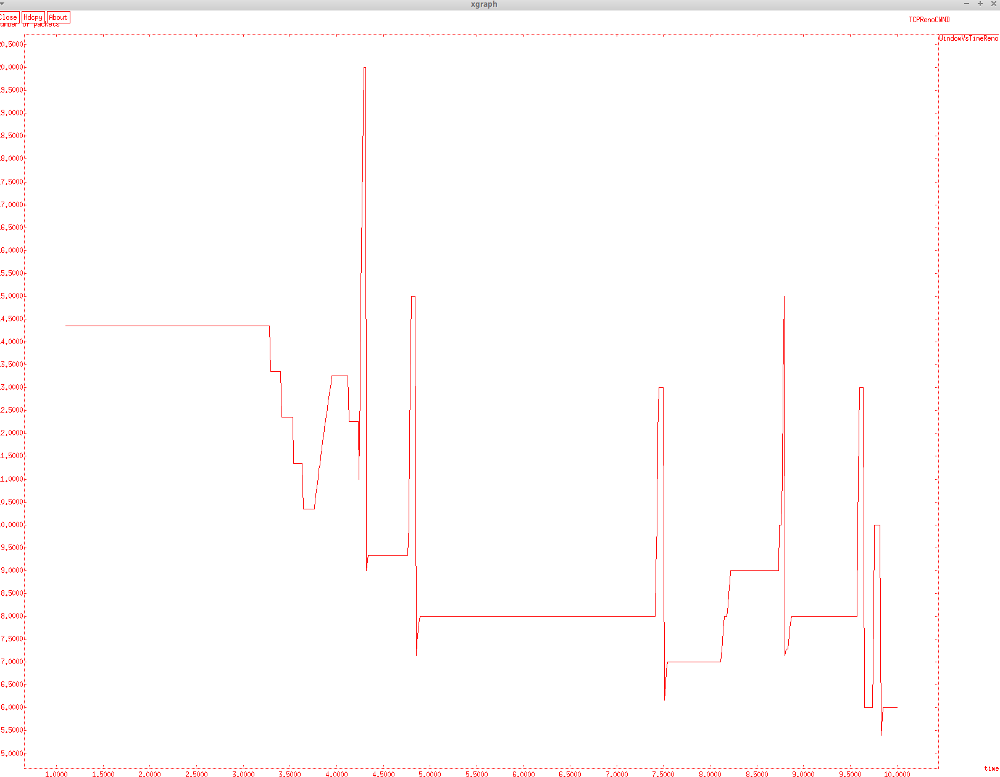

# Цель работы

- Приобретение навыков моделирования сетей передачи данных с помощью средства имитационного моделирования NS-2 на основе алгоритма RED, а также анализ полученных результатов
моделирования.

# Задание
- Измените в модели на узле s1 тип протокола TCP с Reno на NewReno, затем на Vegas. Сравните и поясните результаты.
- Внесите изменения при отображении окон с графиками (измените цвет фона, цвет траекторий, подписи к осям, подпись траектории в легенде). [@book]

# Теоретическое введение

"Алгоритм Random Early Detection (RED) лежит в основе ряда механизмов предотвращения и контроля перегрузок в очередях маршрутизаторов. Его основное предназначение заключается в сглаживании временных всплесков трафика и предупреждении длительной перегрузки сети посредством уведомления источников трафика о необходимости снижения интенсивности передачи информации." [@article]
Алгоритм RED позволяет контролировать нагрузку с помощью выборочного случайного уничтожения некоторых пакетов, что заставляет протоколы, подобные TCP, снижать скорость передачи. При потере хотя бы одного пакета протокол TCP начинает процедуру Slow Start заново; это снижает объем трафика, поступающего в сеть. Наиболее разумно - не дожидаться полной перегрузки сети (тогда будет удален весь трафик), а уже на подступах к опасному порогу начать выборочное уничтожение отдельных пакетов, информируя тем самым источники нагрузки о текущей пропускной способности сети. [@osp]


# Выполнение лабораторной работы

## Шаблон сценария для NS-2

1. Во-первых, скопируем содержимое созданного шаблона в прошлой лабароторной работе в новый файл example.tcl:

   ```sh
      cp shablon.tcl example.tcl
   ```

2. и откроем example.tcl на редактирование. Добавим в него до строки $ns run описание топологии сети:

   ```tcl
      # Узлы сети:
      set N 5
      for {set i 1} {$i < $N} {incr i} {
         set node_(s$i) [$ns node]
      }
      set node_(r1) [$ns node]
      set node_(r2) [$ns node]
   ```
3. Соединим наши узлы и роутеры:

   ```tcl
      # Соединения:
      $ns duplex-link $node_(s1) $node_(r1) 10Mb 2ms DropTail
      $ns duplex-link $node_(s2) $node_(r1) 10Mb 3ms DropTail
      $ns duplex-link $node_(r1) $node_(r2) 1.5Mb 20ms RED
      $ns queue-limit $node_(r1) $node_(r2) 25
      $ns queue-limit $node_(r2) $node_(r1) 25
      $ns duplex-link $node_(s3) $node_(r2) 10Mb 4ms DropTail
      $ns duplex-link $node_(s4) $node_(r2) 10Mb 5ms DropTail
   ```
4. Далее, создадим агенты ftp на улзах s1 и s2:
   
   ```tcl
      # Агенты и приложения:
      set tcp1 [$ns create-connection TCP/Reno $node_(s1) TCPSink $node_(s3) 0]
      $tcp1 set window_ 15
      set tcp2 [$ns create-connection TCP/Reno $node_(s2) TCPSink $node_(s3) 1]
      $tcp2 set window_ 15
      set ftp1 [$tcp1 attach-source FTP]
      set ftp2 [$tcp2 attach-source FTP]
   ```
5. Подготовиш графический шаблон:

    ```tcl
      # Здесь window_ — верхняя граница окна приёмника (Advertisment Window) TCP соединения.
      # Мониторинг размера окна TCP:
      set windowVsTime [open WindowVsTimeReno w]
      set qmon [$ns monitor-queue $node_(r1) $node_(r2) [open qm.out w] 0.1];
      [$ns link $node_(r1) $node_(r2)] queue-sample-timeout;
   ```

6. Для мониторинга очереди. curq_ — текущий размер очереди, ave_ — средний размер очереди:

   ```tcl
      # Мониторинг очереди:
      set redq [[$ns link $node_(r1) $node_(r2)] queue]
      set tchan_ [open all.q w]
      $redq trace curq_
      $redq trace ave_
      $redq attach $tchan_ 
      # Здесь curq_ — текущий размер очереди, ave_ — средний размер очереди.
   ```
7. Добавление at-событий:
   ```tcl
      # Добавление at-событий:
      $ns at 0.0 "$ftp1 start"
      $ns at 1.1 "plotWindow $tcp1 $windowVsTime"
      $ns at 3.0 "$ftp2 start"
      $ns at 10 "finish"
      
   ```
8. Формирование файла с данными о размере окна TCP:
   ```tcl
      # Формирование файла с данными о размере окна TCP:
      proc plotWindow {tcpSource file} {
         global ns
         set time 0.01
         set now [$ns now]
         set cwnd [$tcpSource set cwnd_]
         puts $file "$now $cwnd"
         $ns at [expr $now+$time] "plotWindow $tcpSource $file"
      }
      # Здесь cwnd_ — текущее значение окна перегрузки.
   ```
9. Процедура finish и запуск модели:
   ```tcl
      # Процедура finish:
      proc finish {} {
         global tchan_
         # подключение кода AWK:
         set awkCode {
         {
            if ($1 == "Q" && NF>2) {
               print $2, $3 >> "temp.q";
               set end $2
         }
            else if ($1 == "a" && NF>2)
            print $2, $3 >> "temp.a";
         }
         }

         set f [open temp.queue w]
         puts $f "TitleText: red"
         puts $f "Device: Postscript"
         if { [info exists tchan_] } {
            close $tchan_
         }


         exec rm -f temp.q temp.a
         exec touch temp.a temp.q
         exec awk $awkCode all.q
         puts $f \"queue
         exec cat temp.q >@ $f
         puts $f \n\"ave_queue
         exec cat temp.a >@ $f
         close $f

         # Запуск xgraph с графиками окна TCP и очереди:
         exec xgraph -bb -tk -x time -t "TCPRenoCWND" WindowVsTimeReno &
         exec xgraph -bb -tk -x time -y queue temp.queue &
         exit 0
      }

      # запуск модели
      $ns run
   ```

10. График динамики длины очереди и средней длины очереди.

   {#fig:001 width=70%}

## Упражнение

1. Скопируем содержимое созданного задания 1 в новый файл:
   ```sh
      cp example.tcl exercise.tcl
   ```
2. В процедуре внесем следующие изменения:
   ```tcl
      # Запуск xgraph с графиками окна TCP и очереди:
      exec xgraph -bb -bg White -fg Red -x "time" -y "number of packets" -tk -x time -t "TCPRenoCWND" WindowVsTimeReno &
      exec xgraph -bb -bg White -fg Red -x "time" -y "number of packets"-tk -x time -y queue temp.queue & 
      exit 0
   ```
   Цвет фона - белый, цвет оси и линии - красный. Название оси х - время, а у - пакеты.

3. Где агенты и приложения вместо TCP/Reno напишим и TCP/Newreno и TCP/Vegas:
   ```tcl
      # Агенты и приложения:
      #set tcp1 [$ns create-connection TCP/Vegas $node_(s1) TCPSink $node_(s3) 0]
      set tcp1 [$ns create-connection TCP/Vegas $node_(s1) TCPSink $node_(s3) 0]
      $tcp1 set window_ 15
      set tcp2 [$ns create-connection TCP/Reno $node_(s2) TCPSink $node_(s3) 1]
      $tcp2 set window_ 15
      set ftp1 [$tcp1 attach-source FTP]
      set ftp2 [$tcp2 attach-source FTP]
   ```
4. Сохранив изменения в отредактированном файле и запустив симулятор:

   {#fig:002 width=70%}

5. Изменённая сети из управжении на TCP/Vegas:

   {#fig:003 width=70%}


## Исходный код

### Управжение

   ```tcl
      # создание объекта Simulator
   set ns [new Simulator]

   # Узлы сети:
   set N 5
   for {set i 1} {$i < $N} {incr i} {
      set node_(s$i) [$ns node]
   }
   set node_(r1) [$ns node]
   set node_(r2) [$ns node]

   # Соединения:
   $ns duplex-link $node_(s1) $node_(r1) 10Mb 2ms DropTail
   $ns duplex-link $node_(s2) $node_(r1) 10Mb 3ms DropTail
   $ns duplex-link $node_(r1) $node_(r2) 1.5Mb 20ms RED
   $ns queue-limit $node_(r1) $node_(r2) 25
   $ns queue-limit $node_(r2) $node_(r1) 25
   $ns duplex-link $node_(s3) $node_(r2) 10Mb 4ms DropTail
   $ns duplex-link $node_(s4) $node_(r2) 10Mb 5ms DropTail

   
   # Агенты и приложения:
   set tcp1 [$ns create-connection TCP/Vegas $node_(s1) TCPSink $node_(s3) 0]
   $tcp1 set window_ 15
   set tcp2 [$ns create-connection TCP/Reno $node_(s2) TCPSink $node_(s3) 1]
   $tcp2 set window_ 15
   set ftp1 [$tcp1 attach-source FTP]
   set ftp2 [$tcp2 attach-source FTP]


   # Здесь window_ — верхняя граница окна приёмника (Advertisment Window) TCP соединения.
   # Мониторинг размера окна TCP:
   set windowVsTime [open WindowVsTimeReno w]
   set qmon [$ns monitor-queue $node_(r1) $node_(r2) [open qm.out w] 0.1];
   [$ns link $node_(r1) $node_(r2)] queue-sample-timeout;

   # Мониторинг очереди:
   set redq [[$ns link $node_(r1) $node_(r2)] queue]
   set tchan_ [open all.q w]
   $redq trace curq_
   $redq trace ave_
   $redq attach $tchan_


   # Здесь curq_ — текущий размер очереди, ave_ — средний размер очереди.
   # Добавление at-событий:
   $ns at 0.0 "$ftp1 start"
   $ns at 1.1 "plotWindow $tcp1 $windowVsTime"
   $ns at 3.0 "$ftp2 start"
   $ns at 10 "finish"

   # Формирование файла с данными о размере окна TCP:
   proc plotWindow {tcpSource file} {
      global ns
      set time 0.01
      set now [$ns now]
      set cwnd [$tcpSource set cwnd_]
      puts $file "$now $cwnd"
      $ns at [expr $now+$time] "plotWindow $tcpSource $file"
   }

   # Здесь cwnd_ — текущее значение окна перегрузки.
   # Процедура finish:
   proc finish {} {
      global tchan_
      # подключение кода AWK:
      set awkCode {
      {
         if ($1 == "Q" && NF>2) {
            print $2, $3 >> "temp.q";
            set end $2
      }
         else if ($1 == "a" && NF>2)
         print $2, $3 >> "temp.a";
      }
      }

      set f [open temp.queue w]
      puts $f "TitleText: red"
      puts $f "Device: Postscript"
      if { [info exists tchan_] } {
         close $tchan_
      }


      exec rm -f temp.q temp.a
      exec touch temp.a temp.q
      exec awk $awkCode all.q
      puts $f \"queue
      exec cat temp.q >@ $f
      puts $f \n\"ave_queue
      exec cat temp.a >@ $f
      close $f

      # Запуск xgraph с графиками окна TCP и очереди:
      exec xgraph -bb -bg White -fg Red -x "time" -y "number of packets" -tk -x time -t "TCPRenoCWND" WindowVsTimeReno &
      exec xgraph -bb -bg White -fg Red -x "time" -y "number of packets"-tk -x time -y queue temp.queue & 
      exit 0
   }


   # запуск модели
   $ns run
   ```

# Вывод

- Изучали как работает алгоритм RED. [@book]

# Библиография

::: {#refs}
:::