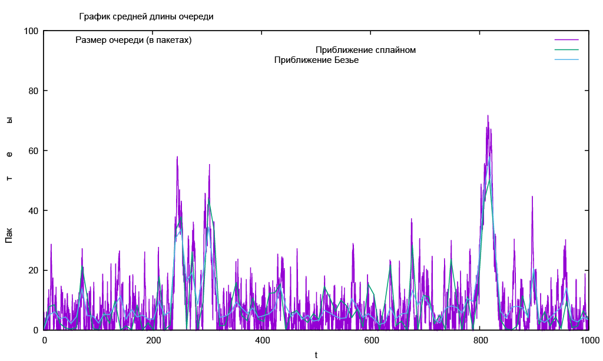

---
## Front matter
lang: ru-RU
title: Лабораторная работа №3
subtitle: Моделирование стохастических процессов
author:
  - Абу Сувейлим Мухаммед Мунивочи
institute:
  - Российский университет дружбы народов, Москва, Россия
date: 27 апреля 2024

## i18n babel
babel-lang: russian
babel-otherlangs: english
##mainfont: Arial
##monofont: Courier New
##fontsize: 8pt

## Formatting pdf
toc: false
toc-title: Содержание
slide_level: 2
aspectratio: 169
section-titles: true
theme: metropolis
header-includes:
 - \metroset{progressbar=frametitle,sectionpage=progressbar,numbering=fraction}
 - '\makeatletter'
 - '\beamer@ignorenonframefalse'
 - '\makeatother'
---

# Информация

## Докладчик

::::::::::::::: {.columns align=center}
::: {.column width="70%"}

  * Абу Сувейлим Мухаммед Мунифович
  * студент, НКНбд-01-21
  * Российский университет дружбы народов
  * [103221315@pfur.ru](mailto:103221315@pfur.ru)
:::
::: {.column width="30%"}

:::
::::::::::::::

# Вводная часть

## Актуальность

- Анализ прибытий в, например, банк или ресторан, а также анализ существующих в настоящее время процессов их обслуживания.

## Объект и предмет исследования

- Объектом исследования является NS-2, а предметом исследования является системы  массового обслуживания. [3]

## Цели и задачи

Приобретение навыков моделирования стохастических процессов на NS-2. [1]

## Материалы и методы

- Королькова, А. В. Моделирование информационных процессов : учебное
пособие / А. В. Королькова, Д. С. Кулябов. - М. : РУДН, 2014. -- 191 с. : ил. [1]

- Плескунов М.А. Теория массового обслуживания : учебное пособие / под
ред. Сесекин А.Н. Издательство Уральского университета, 2022. С. 264. [2]

- Queuing Theory Definition, Elements, and Example // investopedia URL: https://www.investopedia.com/terms/q/queuing-theory.asp (дата обращения: 27.04.2024). [3]

# Теоретическое введение

## Network Simulator

Система массового обслуживания (СМО) - система, предназначенная для многократно повторяющегося (многоразового) использования при решении однотипных задач. [2]

# Выполнение работы

## Реализация на NS-2 

  1. Во-первых, создадим новый файл example.tcl:

   ```sh
    touch example.tcl
   ```
## Реализация на NS-2  

  2. и откроем example.tcl на редактирование. Создадим новый объект Simulator.

   ```tcl
    set ns [new Simulator]
   ```
## Реализация на NS-2   
  
  3. Открывем на запись файл out.tr для регистрации событий.

   ```tcl
    set tf [open out.tr w]
    $ns trace-all $tf
   ```
## Реализация на NS-2   
  
  4. Размер очереди для M|M|1 (для M|M|1|R: set qsize R). Устанавливаем длительность эксперимента.
  
   ```tcl
    set qsize 100000
    set duration 1000.0
   ```
## Реализация на NS-2   

  5. Задаём узлы и соединяем их симплексным соединением с полосой пропускания 100 Кб/с и задержкой 0 мс, очередью с обслуживанием типа DropTail

   ```tcl
    set n1 [$ns node]
    set n2 [$ns node]
    set link [$ns simplex-link $n1 $n2 100kb 0ms DropTail]
   ```
## Реализация на NS-2   

  6. Наложем ограничения на размер очереди.

   ```tcl
    $ns queue-limit $n1 $n2 $qsize
   ```

## Реализация на NS-2 

  7. Задаём распределения интервалов времени поступления пакетов и размера пакетов.

   ```tcl
    set InterArrivalTime [new RandomVariable/Exponential]
    $InterArrivalTime set avg_ [expr 1/$lambda]
    set pktSize [new RandomVariable/Exponential]
    $pktSize set avg_ [expr 100000.0/(8*$mu)]
   ```
## Реализация на NS-2 

  8. Задаём агент UDP и присоединяем его к источнику, задаём размер пакета.

   ```tcl
    set src [new Agent/UDP]
    $src set packetSize_ 100000
    $ns attach-agent $n1 $src
   ```
## Реализация на NS-2

  9. Задаём агент-приёмник и присоединяем его:

   ```tcl
    set sink [new Agent/Null]
    $ns attach-agent $n2 $sink
    $ns connect $src $sin
   ```
## Реализация на NS-2

10. Мониторинг очереди:

   ```tcl
    sset qmon [$ns monitor-queue $n1 $n2 [open qm.out w] 0.1]
    $link queue-sample-timeout
   ```
## Реализация на NS-2

11. Процедура finish закрывает файлы трассировки
   ```tcl
    proc finish {} {
    global ns tf
    $ns flush-trace
    close $tf
    exit 0
    }
   ```
## Реализация на NS-2

12. Процедура случайного генерирования пакетов

   ```tcl
    proc sendpacket {} {
        global ns src InterArrivalTime pktSize
        set time [$ns now]
        $ns at [expr $time +[$InterArrivalTime value]] "sendpacket"
        set bytes [expr round ([$pktSize value])]
        $src send $bytes
    }
   ```
## Реализация на NS-2

13. Планировщик событий:

   ```tcl
    $ns at 0.0001 "sendpacket"
    $ns at $duration "finish"
   ```
## Реализация на NS-2

14. Расчет загрузки системы и вероятности потери пакетов

   ```tcl
    set rho [expr $lambda/$mu]
    set ploss [expr (1-$rho)*pow($rho,$qsize)/(1-pow($rho,($qsize+1)))]
    puts "Теоретическая вероятность потери = $ploss"

    set aveq [expr $rho*$rho/(1-$rho)]
    puts "Теоретическая средняя длина очереди = $aveq"
   ```
## Реализация на NS-2

15. Запуск модели

   ```tcl
    $ns run
   ```
## Реализация на NS-2

16. В каталоге с проектом создайте отдельный файл, например, graph_plot:
   
   ```sh
    touch graph_plot
   ```
## Реализация на NS-2

17. Откроем его на редактирование и добавьте следующий код, обращая внимание на синтаксис GNUplot:
   ```gnuplot
    #!/usr/bin/gnuplot -persist
   ```
## Реализация на NS-2

18. Задаём текстовую кодировку, тип терминала, тип и размер шрифта:

   ```gnuplot
    set encoding utf8
    set term pdfcairo font "Arial,9"
   ```
## Реализация на NS-2

19. Задаём выходной файл графика:

   ```gnuplot
    set out 'qm.pdf'
   ```
## Реализация на NS-2

20. Задаём название графика:

   ```gnuplot
    set title "График средней длины очереди"
   ```
## Реализация на NS-2

21. Задаём стиль линии:

   ```gnuplot
    set style line 3
   ```
## Реализация на NS-2

22. Изменение по Ox, Oy:
   
   ```gnuplot
    set xrange [0:1000]
    set yrange [0:100]
   ```
## Реализация на NS-2

23. Подписи осей графика:
   
   ```gnuplot
    set xlabel "t"
    set ylabel "Пакеты"
   ```
## Реализация на NS-2

24. Построение графика, используя значения 1-го и 5-го столбцов файла qm.out:

   ```gnuplot
    plot "qm.out" using ($1):($5) with lines title "Размер очереди (в пакетах)",\
    "qm.out" using ($1):($5) smooth csplines title "Приближение сплайном", \
    "qm.out" using ($1):($5) smooth bezier title "Приближение Безье"
   ```
# Результаты 

25. График поведения длины очереди:

  {#fig:001 width=70%}

## Вывод

- Изучали смоделировать СМО на NS-2. [1]