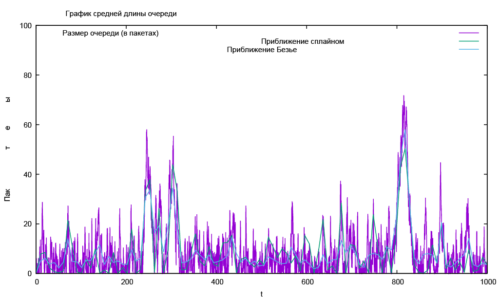

# Цель работы

- Приобретение навыков моделирования стохастических процессов на NS-2.

# Задание

$M | M | 1$ — однолинейная СМО с накопителем бесконечной ёмкости. Поступающий поток заявок — пуассоновский с интенсивностью $\lambda$. Времена обслуживания заявок — независимые в совокупности случайные величины, распределённые по экспоненциальному закону с параметром $\mu$.
Нужно моделировать эту систему на NS-2. [@book]

# Теоретическое введение

Система массового обслуживания (СМО) — система, пред‑
назначенная для многократно повторяющегося (многоразо‑
вого) использования при решении однотипных задач. [@CMO]


# Выполнение лабораторной работы

## Шаблон сценария для NS-2

1. Во-первых, создадим новый файл example.tcl:

   ```sh
      touch example.tcl
   ```

2. и откроем example.tcl на редактирование. Создадим новый объект Simulator.

   ```tcl
      set ns [new Simulator]
   ```
3. Открывем на запись файл out.tr для регистрации событий.

   ```tcl
      set tf [open out.tr w]
      $ns trace-all $tf
   ```
4. Задаём значения параметров системы.
   
   ```tcl
      set lambda 30.0
      set mu 33.0
   ```
5. Размер очереди для M|M|1 (для M|M|1|R: set qsize R). Устанавливаем длительность эксперимента.

    ```tcl
      set qsize 100000
      set duration 1000.0
   ```

6. Задаём узлы и соединяем их симплексным соединением с полосой пропускания 100 Кб/с и задержкой 0 мс, очередью с обслуживанием типа DropTail

   ```tcl
      set n1 [$ns node]
      set n2 [$ns node]
      set link [$ns simplex-link $n1 $n2 100kb 0ms DropTail]
   ```
7. Наложем ограничения на размер очереди.

   ```tcl
      $ns queue-limit $n1 $n2 $qsize
   ```
8. Задаём распределения интервалов времени поступления пакетов и размера пакетов.

   ```tcl
      set InterArrivalTime [new RandomVariable/Exponential]
      $InterArrivalTime set avg_ [expr 1/$lambda]
      set pktSize [new RandomVariable/Exponential]
      $pktSize set avg_ [expr 100000.0/(8*$mu)]
   ```

9. Задаём агент UDP и присоединяем его к источнику, задаём размер пакета.

   ```tcl
      set src [new Agent/UDP]
      $src set packetSize_ 100000
      $ns attach-agent $n1 $src
   ```

10. Задаём агент-приёмник и присоединяем его:

   ```tcl
      set sink [new Agent/Null]
      $ns attach-agent $n2 $sink
      $ns connect $src $sin
   ```

11. Мониторинг очереди:

   ```tcl
      sset qmon [$ns monitor-queue $n1 $n2 [open qm.out w] 0.1]
      $link queue-sample-timeout
   ```

12. Процедура finish закрывает файлы трассировки
   ```tcl
      proc finish {} {
      global ns tf
      $ns flush-trace
      close $tf
      exit 0
      }
   ```
13. Процедура случайного генерирования пакетов

   ```tcl
      proc sendpacket {} {
         global ns src InterArrivalTime pktSize
         set time [$ns now]
         $ns at [expr $time +[$InterArrivalTime value]] "sendpacket"
         set bytes [expr round ([$pktSize value])]
         $src send $bytes
      }
   ```
14. Планировщик событий:

   ```tcl
      $ns at 0.0001 "sendpacket"
      $ns at $duration "finish"
   ```
15. Расчет загрузки системы и вероятности потери пакетов

   ```tcl
      set rho [expr $lambda/$mu]
      set ploss [expr (1-$rho)*pow($rho,$qsize)/(1-pow($rho,($qsize+1)))]
      puts "Теоретическая вероятность потери = $ploss"

      set aveq [expr $rho*$rho/(1-$rho)]
      puts "Теоретическая средняя длина очереди = $aveq"
   ```
16. Запуск модели

   ```tcl
      $ns run
   ```
17. В каталоге с проектом создайте отдельный файл, например, graph_plot:
   
   ```sh
   touch graph_plot
   ```
18. Откроем его на редактирование и добавьте следующий код, обращая внимание на синтаксис GNUplot:
   ```gnuplot
   #!/usr/bin/gnuplot -persist
   ```
19. Задаём текстовую кодировку, тип терминала, тип и размер шрифта:

   ```gnuplot
      set encoding utf8
      set term pdfcairo font "Arial,9"
   ```
20. Задаём выходной файл графика:

   ```gnuplot
      set out 'qm.pdf'
   ```
21. Задаём название графика:

   ```gnuplot
      set title "График средней длины очереди"
   ```
22. Задаём стиль линии:

   ```gnuplot
      set style line 3
   ```
23. Изменение по Ox, Oy:
   
   ```gnuplot
      set xrange [0:1000]
      set yrange [0:100]
   ```
24. Подписи осей графика:
   
   ```gnuplot
      set xlabel "t"
      set ylabel "Пакеты"
   ```
25. Построение графика, используя значения 1-го и 5-го столбцов файла qm.out:

   ```gnuplot
      plot "qm.out" using ($1):($5) with lines title "Размер очереди (в пакетах)",\
      "qm.out" using ($1):($5) smooth csplines title "Приближение сплайном", \
      "qm.out" using ($1):($5) smooth bezier title "Приближение Безье"
   ```

26. График поведения длины очереди:

   {#fig:001 width=70%}


## Исходный код

### Управжение

1. Файл example: 

   ```tcl
      # создание объекта Simulator
      set ns [new Simulator]

      # открытие на запись файла out.tr для регистрации событий
      set tf [open out.tr w]
      $ns trace-all $tf

      # задаём значения параметров системы
      set lambda 30.0
      set mu 33.0

      # размер очереди для M|M|1 (для M|M|1|R: set qsize R)
      set qsize 100000

      # устанавливаем длительность эксперимента
      set duration 1000.0

      # задаём узлы и соединяем их симплексным соединением
      # с полосой пропускания 100 Кб/с и задержкой 0 мс,
      # очередью с обслуживанием типа DropTail
      set n1 [$ns node]
      set n2 [$ns node]
      set link [$ns simplex-link $n1 $n2 100kb 0ms DropTail]

      # наложение ограничения на размер очереди:
      $ns queue-limit $n1 $n2 $qsize

      # задаём распределения интервалов времени
      # поступления пакетов и размера пакетов
      set InterArrivalTime [new RandomVariable/Exponential]
      $InterArrivalTime set avg_ [expr 1/$lambda]
      set pktSize [new RandomVariable/Exponential]
      $pktSize set avg_ [expr 100000.0/(8*$mu)]

      # задаём агент UDP и присоединяем его к источнику,
      # задаём размер пакета
      set src [new Agent/UDP]
      $src set packetSize_ 100000
      $ns attach-agent $n1 $src

      # задаём агент-приёмник и присоединяем его
      set sink [new Agent/Null]
      $ns attach-agent $n2 $sink
      $ns connect $src $sink

      # мониторинг очереди
      set qmon [$ns monitor-queue $n1 $n2 [open qm.out w] 0.1]
      $link queue-sample-timeout

      # процедура finish закрывает файлы трассировки
      proc finish {} {
         global ns tf
         $ns flush-trace
         close $tf
         exit 0
      }

      # процедура случайного генерирования пакетов
      proc sendpacket {} {
         global ns src InterArrivalTime pktSize
         set time [$ns now]
         $ns at [expr $time +[$InterArrivalTime value]] "sendpacket"
         set bytes [expr round ([$pktSize value])]
         $src send $bytes
      }

      # планировщик событий
      $ns at 0.0001 "sendpacket"
      $ns at $duration "finish"


      # расчет загрузки системы и вероятности потери пакетов
      set rho [expr $lambda/$mu]
      set ploss [expr (1-$rho)*pow($rho,$qsize)/(1-pow($rho,($qsize+1)))]
      puts "Теоретическая вероятность потери = $ploss"

      set aveq [expr $rho*$rho/(1-$rho)]
      puts "Теоретическая средняя длина очереди = $aveq"

      # запуск модели
      $ns run
   ```
2. GNUPlot

   ```gnuplot
      #!/usr/bin/gnuplot -persist

      # задаём текстовую кодировку,
      # тип терминала, тип и размер шрифта
      set encoding utf8
      set term pdfcairo font "Arial,9"

      # задаём выходной файл графика
      set out 'qm.pdf'

      # задаём название графика
      set title "График средней длины очереди"

      # задаём стиль линии
      set style line 3

      # изменение по Ox, Oy
      set xrange [0:1000]
      set yrange [0:100]


      # подписи осей графика
      set xlabel "t"
      set ylabel "Пакеты"

      # построение графика, используя значения
      # 1-го и 5-го столбцов файла qm.out
      plot "qm.out" using ($1):($5) with lines title "Размер очереди (в пакетах)",\
         "qm.out" using ($1):($5) smooth csplines title "Приближение сплайном", \
         "qm.out" using ($1):($5) smooth bezier title "Приближение Безье"
   ```

# Вывод

- Изучали смоделировать СМО на NS-2. [@book]

# Библиография

::: {#refs}
:::