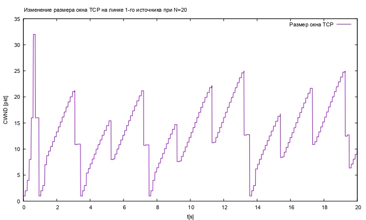
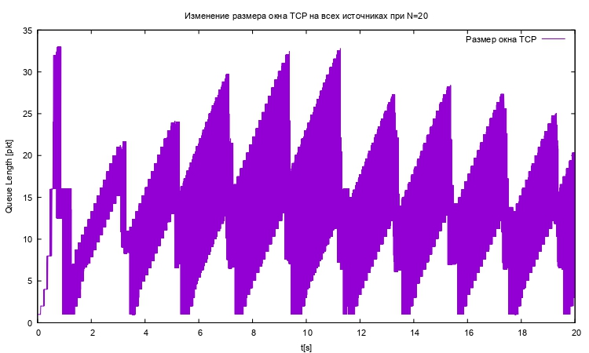
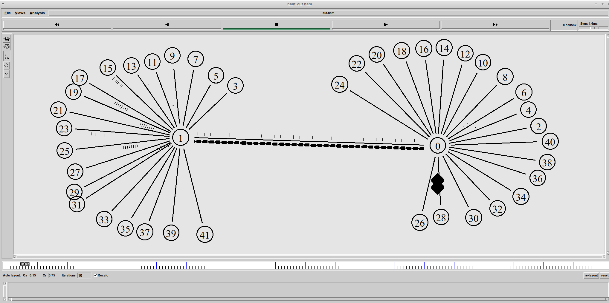

---
## Front matter
lang: ru-RU
title: Лабораторная работа №4
subtitle: Задание для самостоятельного выполнения
author:
  - Абу Сувейлим Мухаммед Мунивочи
institute:
  - Российский университет дружбы народов, Москва, Россия
date: 04 мая 2024

## i18n babel
babel-lang: russian
babel-otherlangs: english
##mainfont: Arial
##monofont: Courier New
##fontsize: 8pt

## Formatting pdf
toc: false
toc-title: Содержание
slide_level: 2
aspectratio: 169
section-titles: true
theme: metropolis
header-includes:
 - \metroset{progressbar=frametitle,sectionpage=progressbar,numbering=fraction}
 - '\makeatletter'
 - '\beamer@ignorenonframefalse'
 - '\makeatother'
---

# Информация

## Докладчик

::::::::::::::: {.columns align=center}
::: {.column width="70%"}

  * Абу Сувейлим Мухаммед Мунифович
  * студент, НКНбд-01-21
  * Российский университет дружбы народов
  * [1032215135@pfur.ru](mailto:1032215135@pfur.ru)
:::
::: {.column width="30%"}

:::
::::::::::::::

# Вводная часть

## Цели 
- Цели: 
   Приобретение навыков моделирования ситей на NS-2. [1]

## Задачи
1. Для приведённой схемы разработать имитационную модель в пакете NS-2.
2. Построить график изменения размера окна TCP (в Xgraph и в GNUPlot);
3. Построить график изменения длины очереди и средней длины очереди на первом маршрутизаторе.
4. Оформить отчёт о выполненной работе.

## Материалы и методы

- Королькова, А. В. Моделирование информационных процессов : учебное пособие / А. В. Королькова, Д. С. Кулябов. - М. : РУДН, 2014. -- 191 с. : ил. [1]

- Korolkova A., Kulyabov D., Черноиванов А. К вопросу о классификации алгоритмов RED // Вестник РУДН. Серия «Математика. Информатика. Физика». 2009. С. 34–46. [2]

- Алленов О.Алгоритм RED: красный светдля лишних пакетов [Электронный ресурс]. 1998. URL: https://www.osp.ru/nets/1998/09/143680. [3]

# Теоретическое введение

## Описание моделируемой сети:

- сеть состоит из N TCP-источников, N TCP-приёмников, двух маршрутизаторов
R1 и R2 между источниками и приёмниками (N — не менее 20);
- между TCP-источниками и первым маршрутизатором установлены дуплексные
соединения с пропускной способностью 100 Мбит/с и задержкой 20 мс очередью
типа DropTail;
- между TCP-приёмниками и вторым маршрутизатором установлены дуплексные
соединения с пропускной способностью 100 Мбит/с и задержкой 20 мс очередью
типа DropTail;
- между маршрутизаторами установлено симплексное соединение (R1–R2) с про-
пускной способностью 20 Мбит/с и задержкой 15 мс очередью типа RED,
размером буфера 300 пакетов; в обратную сторону — симплексное соедине-
ние (R2–R1) с пропускной способностью 15 Мбит/с и задержкой 20 мс очередью
типа DropTail;
- данные передаются по протоколу FTP поверх TCPReno;
- параметры алгоритма RED: $q_min = 75, q_max = 150, q_w = 0.002, p_max = 0.1$;
- максимальный размер TCP-окна 32; размер передаваемого пакета 500 байт; время
моделирования — не менее 20 единиц модельного времени.

# Выполнение работы

## Реализация на NS-2 

  1. Во-первых, создадим новый файл example.tcl:

   ```sh
      touch example.tcl
   ```
## Реализация на NS-2  

  2. и откроем example.tcl на редактирование. Создадим новый объект Simulator:

   ```tcl
      set ns [new Simulator]
   ```
## Реализация на NS-2   
  
  3. Открывем на запись файл out.tr для регистрации событий:

   ```tcl
      set tf [open out.tr w]
      $ns trace-all $tf
   ```
## Реализация на NS-2   
  
  4. Открытие на запись файла out.nam для визуализатора nam. Все результаты моделирования будут записаны в переменную nf:
   
   ```tcl
      set nf [open out.nam w]
      $ns namtrace-all $nf
   ```
## Реализация на NS-2   

  5. Максимальный размер TCP-окна 32; размер передаваемого пакета 500 байт:
   ```tcl
      Agent/TCP set window_ 32
      Agent/TCP set pktSize_ 500
   ```  
## Реализация на NS-2   

  6. Маршрутизаторы:
   ```tcl
      set node_(r1) [$ns node]
      set node_(r2) [$ns node]
   ```
## Реализация на NS-2 

  7. Узлы сети:

   ```tcl
      set N 20
      for {set i 0} {$i < $N} {incr i} {
         set node_(s$i) [$ns node]
         $ns duplex-link $node_(s$i) $node_(r1) 100Mb 20ms DropTail

         set node_(n$i) [$ns node]
         $ns duplex-link $node_(n$i) $node_(r2) 100Mb 20ms DropTail

         set tcp_($i) [$ns create-connection TCP/Reno $node_(s$i) TCPSink $node_(n$i) $i]
         set ftp_($i) [$tcp_($i) attach-source FTP]
      }
   ```
## Реализация на NS-2 

  8. Мониторниг очерды и размер окна:

   ```tcl
      set windowVsTime1A [open Window1A w]
      for {set i 0} {$i < $N} {incr i} {
         $ns at 0.0 "$ftp_($i) start"
         if {$i == 1} {
            set windowVsTime2B [open Window2B w] 	
         }
         set qmon [$ns monitor-queue $node_(s$i) $node_(r1) [open qm_($i).out w] 0.1];
         [$ns link $node_(s$i) $node_(r1)] queue-sample-timeout;
         $ns at 0.0 "plotWindow $tcp_($i) $windowVsTime1A"	
      }
      $ns at 0.0 "plotWindow $tcp_(1) $windowVsTime2B"
   ```
## Реализация на NS-2

  9. Между маршрутизаторами установлено симплексное соединение (R1–R2) с пропускной способностью 20 Мбит/с и задержкой 15 мс очередью типа RED, размером буфера 300 пакетов; в обратную сторону — симплексное соединение (R2–R1) с пропускной способностью 15 Мбит/с и задержкой 20 мс очередью типа DropTail:

   ```tcl
      $ns simplex-link $node_(r1) $node_(r2) 20Mb 15ms RED
      $ns queue-limit $node_(r1) $node_(r2) 300
      $ns simplex-link $node_(r2) $node_(r1) 15Mb 20ms DropTail
   ```
## Реализация на NS-2

10. Параметры алгоритма RED: q min = 75, q max = 150, q w = 0, 002, p max = 0.1:

   ```tcl
      set red [[$ns link $node_(r1) $node_(r2)] queue]
      $red set thresh_ 75
      $red set maxthresh_ 150
      $red set q_weight_ 0.002
      $red set linterm_ 0.1
   ```
## Реализация на NS-2

11. Формирование файла с данными о размере окна TCP. Здесь cwnd_ — текущее значение окна перегрузки:

   ```tcl
      proc plotWindow {tcpSource file} {
         global ns
         set time 0.01
         set now [$ns now]
         set cwnd [$tcpSource set cwnd_]
         puts $file "$now $cwnd"
         $ns at [expr $now+$time] "plotWindow $tcpSource $file"
      }
   ```
## Реализация на NS-2

2. Мониторинг очереди:

   ```tcl
      set tchan_ [open all.q w]
      $red trace curq_
      $red trace ave_
      $red attach $tchan_
   ```
## Реализация на NS-2

13. Процедура finish:

   ```tcl
      proc finish {} {
         global ns nf tf tchan_ N
         $ns flush-trace
         close $nf
         # подключение кода AWK:
         set awkCode {
         {
            if ($1 == "Q" && NF>2) {
               print $2, $3 >> "CurrentQueue";
               set end $2
         }
            else if ($1 == "a" && NF>2)
            print $2, $3 >> "AvrageQueue";
         }
         }

         if { [info exists tchan_] } {
            close $tchan_
         }
   ```
## Реализация на NS-2

   ```tcl
      exec rm -f Current-Queue Avrage-Queue
      exec touch Avrage-Queue Current-Queue
      exec awk $awkCode all.q
      puts $tf \"queue
      exec cat Current-Queue >@ $tf
      puts $tf \n\"ave-queue"
      exec cat Avrage-Queue >@ $tf
      close $tf


      # Запуск xgraph с графиками окна TCP и очереди:
      exec xgraph -bb -tk -x time -t CWND "windowVsTime2B" Window2B &
      exec xgraph -bb -tk -x time -t CWND "windowVsTime1A" Window1A &
      exec xgraph -bb -tk -x time -y "CurrentQueue" CurrentQueue &
      exec xgraph -bb -tk -x time -y "AvrageQueue" AvrageQueue &
      exec nam out.nam &
      exit 0
   }
   ```
## Реализация на NS-2

14. Планировщик событий и запуск модели:

   ```tcl
      $ns at 20 "finish"
      $ns run
   ```
# Результаты 

## График изменении размера окна TCP на линке 1-го источника при N=20

15. График изменении размера окна TCP на линке 1-го источника при N=20:

   {#fig:001 width=70%}

## График изменении размера окна TCP на всех источниках при N=20

16. График изменении размера окна TCP на всех источниках при N=20:

   {#fig:002 width=70%}

## График изменении размера длины очереди на линке (R1–R2) при N=20, qmin = 75, qmax = 150

17. График изменении размера длины очереди на линке (R1–R2) при N=20, qmin = 75, qmax = 150:

   {#fig:003 width=70%}

## График изменении размера средней длины очереди на линке (R1–R2) при N=20, qmin = 75, qmax = 150

18. График изменении размера средней длины очереди на линке (R1–R2) при N=20, qmin = 75, qmax = 150:
   {#fig:004 width=70%}
   
## Схема моделируемой сети при N=20

19. Схема моделируемой сети при N=20
   {#fig:004 width=70%}

## Вывод

- Изучали как работает алгоритм RED. [1]