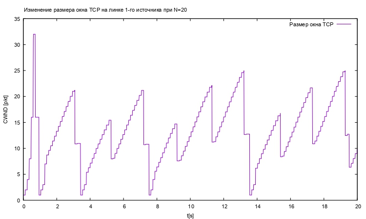

# Цель работы

- Приобретение навыков моделирования ситей на NS-2.

# Задание

Описание моделируемой сети:
- сеть состоит из N TCP-источников, N TCP-приёмников, двух маршрутизаторов
R1 и R2 между источниками и приёмниками (N — не менее 20);
- между TCP-источниками и первым маршрутизатором установлены дуплексные
соединения с пропускной способностью 100 Мбит/с и задержкой 20 мс очередью
типа DropTail;
- между TCP-приёмниками и вторым маршрутизатором установлены дуплексные
соединения с пропускной способностью 100 Мбит/с и задержкой 20 мс очередью
типа DropTail;
- между маршрутизаторами установлено симплексное соединение (R1–R2) с про-
пускной способностью 20 Мбит/с и задержкой 15 мс очередью типа RED,
размером буфера 300 пакетов; в обратную сторону — симплексное соедине-
ние (R2–R1) с пропускной способностью 15 Мбит/с и задержкой 20 мс очередью
типа DropTail;
- данные передаются по протоколу FTP поверх TCPReno;
- параметры алгоритма RED: $q_min = 75, q_max = 150, q_w = 0.002, p_max = 0.1$;
- максимальный размер TCP-окна 32; размер передаваемого пакета 500 байт; время
моделирования — не менее 20 единиц модельного времени.

Задание
1. Для приведённой схемы разработать имитационную модель в пакете NS-2.
2. Построить график изменения размера окна TCP (в Xgraph и в GNUPlot);
3. Построить график изменения длины очереди и средней длины очереди на первом маршрутизаторе.
4. Оформить отчёт о выполненной работе.


# Теоретическое введение

"Алгоритм Random Early Detection (RED) лежит в основе ряда механизмов предотвращения и контроля перегрузок в очередях маршрутизаторов. Его основное предназначение заключается в сглаживании временных всплесков трафика и предупреждении длительной перегрузки сети посредством уведомления источников трафика о необходимости снижения интенсивности передачи информации." [@article]
Алгоритм RED позволяет контролировать нагрузку с помощью выборочного случайного уничтожения некоторых пакетов, что заставляет протоколы, подобные TCP, снижать скорость передачи. При потере хотя бы одного пакета протокол TCP начинает процедуру Slow Start заново; это снижает объем трафика, поступающего в сеть. Наиболее разумно - не дожидаться полной перегрузки сети (тогда будет удален весь трафик), а уже на подступах к опасному порогу начать выборочное уничтожение отдельных пакетов, информируя тем самым источники нагрузки о текущей пропускной способности сети. [@osp]


# Выполнение лабораторной работы

## Шаблон сценария для NS-2

1. Во-первых, создадим новый файл example.tcl:

   ```sh
      touch example.tcl
   ```

2. и откроем example.tcl на редактирование. Создадим новый объект Simulator:

   ```tcl
      set ns [new Simulator]
   ```
3. Открывем на запись файл out.tr для регистрации событий:

   ```tcl
      set tf [open out.tr w]
      $ns trace-all $tf
   ```
4. Открытие на запись файла out.nam для визуализатора nam. Все результаты моделирования будут записаны в переменную nf:
   
   ```tcl
      set nf [open out.nam w]
      $ns namtrace-all $nf
   ```
5. Максимальный размер TCP-окна 32; размер передаваемого пакета 500 байт:

    ```tcl
      Agent/TCP set window_ 32
      Agent/TCP set pktSize_ 500
   ```

6. Маршрутизаторы:
   ```tcl
      set node_(r1) [$ns node]
      set node_(r2) [$ns node]
   ```
7. Узлы сети:

   ```tcl
      set N 20
      for {set i 0} {$i < $N} {incr i} {
         set node_(s$i) [$ns node]
         $ns duplex-link $node_(s$i) $node_(r1) 100Mb 20ms DropTail

         set node_(n$i) [$ns node]
         $ns duplex-link $node_(n$i) $node_(r2) 100Mb 20ms DropTail

         set tcp_($i) [$ns create-connection TCP/Reno $node_(s$i) TCPSink $node_(n$i) $i]
         set ftp_($i) [$tcp_($i) attach-source FTP]
      }
   ```
8. Мониторниг очерды и размер окна:

   ```tcl
      set windowVsTime1A [open Window1A w]
      for {set i 0} {$i < $N} {incr i} {
         $ns at 0.0 "$ftp_($i) start"
         if {$i == 1} {
            set windowVsTime2B [open Window2B w] 	
         }
         set qmon [$ns monitor-queue $node_(s$i) $node_(r1) [open qm_($i).out w] 0.1];
         [$ns link $node_(s$i) $node_(r1)] queue-sample-timeout;
         $ns at 0.0 "plotWindow $tcp_($i) $windowVsTime1A"	
      }
      $ns at 0.0 "plotWindow $tcp_(1) $windowVsTime2B"
   ```

9. Между маршрутизаторами установлено симплексное соединение (R1–R2) с пропускной способностью 20 Мбит/с и задержкой 15 мс очередью типа RED, размером буфера 300 пакетов; в обратную сторону — симплексное соединение (R2–R1) с пропускной способностью 15 Мбит/с и задержкой 20 мс очередью типа DropTail:

   ```tcl
      $ns simplex-link $node_(r1) $node_(r2) 20Mb 15ms RED
      $ns queue-limit $node_(r1) $node_(r2) 300
      $ns simplex-link $node_(r2) $node_(r1) 15Mb 20ms DropTail
   ```

10. Параметры алгоритма RED: q min = 75, q max = 150, q w = 0, 002, p max = 0.1:

   ```tcl
      set red [[$ns link $node_(r1) $node_(r2)] queue]
      $red set thresh_ 75
      $red set maxthresh_ 150
      $red set q_weight_ 0.002
      $red set linterm_ 0.1
   ```

11. Формирование файла с данными о размере окна TCP. Здесь cwnd_ — текущее значение окна перегрузки:

   ```tcl
      proc plotWindow {tcpSource file} {
         global ns
         set time 0.01
         set now [$ns now]
         set cwnd [$tcpSource set cwnd_]
         puts $file "$now $cwnd"
         $ns at [expr $now+$time] "plotWindow $tcpSource $file"
      }
   ```

12. Мониторинг очереди:

   ```tcl
      set tchan_ [open all.q w]
      $red trace curq_
      $red trace ave_
      $red attach $tchan_
   ```
13. Процедура finish:

   ```tcl
      proc finish {} {
         global ns nf tf tchan_ N
         $ns flush-trace
         close $nf
         # подключение кода AWK:
         set awkCode {
         {
            if ($1 == "Q" && NF>2) {
               print $2, $3 >> "CurrentQueue";
               set end $2
         }
            else if ($1 == "a" && NF>2)
            print $2, $3 >> "AvrageQueue";
         }
         }

         if { [info exists tchan_] } {
            close $tchan_
         }


         exec rm -f Current-Queue Avrage-Queue
         exec touch Avrage-Queue Current-Queue
         exec awk $awkCode all.q
         puts $tf \"queue
         exec cat Current-Queue >@ $tf
         puts $tf \n\"ave-queue"
         exec cat Avrage-Queue >@ $tf
         close $tf


         # Запуск xgraph с графиками окна TCP и очереди:
         exec xgraph -bb -tk -x time -t CWND "windowVsTime2B" Window2B &
         exec xgraph -bb -tk -x time -t CWND "windowVsTime1A" Window1A &
         exec xgraph -bb -tk -x time -y "CurrentQueue" CurrentQueue &
         exec xgraph -bb -tk -x time -y "AvrageQueue" AvrageQueue &
         exec nam out.nam &
         exit 0
      }
   ```
14. Планировщик событий и запуск модели:

   ```tcl
      $ns at 20 "finish"
      $ns run
   ```
15. В каталоге с проектом создайте отдельный файл, например, graph-plot:
   
   ```sh
   touch graph-plot
   ```
16. Откроем его на редактирование и добавьте следующий код, обращая внимание на синтаксис GNUplot:

   ```gnuplot
      #!/usr/bin/gnuplot -persist
   ```
17. Задаём текстовую кодировку, тип терминала, тип и размер шрифта:

   ```gnuplot
      set encoding utf8
      set term pdfcairo font "Arial,9"
   ```
18. Задаём выходной файл графика:

   ```gnuplot
      set out 'qm.pdf'
   ```
19. Задаём название графика:

   ```gnuplot
      set title "Изменение размера окна ТСР на линке 1-го источника при N=20"
   ```
20. Задаём стиль линии:

   ```gnuplot
      set style line 3
   ```
21. Подписи осей графика:
   
   ```gnuplot
      set xlabel "t[s]"
      set ylabel "CWND [pkt]"
   ```
22. построение графика, используя значения 1-го и 2-го столбцов файла qm. out:

   ```gnuplot
      plot "Window2B" using ($1):($2) with lines title "Размер окна ТСР"
      set out 'A&Q.pdf'
      set title "Изменение размера окна ТСР на всех источниках при N=20"
      plot "Window1A" using ($1): ($2) with lines title "Размер окна ТСР"
      set out 'Current Queue.pdf'
   ```
23. Создадим новые графики:
   ```gnuplot
      set title "Изменение размера длины очереди на линке (R1-R2)"

      set xlabel "t[s]"
      set ylabel "Queue Length [pkt]"
      plot "CurrentQueue" using ($1): ($2) with lines title "Текущая длина очереди"

      set out 'Avrage Queue.pdf

      set out 'A&Q.pdf'
      set title "Изменение размера окна ТСР на всех источниках при N=20"
      plot "Window1A" using ($1): ($2) with lines title "Размер окна ТСР" 

      set out 'CurrQueue.pdf'

      set title "Изменение размера длины очереди на линке (R1-R2)"

      set xlabel "t[s]"
      set ylabel "Queue Length [pkt]"
      plot "CurrentQueue" using ($1): ($2) with lines title "Текущая длина очереди"

      set out 'Avrage Queue.pdf'

      set title "Изменение размера средней длины очереди на линке (R1-R2)"

      set xlabel "t[s]"
      set ylabel "Queue Length [pkt]"
      plot "AvrageQueue" using ($1): ($2) with lines title "Средняя длина очереди"
   ```
26. График изменении размера окна TCP на линке 1-го источника при N=20:

   {#fig:001 width=70%}
27. График изменении размера окна TCP на всех источниках при N=20:

   {#fig:002 width=70%}
28. График изменении размера длины очереди на линке (R1–R2) при N=20, qmin = 75, qmax = 150:

   {#fig:003 width=70%}
28. График изменении размера средней длины очереди на линке (R1–R2) при N=20, qmin = 75, qmax = 150:

   {#fig:004 width=70%}

## Исходный код

### Управжение

1. Файл example: 

   ```tcl
      # создание объекта Simulator
      set ns [new Simulator]

      # открытие на запись файла out.nam для визуализатора nam
      set nf [open out.nam w]

      # все результаты моделирования будут записаны в переменную nf
      $ns namtrace-all $nf

      # открытие на запись файла out.tr для регистрации событий
      set tf [open out.tr w]
      $ns trace-all $tf

      #максимальный размер TCP-окна 32; размер передаваемого пакета 500 байт;
      Agent/TCP set window_ 32
      Agent/TCP set pktSize_ 500


      # маршрутизаторы
      set node_(r1) [$ns node]
      set node_(r2) [$ns node]

      # Узлы сети:
      set N 20
      for {set i 0} {$i < $N} {incr i} {
         set node_(s$i) [$ns node]
         $ns duplex-link $node_(s$i) $node_(r1) 100Mb 20ms DropTail

         set node_(n$i) [$ns node]
         $ns duplex-link $node_(n$i) $node_(r2) 100Mb 20ms DropTail

         set tcp_($i) [$ns create-connection TCP/Reno $node_(s$i) TCPSink $node_(n$i) $i]
         set ftp_($i) [$tcp_($i) attach-source FTP]
      }

      set windowVsTime1A [open Window1A w]

      for {set i 0} {$i < $N} {incr i} {
         $ns at 0.0 "$ftp_($i) start"
         if {$i == 1} {
            set windowVsTime2B [open Window2B w] 	
         }
         set qmon [$ns monitor-queue $node_(s$i) $node_(r1) [open qm_($i).out w] 0.1];
         [$ns link $node_(s$i) $node_(r1)] queue-sample-timeout;
         $ns at 0.0 "plotWindow $tcp_($i) $windowVsTime1A"	
      }
      $ns at 0.0 "plotWindow $tcp_(1) $windowVsTime2B"


      # между маршрутизаторами установлено симплексное соединение (R1–R2) с про-
      # пускной способностью 20 Мбит/с и задержкой 15 мс очередью типа RED,
      # размером буфера 300 пакетов; в обратную сторону — симплексное соедине-
      # ние (R2–R1) с пропускной способностью 15 Мбит/с и задержкой 20 мс очередью
      # типа DropTail;
      $ns simplex-link $node_(r1) $node_(r2) 20Mb 15ms RED
      $ns queue-limit $node_(r1) $node_(r2) 300
      $ns simplex-link $node_(r2) $node_(r1) 15Mb 20ms DropTail

      # Параметры алгоритма RED: q min = 75, q max = 150, q w = 0, 002, p max = 0.1;
      set red [[$ns link $node_(r1) $node_(r2)] queue]
      $red set thresh_ 75
      $red set maxthresh_ 150
      $red set q_weight_ 0.002
      $red set linterm_ 10


      # Формирование файла с данными о размере окна TCP:
      proc plotWindow {tcpSource file} {
         global ns
         set time 0.01
         set now [$ns now]
         set cwnd [$tcpSource set cwnd_]
         puts $file "$now $cwnd"
         $ns at [expr $now+$time] "plotWindow $tcpSource $file"
      }
      # Здесь cwnd_ — текущее значение окна перегрузки.

      # Мониторинг очереди:
      set tchan_ [open all.q w]
      $red trace curq_
      $red trace ave_
      $red attach $tchan_


      # Процедура finish:
      proc finish {} {
         global ns nf tf tchan_ N
         $ns flush-trace
         close $nf
         # подключение кода AWK:
         set awkCode {
         {
            if ($1 == "Q" && NF>2) {
               print $2, $3 >> "CurrentQueue";
               set end $2
         }
            else if ($1 == "a" && NF>2)
            print $2, $3 >> "AvrageQueue";
         }
         }

         if { [info exists tchan_] } {
            close $tchan_
         }


         exec rm -f Current-Queue Avrage-Queue
         exec touch Avrage-Queue Current-Queue
         exec awk $awkCode all.q
         puts $tf \"queue
         exec cat Current-Queue >@ $tf
         puts $tf \n\"ave-queue"
         exec cat Avrage-Queue >@ $tf
         close $tf


         # Запуск xgraph с графиками окна TCP и очереди:
         exec xgraph -bb -tk -x time -t CWND "windowVsTime2B" Window2B &
         exec xgraph -bb -tk -x time -t CWND "windowVsTime1A" Window1A &
         exec xgraph -bb -tk -x time -y "CurrentQueue" CurrentQueue &
         exec xgraph -bb -tk -x time -y "AvrageQueue" AvrageQueue &
         exec nam out.nam &
         exit 0
      }

      $ns at 20 "finish"
      $ns run
   ```
2. GNUPlot

   ```gnuplot
      #!/usr/bin/gnuplot -persist
      # задаём текстовую кодировку, 
      # тип терминала, тип и размер шрифта

      set encoding utf8
      set term pdfcairo font "Arial,9"

      # задаём выходной файл графика
      set out 'qm.pdf'

      # задаём название графика
      set title "Изменение размера окна ТСР на линке 1-го источника при N=20" 

      # задаём стиль линии
      set style line 3
      # подписи осей графика
      set xlabel "t[s]"
      set ylabel "CWND [pkt]"

      # построение графика, используя значения 
      # 1-го и 2-го столбцов файла qm. out
      plot "Window2B" using ($1):($2) with lines title "Размер окна ТСР"
      set out 'A&Q.pdf'
      set title "Изменение размера окна ТСР на всех источниках при N=20"
      plot "Window1A" using ($1): ($2) with lines title "Размер окна ТСР"

      set out 'Current Queue.pdf'

      set title "Изменение размера длины очереди на линке (R1-R2)"

      set xlabel "t[s]"
      set ylabel "Queue Length [pkt]"
      plot "CurrentQueue" using ($1): ($2) with lines title "Текущая длина очереди"

      set out 'Avrage Queue.pdf

      set out 'A&Q.pdf'

      set title "Изменение размера окна ТСР на всех источниках при N=20"
      plot "Window1A" using ($1): ($2) with lines title "Размер окна ТСР" 

      set out 'CurrQueue.pdf'

      set title "Изменение размера длины очереди на линке (R1-R2)"

      set xlabel "t[s]"
      set ylabel "Queue Length [pkt]"
      plot "CurrentQueue" using ($1): ($2) with lines title "Текущая длина очереди"

      set out 'Avrage Queue.pdf'

      set title "Изменение размера средней длины очереди на линке (R1-R2)"

      set xlabel "t[s]"
      set ylabel "Queue Length [pkt]"
      plot "AvrageQueue" using ($1): ($2) with lines title "Средняя длина очереди"
   ```

# Вывод

- Изучали как работает алгоритм RED. [@book]

# Библиография

::: {#refs}
:::