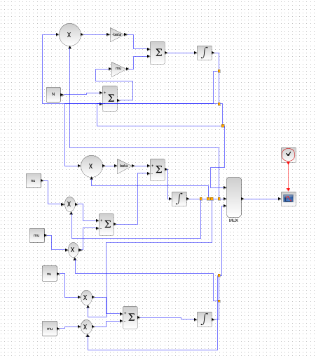
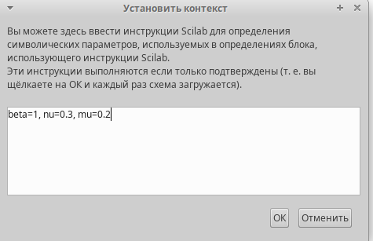
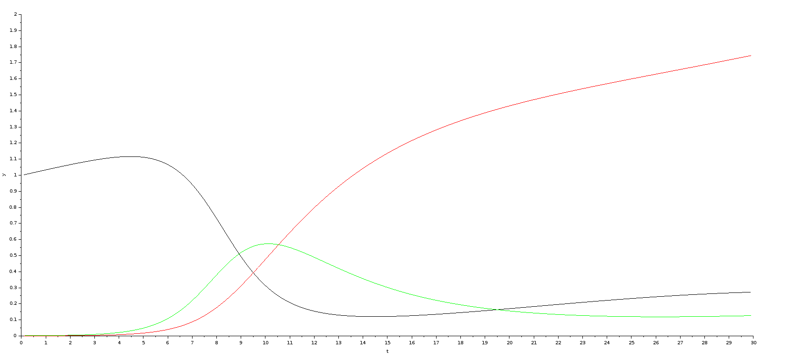
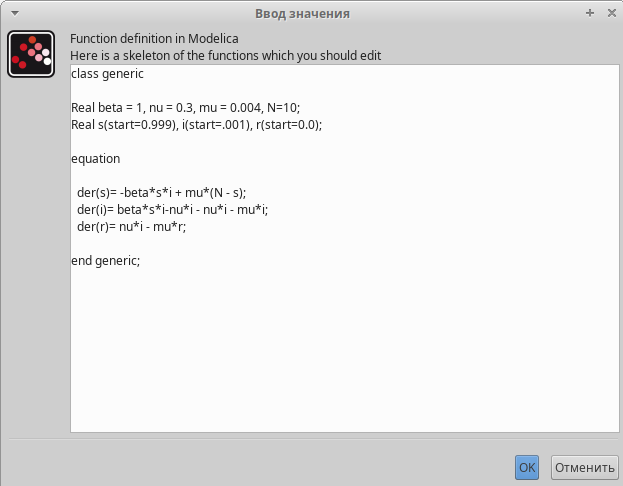
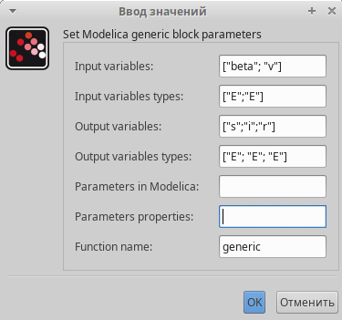
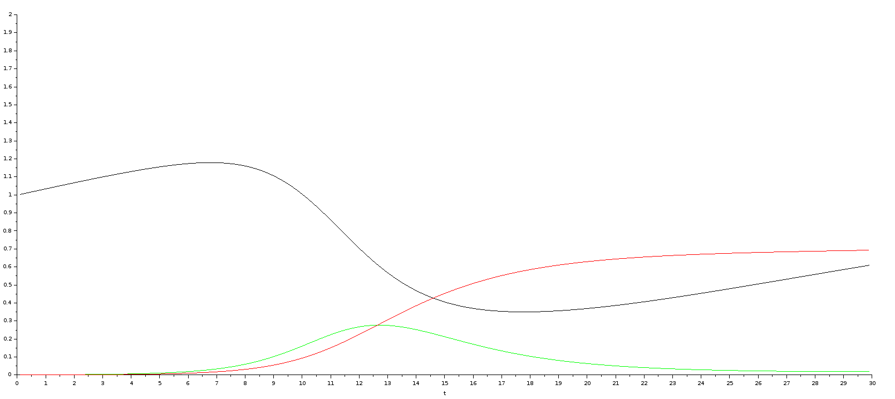
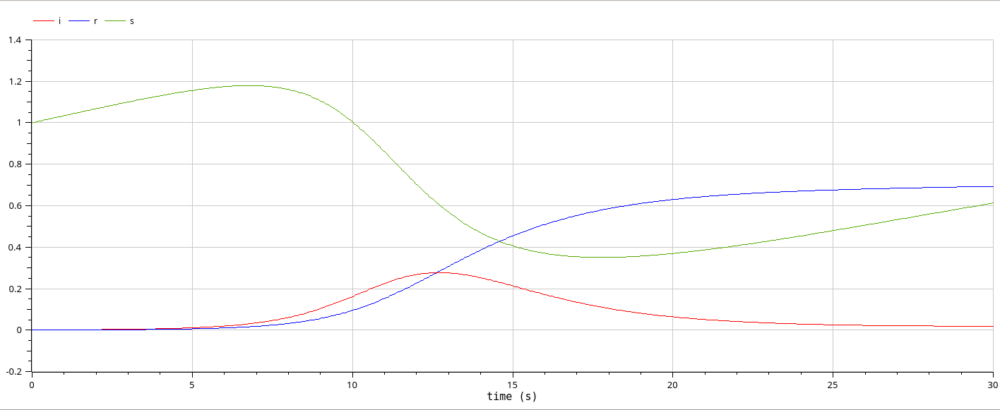

---
## Front matter
lang: ru-RU
title: Лабораторная работа 5
subtitle: Модель эпидемии (SIR)
author:
  - Абу Сувейлим Мухаммед Мунивочи
institute:
  - Российский университет дружбы народов, Москва, Россия
date: 11 мая 2024

## i18n babel
babel-lang: russian
babel-otherlangs: english
mainfont: Arial
##monofont: Courier New
fontsize: 8pt

## Formatting pdf
toc: false
toc-title: Содержание
slide_level: 2
aspectratio: 169
section-titles: true
theme: metropolis
header-includes:
 - \metroset{progressbar=frametitle,sectionpage=progressbar,numbering=fraction}
 - '\makeatletter'
 - '\beamer@ignorenonframefalse'
 - '\makeatother'
---

# Информация

## Докладчик

::::::::::::::: {.columns align=center}
::: {.column width="70%"}

  * Абу Сувейлим Мухаммед Мунифович
  * студент, НКНбд-01-21
  * Российский университет дружбы народов
  * [1032215135@pfur.ru](mailto:1032215135@pfur.ru)
:::
::: {.column width="30%"}

:::
::::::::::::::

# Вводная часть

## Цели 

Цели:

   - Приобретение навыков математического моделирования в xcos, modelica и OpenModelica.

## Задачи

В дополнение к предположениям, которые были сделаны для модели SIR (5.1), предположим, что учитываются демографические процессы, в частности, что смертность
в популяции полностью уравновешивает рождаемость, а все рожденные индивидуумы появляются на свет абсолютно здоровыми.

## Задачи

Тогда получим следующую систему
уравнений:

$$
\begin{cases}
\dot{s} = -\beta s(t)i(t) + \mu (N-s(t));\\
\dot{i} = \beta s(t)i(t) - vi(t) - \mu i(t); \\
\dot{r} = vi(t) - \mu r(t), 
\end{cases}
$$ 
где $\mu$ — константа, которая равна коэффициенту смертности и рождаемости.

## Задачи

Требуется:

- реализовать модель SIR с учётом процесса рождения / гибели особей в xcos (в
том числе и с использованием блока Modelica), а также в OpenModelica;

- построить графики эпидемического порога при различных значениях параметров
модели (в частности изменяя параметр $\mu$);

- сделать анализ полученных графиков в зависимости от выбранных значений
параметров модели.

## Материалы и методы

- Xcos (через Scilab), modelicd (в Xcos), OpenModelica.

- Королькова, А. В. Моделирование информационных процессов : учебное пособие / А. В. Королькова, Д. С. Кулябов. - М. : РУДН, 2014. -- 191 с. : ил. [1]

- Жумартова Б. О. Ж.Б.О. ПРИМЕНЕНИЕ SIR МОДЕЛИ В МОДЕЛИРОВАНИИ
ЭПИДЕМИЙ // Международный журнал гуманитарных и естественных
наук. 2021. Т. 63, № 12-2. С. 6–9. [2]


# Теоретическое введение

## Описание моделируемой сети:

Модель SIR (модель Кермака Маккедрика) – одна из простейших компартментных моделей, в которых с помощью систем дифференциальных уравнений описывается динамика групп восприимчивых, инфицированных и выздоровевших индивидов. Многие модели являются производными от этой базовой формы. Модель состоит из трех «ячеек». S: количество лиц, восприимчивые к инфекции, то есть, те люди, которые не имеют иммунитета к данному вирусу и потенциально могут заразиться. I: число инфицированных в некоторый момент времени. Это инфицированные люди, способные заразить восприимчивых людей. R: количество людей, которые переболели, имеют иммунитет, или число умерших лиц [2].

# Выполнение работы

## Scilab 

   1. Во-первых, я открыл scilab.
   2. Далее, я открыл, через инструменты, Визуальное моделирование Xcos.

## Xcos

   3. В Xcos я добавыл регистратор CSCOPE, мультиплексер MUX, три блока интегрирования GAINBLK_f — в данном случае позволяет задать значения коэффициентов β и ν; SUMMATION - блок суммирования, PROD_f  — поэлементное произведение двух векторов на входе блока, и запуск часов модельного времени CLOCK_c.

## Xcos
  
   4. Ниже на рис. 7 показано схема модели:

   {#fig:001 width=30%}

## Xcos
  
   5. Константы по мимо N=10:
   
   {#fig:002 width=50%}

## Xcos

   6. Получаем следующей график в xcos:
      
      {#fig:003 width=70%}

## modelica

   7. Код второй модели в modelica:

   {#fig:004 width=50%}

## modelica

   8. Папаметры моделирования:

   {#fig:005 width=50%}

## modelica

   9. Получаем следующей график в modelica:

      {#fig:006 width=70%}

## OpenModelica

    10. Код модели 2 в OpenModelica:  
    
   ```openmodelica
      model SIR_model_02
      Real beta = 1, nu = 0.3, mu = 0.004, N=10;
      Real s(start=0.999), i(start=.001), r(start=0.0);
      equation
      der(s)= -beta*s*i + mu*(N - s);
      der(i)= beta*s*i-nu*i - nu*i - mu*i;
      der(r)= nu*i - mu*r;
      end SIR_model_02;
   ```

## OpenModelica

   10. Получаем следующей график в OpenModelica:

   {#fig:007 width=70%}


## Вывод

- Изучали как работать с xocs, modelica и OpenModelica. [1]
