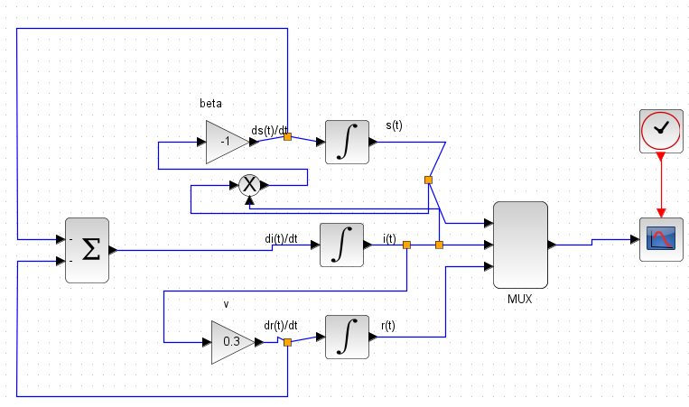
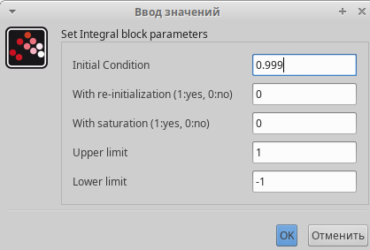
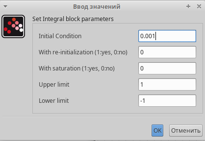
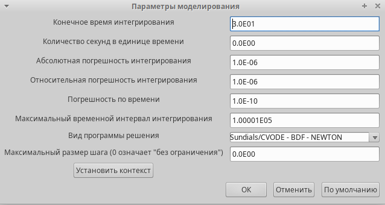
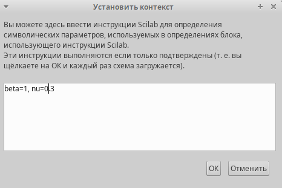
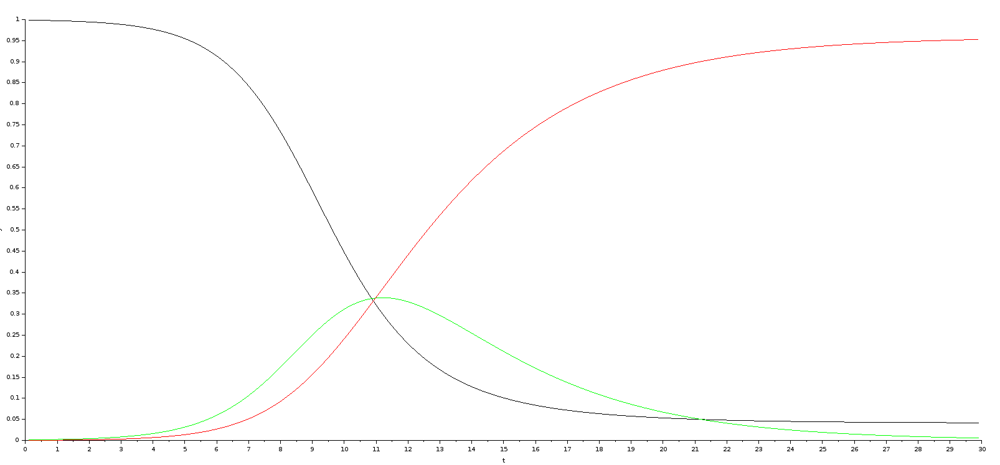
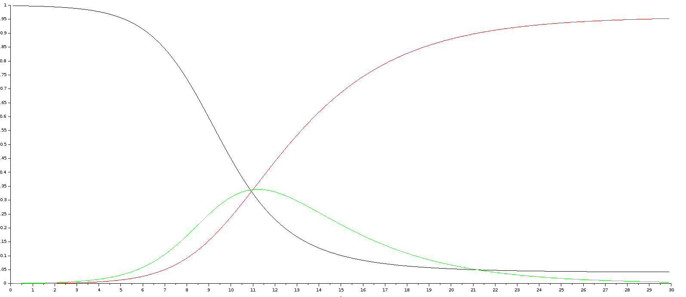

# Цель работы

- Приобретение навыков математического моделирования в xcos.

# Задание

В дополнение к предположениям, которые были сделаны для модели SIR (5.1), предположим, что учитываются демографические процессы, в частности, что смертность
в популяции полностью уравновешивает рождаемость, а все рожденные индивидуумы появляются на свет абсолютно здоровыми. Тогда получим следующую систему
уравнений:

$$
\begin{cases}
\dot{s} = -\beta s(t)i(t) + \mu (N-s(t));\\
\dot{i} = \beta s(t)i(t) - vi(t) - \mu i(t); \\
\dot{r} = vi(t) - \mu r(t), 
\end{cases}
$$ 
где $\mu$ — константа, которая равна коэффициенту смертности и рождаемости.

Требуется:
- реализовать модель SIR с учётом процесса рождения / гибели особей в xcos (в
том числе и с использованием блока Modelica), а также в OpenModelica;
- построить графики эпидемического порога при различных значениях параметров
модели (в частности изменяя параметр $\mu$);
- сделать анализ полученных графиков в зависимости от выбранных значений
параметров модели.

# Теоретическое введение

Модель SIR (модель Кермака Маккедрика) – одна из простейших компартментных моделей, в которых с помощью систем дифференциальных уравнений описывается динамика групп восприимчивых, инфицированных и выздоровевших индивидов. Многие модели являются производными от этой базовой формы. Модель состоит из трех «ячеек». S: количество лиц, восприимчивые к инфекции, то есть, те люди, которые не имеют иммунитета к данному вирусу и потенциально могут заразиться. I: число инфицированных в некоторый момент времени. Это инфицированные люди, способные заразить восприимчивых людей. R: количество людей, которые переболели, имеют иммунитет, или число умерших лиц [@Zhumartova].

# Выполнение лабораторной работы

## Реализация модели в xcos

1. Во-первых, я открыл scilab.
2. Далее, я открыл, через инструменты, Визуальное моделирование Xcos.
3. В Xcos я добавыл регистратор CSCOPE, мультиплексер MUX, три блока интегрирования, GAINBLK_f — в данном случае позволяет задать значения коэффициентов β и ν; SUMMATION - блок суммирования, PROD_f  — поэлементное произведение двух векторов на входе блока, и запуск часов модельного времени CLOCK_c. Ниже на рис. 1 показано модели:

   {#fig:001 width=70%}

4. Ниже папаметры интегралов:

   {#fig:002 width=70%}

   {#fig:003 width=70%}

5. Папаметры моделирования:
   
   {#fig:004 width=70%}

6. Константы модели 1:

   {#fig:005 width=70%}

7. Получаем следующей график в xcos:

   {#fig:006 width=70%}

8. Получаем следующей график в modelica:

   {#fig:007 width=70%}

## Реализация задания в xcos, modelica и OpenModelica

9. Ниже на рис. 7 показано схема модели:

   {#fig:008 width=70%}

10. Константы по мимо N=10:
   
   {#fig:009 width=70%}

11. Получаем следующей график в xcos:

   {#fig:010 width=70%}

12. Код второй модели в modelica:

   {#fig:011 width=70%}

13. Папаметры моделирования:

   {#fig:012 width=70%}

14. Получаем следующей график в modelica:

   {#fig:013 width=70%}

15. Код модели 2 в OpenModelica:

   ```openmodelica
      model SIR_model_02

      Real beta = 1, nu = 0.3, mu = 0.004, N=10;
      Real s(start=0.999), i(start=.001), r(start=0.0);

      equation

      der(s)= -beta*s*i + mu*(N - s);
      der(i)= beta*s*i-nu*i - nu*i - mu*i;
      der(r)= nu*i - mu*r;

      end SIR_model_02;
   ```

16. Получаем следующей график в OpenModelica:

   {#fig:014 width=70%}

# Вывод

- Изучали как работать с xocs, modelica и OpenModelica. [@book]

# Библиография

::: {#refs}
:::