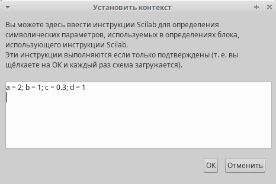
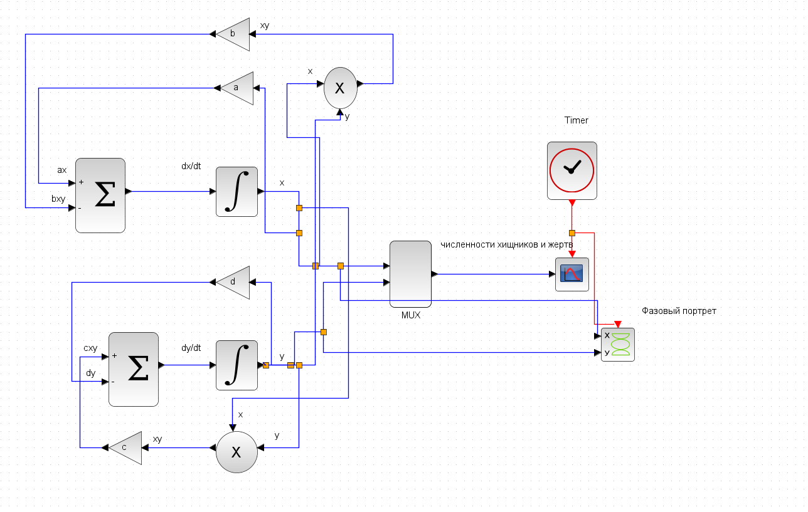
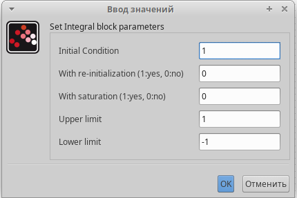
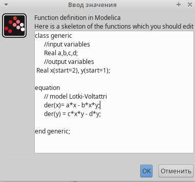
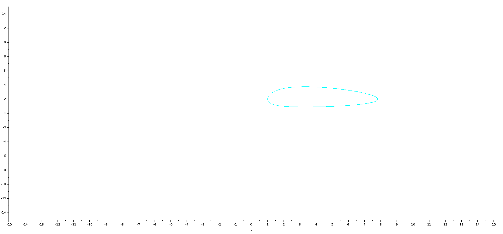
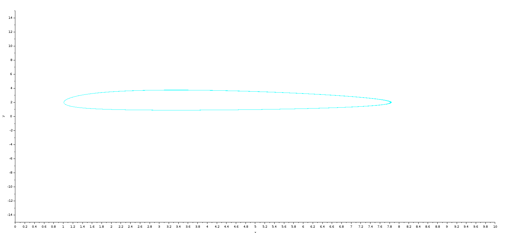
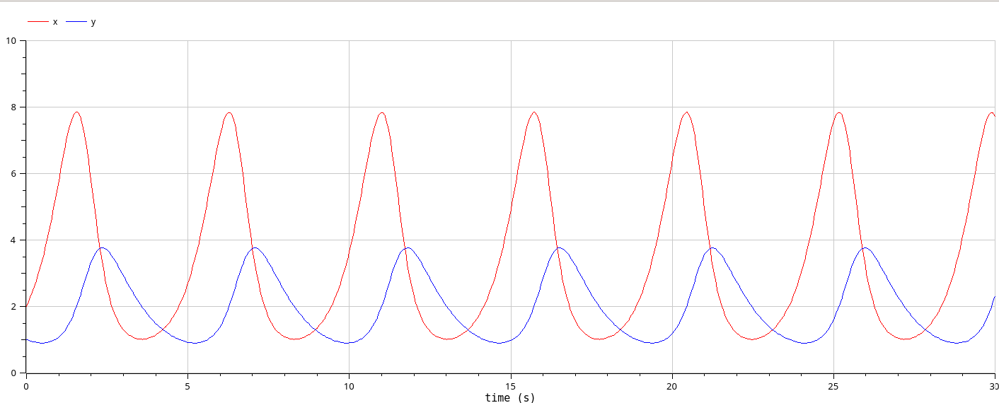

---
## Front matter
lang: ru-RU
title: Лабораторная работа 6
subtitle: Модель «хищник–жертва»
author:
  - Абу Сувейлим Мухаммед Мунивочи
institute:
  - Российский университет дружбы народов, Москва, Россия
date: 11 мая 2024

## i18n babel
babel-lang: russian
babel-otherlangs: english
##mainfont: Arial
##monofont: Courier New
##fontsize: 8pt

## Formatting pdf
toc: false
toc-title: Содержание
slide_level: 2
aspectratio: 169
section-titles: true
theme: metropolis
header-includes:
 - \metroset{progressbar=frametitle,sectionpage=progressbar,numbering=fraction}
 - '\makeatletter'
 - '\beamer@ignorenonframefalse'
 - '\makeatother'
---

# Информация

## Докладчик

::::::::::::::: {.columns align=center}
::: {.column width="70%"}

  * Абу Сувейлим Мухаммед Мунифович
  * студент, НКНбд-01-21
  * Российский университет дружбы народов
  * [1032215135@pfur.ru](mailto:1032215135@pfur.ru)
:::
::: {.column width="30%"}

:::
::::::::::::::

# Вводная часть

## Цели 

Цели: 

- Приобретение навыков моделирования в Xcos, modelica и OpenModelica.

## Задачи

Модель «хищник–жертва» (модель Лотки — Вольтерры) представляет собой модель
межвидовой конкуренции (описание модели см. например в [1]). В математической
форме модель (1) имеет вид:
   $$
   \begin{cases}
   \dot{x} = ax - bxy;\\
   \dot{y} = cxy - dy,\\
   \end{cases}
   $$ 
где $x$ - количество жертв; $y$ - количество хищников; $a, b, c, d$ - коэффициенты, отражающие взаимодействия между видами: $a$ - коэффициент рождаемости
жертв; $b$ - коэффициент убыли жертв; $c$ - коэффициент рождения хищников; $d$ -
коэффициент убыли хищников.

## Задачи

Требуется:
   
   Реализовать модель «хищник – жертва» в Xcos, modelica и OpenModelica. Постройть
   графики изменения численности популяций и фазовый портрет.

## Материалы и методы

1. Королькова, А. В. Моделирование информационных процессов : учебное пособие / А. В. Королькова, Д. С. Кулябов. - М. : РУДН, 2014. -- 191 с. : ил.

2. Турчин П.В. Лекция №14. Популяционная динамика. Биологическое образование в МФТИ, 2012.

3. Ю. О. Основ экологии. Мир, 1986. 376 с.

# Теоретическое введение

## Описание модели «хищник–жертва»:

Модель Лотки — Вольтерры [2] — модель взаимодействия двух видов типа «хищник — жертва», названная в честь своих авторов (Лотка, 1925; Вольтерра 1926), которые предложили модельные уравнения независимо друг от друга. Такие уравнения можно использовать для моделирования систем «хищник — жертва», «паразит — хозяин», конкуренции и других видов взаимодействия между двумя видами [3]. 

## Описание модели «хищник–жертва»:

В математической форме предложенная система имеет следующий вид:

$$\frac{dx}{dt} = ax(t) - bx(t)y(t)$$

$$\frac{dy}{dt} = -cx(t) + dx(t)y(t)$$

В этой модели $x$ – число жертв, $y$ - число хищников. Коэффициент a описывает скорость естественного прироста числа жертв в отсутствие хищников, с естественное вымирание хищников, лишенных пищи в виде жертв. Вероятность взаимодействия жертвы и хищника считается пропорциональной как количеству жертв, так и числу самих хищников ($xy$). Каждый акт взаимодействия уменьшает популяцию жертв, но способствует увеличению популяции хищников (члены $-bxy$ и $dxy$ в правой части уравнения).

# Выполнение работы

## Реализация модели в xcos

   1. В меню Моделирование, Задать переменные окружения зададим значения коэффициентов a, b, c, d (рис. 1):


      {#fig:001 width=50%}

## Реализация модели в xcos

   2. Для реализации модели (1) в дополнение к блокам CLOCK_c, CSCOPE, TEXT_f,
   MUX, INTEGRAL_m, GAINBLK_f, SUMMATION, PROD_f потребуется блок CSCOPXY —
   регистрирующее устройство для построения фазового портрета.

## Реализация модели в xcos

   Готовая модель «хищник–жертва» представлена на рис. 2:

   {#fig:002 width=50%}

## Реализация модели в xcos

   3. В параметрах блоков интегрирования необходимо задать начальные значения
   $x(0) = 2, y(0) = 1$ (рис. 3):

      {#fig:003 width=50%} 

## Реализация модели в xcos

   {#fig:004 width=50%}

## Реализация модели в xcos

   4. В меню Моделирование, Установка необходимо задать конечное время интегрирования, равным времени моделирования: 30.

## Реализация модели с помощью блока Modelica в xcos 

  5. Для реализации модели (6.1) с помощью языка Modelica потребуются следующие блоки xcos: CLOCK_c, CSCOPE, CSCOPXY, TEXT_f, MUX, CONST_m и MBLOCK (Modelica generic). Как и ранее, задаём значения коэффициентов a, b, c, d (см. рис. 1). Готовая модель «хищник–жертва» представлена на рис. 7:

      {#fig:007 width=50%}

## Реализация модели с помощью блока Modelica в xcos 

   6. Параметры блока Modelica представлены на рис. 8:

      {#fig:008 width=50%}

## Реализация модели с помощью блока Modelica в xcos 
   
   {#fig:009 width=50%}

## Реализация модели в OpenModelica

   7. Код на языке Modelica в OpenModelica:

      ```modelica
         model lab06_OM
         //input variables
         Real a = 2, b = 1, c = 0.3, d = 1;
               //output variables
         Real x(start=2), y(start=1);
         equation
               // model Lotki-Voltattri
               der(x)= a*x - b*x*y;
               der(y) = c*x*y - d*y;
         end lab06_OM;
      ```

# Результаты 

## Реализация модели в xcos

   8. Результат моделирования представлен на рис. 5:

      {#fig:005 width=50%} 

## Реализация модели в xcos

   {#fig:006 width=50%}

## Реализация модели с помощью блока Modelica в xcos 

   9. Результат моделирования совпадёт с рис. 5 и 6:

      {#fig:010 width=50%} 

## Реализация модели с помощью блока Modelica в xcos 

   {#fig:011 width=50%}

## Реализация модели в OpenModelica

   10. Результат моделирования:

   {#fig:012 width=50%}

## Реализация модели в OpenModelica

   {#fig:013 width=50%}

## Вывод

- Изучали как работать с xocs, modelica и OpenModelica. [1]