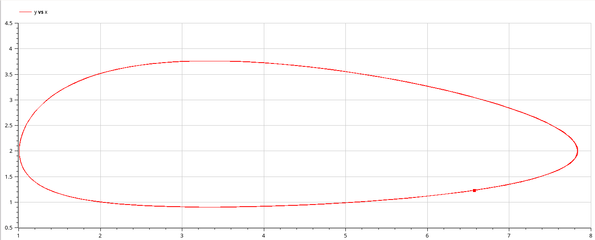

# Цель работы

- Приобретение навыков моделирования в Xcos, modelica и OpenModelica.

# Задание

Модель «хищник–жертва» (модель Лотки — Вольтерры) представляет собой модель
межвидовой конкуренции (описание модели см. например в [1]). В математической
форме модель (1) имеет вид:
   $$
   \begin{cases}
   \dot{x} = ax - bxy;\\
   \dot{y} = cxy - dy,\\
   \end{cases}
   $$ 
где $x$ - количество жертв; $y$ - количество хищников; $a, b, c, d$ - коэффициенты, отражающие взаимодействия между видами: $a$ - коэффициент рождаемости
жертв; $b$ - коэффициент убыли жертв; $c$ - коэффициент рождения хищников; $d$ -
коэффициент убыли хищников.

Нужно:
   
   Реализовать модель «хищник – жертва» в Xcos, modelica и OpenModelica. Постройть
   графики изменения численности популяций и фазовый портрет.

# Теоретическое введение

Модель Лотки — Вольтерры (модель Лотки — Вольтерра) [@Turchin] — модель взаимодействия двух видов типа «хищник — жертва», названная в честь своих авторов (Лотка, 1925; Вольтерра 1926), которые предложили модельные уравнения независимо друг от друга.

Такие уравнения можно использовать для моделирования систем «хищник — жертва», «паразит — хозяин», конкуренции и других видов взаимодействия между двумя видами [@Odum].

В математической форме предложенная система имеет следующий вид:

$\frac{dx}{dt} = ax(t) - bx(t)y(t)$

$\frac{dy}{dt} = -cx(t) + dx(t)y(t)$

В этой модели $x$ – число жертв, $y$ - число хищников. Коэффициент a
описывает скорость естественного прироста числа жертв в отсутствие хищников, с естественное вымирание хищников, лишенных пищи в виде жертв. Вероятность взаимодействия жертвы и хищника считается пропорциональной как количеству жертв, так и числу самих хищников ($xy$). Каждый акт взаимодействия уменьшает популяцию жертв, но способствует увеличению популяции хищников (члены $-bxy$ и $dxy$ в правой части уравнения).


# Выполнение лабораторной работы

## Реализация модели в xcos

1. В меню Моделирование, Задать переменные окружения зададим значения коэффициентов a, b, c, d (рис. 1):


   {#fig:001 width=50%}


2. Для реализации модели (1) в дополнение к блокам CLOCK_c, CSCOPE, TEXT_f,
MUX, INTEGRAL_m, GAINBLK_f, SUMMATION, PROD_f потребуется блок CSCOPXY —
регистрирующее устройство для построения фазового портрета.
Готовая модель «хищник–жертва» представлена на рис. 2:

   {#fig:002 width=50%}

3. В параметрах блоков интегрирования необходимо задать начальные значения
$x(0) = 2, y(0) = 1$ (рис. 3):

   {#fig:003 width=50%}
   
   {#fig:004 width=50%}

4. В меню Моделирование, Установка необходимо задать конечное время интегрирования, равным времени моделирования: 30.

5. Результат моделирования представлен на рис. 5:

   {#fig:005 width=50%} 
   
   {#fig:006 width=50%}

## Реализация модели с помощью блока Modelica в xcos 

6. Для реализации модели (6.1) с помощью языка Modelica потребуются следующие блоки xcos: CLOCK_c, CSCOPE, CSCOPXY, TEXT_f, MUX, CONST_m и MBLOCK (Modelica generic). Как и ранее, задаём значения коэффициентов a, b, c, d (см. рис. 1). Готовая модель «хищник–жертва» представлена на рис. 7:

   {#fig:007 width=50%}

7. Параметры блока Modelica представлены на рис. 8:

   {#fig:008 width=50%} 
   
   {#fig:009 width=50%}
   
8. Результат моделирования совпадёт с рис. 5 и 6:

    {#fig:010 width=50%} 
    
    {#fig:011 width=50%}

9. Код на языке Modelica в OpenModelica:

   ```modelica
      model lab06_OM
      //input variables
      Real a = 2, b = 1, c = 0.3, d = 1;
            //output variables
      Real x(start=2), y(start=1);
      equation
            // model Lotki-Voltattri
            der(x)= a*x - b*x*y;
            der(y) = c*x*y - d*y;
      end lab06_OM;
   ```

10. Результат моделирования:

   {#fig:012 width=50%} 
   
   {#fig:013 width=50%}


## Исходный код

### Управжение

```modelica
      model lab06_OM
      //input variables
      Real a = 2, b = 1, c = 0.3, d = 1;
            //output variables
      Real x(start=2), y(start=1);
      equation
            // model Lotki-Voltattri
            der(x)= a*x - b*x*y;
            der(y) = c*x*y - d*y;
      end lab06_OM;
   ```

# Вывод

- Изучали как работать с xocs, modelica и OpenModelica. [@book]

# Библиография

::: {#refs}
:::