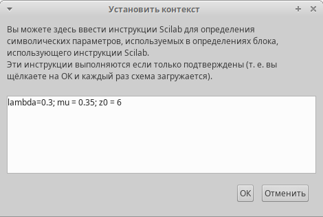
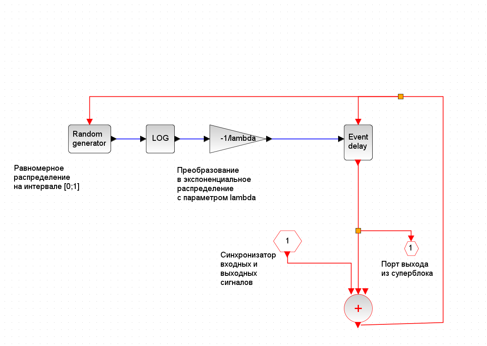
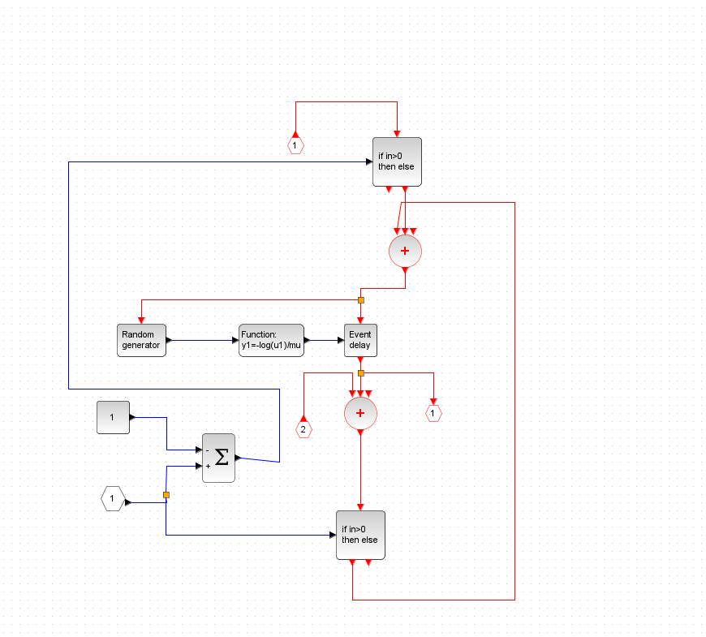
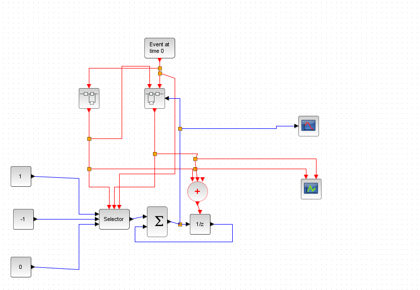
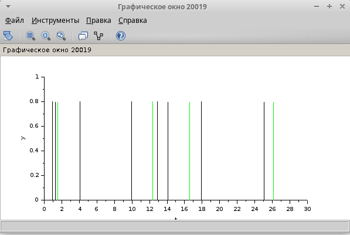
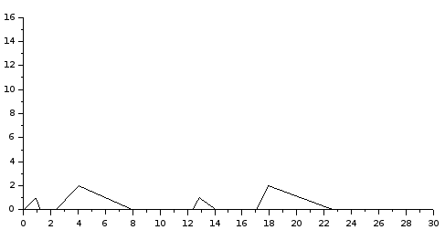

---
## Front matter
lang: ru-RU
title: Лабораторная работа 7
subtitle: Модель $M | M | 1 | \infty$
author:
  - Абу Сувейлим Мухаммед Мунивочи
institute:
  - Российский университет дружбы народов, Москва, Россия
date: 11 мая 2024

## i18n babel
babel-lang: russian
babel-otherlangs: english
##mainfont: Arial
##monofont: Courier New
##fontsize: 8pt

## Formatting pdf
toc: false
toc-title: Содержание
slide_level: 2
aspectratio: 169
section-titles: true
theme: metropolis
header-includes:
 - \metroset{progressbar=frametitle,sectionpage=progressbar,numbering=fraction}
 - '\makeatletter'
 - '\beamer@ignorenonframefalse'
 - '\makeatother'
---

# Информация

## Докладчик

::::::::::::::: {.columns align=center}
::: {.column width="70%"}

  * Абу Сувейлим Мухаммед Мунифович
  * студент, НКНбд-01-21
  * Российский университет дружбы народов
  * [1032215135@pfur.ru](mailto:1032215135@pfur.ru)
:::
::: {.column width="30%"}

:::
::::::::::::::

# Вводная часть

## Цели 

Цели: 

- Приобретение навыков моделирования в Xcos.

## Задачи

Требуется:
   
   Реализовать модель $M | M | 1 | \infty$ в Xcos.

## Материалы и методы

1. Королькова, А. В. Моделирование информационных процессов : учебное пособие / А. В. Королькова, Д. С. Кулябов. - М. : РУДН, 2014. -- 191 с. : ил.

2. Плескунов М.А. Теория массового обслуживания : учебное пособие / подред. Сесекин А.Н. Издательство Уральского университета, 2022. С. 264.

# Теоретическое введение

## Модель $M | M | 1 | \infty$

Система массового обслуживания (СМО) - система, предназначенная для многократно повторяющегося (многоразового) использования при решении однотипных задач. [2]

# Выполнение работы

## Реализация модели в xcos

  1. В меню Моделирование, Задать переменные окружения зададим значения коэффициентов a, b, c, d (рис. 1):

   {#fig:001 width=50%}

## Реализация модели в xcos

   2. Суперблок, моделирующий поступление заявок, представлен на рис. 2:

   {#fig:002 width=50%}

## Реализация модели в xcos

   3. Суперблок, моделирующий процесс обработки заявок, представлен на рис. 3:

   {#fig:003 width=50%}
   

## Реализация модели в xcos

   4. В меню Моделирование, Установка необходимо задать конечное время интегрирования, равным времени моделирования: 30.

## Реализация модели в xcos

   5. Схема  модели $M | M | 1 | \infty$ в Xcos рис. 4:

   {#fig:004 width=50%}

## Реализация модели в xcos

6. Результат моделирования представлен на рис. 5 и 6:

   {#fig:005 width=50%}

## Реализация модели в xcos

   {#fig:006 width=50%}

## Вывод

- Изучали как работать с xocs. Также, научились как строит суперблоки в xocs.
[1]