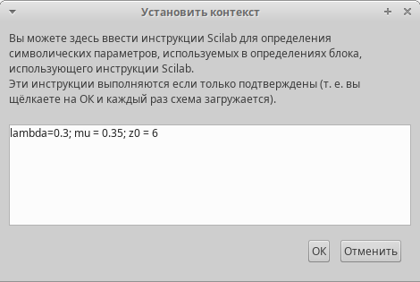
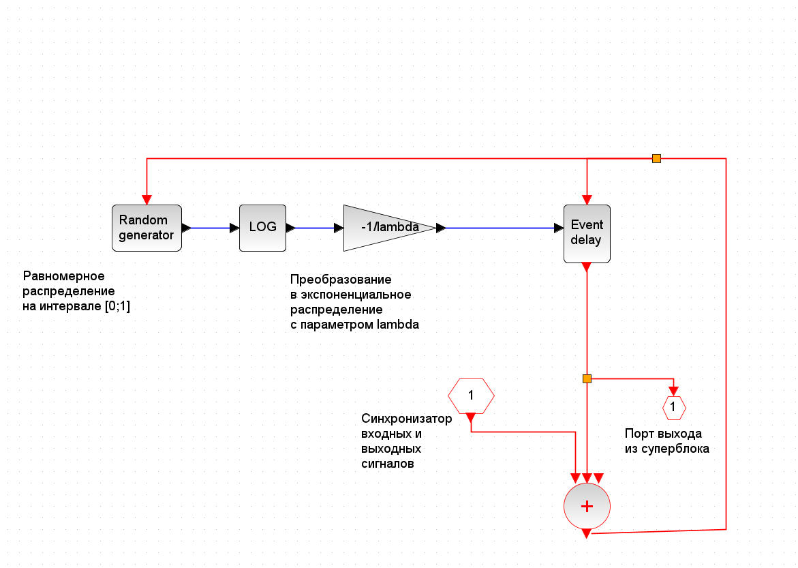
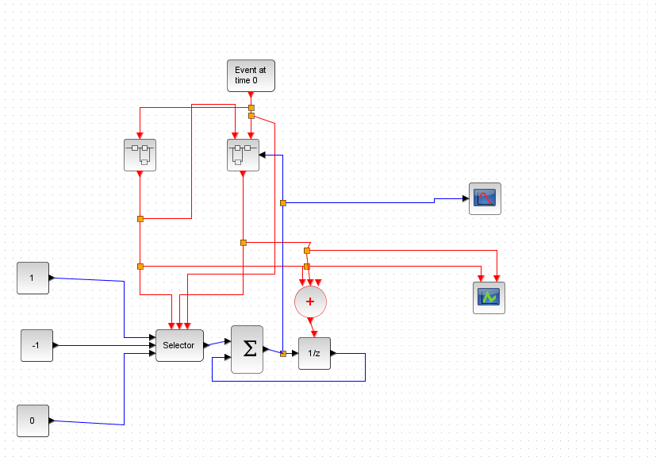
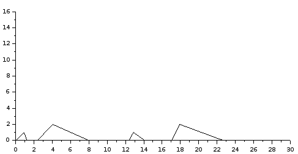

# Цель работы

- Приобретение навыков моделирования в Xcos.

# Задание

Требуется:
   
   Реализовать модель $M | M | 1 | \infty$ в Xcos.

# Теоретическое введение

Система массового обслуживания (СМО) - система, предназначенная для многократно повторяющегося (многоразового) использования при решении однотипных задач. [@CMO]

# Выполнение лабораторной работы

## Реализация модели в xcos

1. В меню Моделирование, Задать переменные окружения зададим значения коэффициентов a, b, c, d (рис. 1):

   {#fig:001 width=50%}

2. Суперблок, моделирующий поступление заявок, представлен на рис. 2:

   {#fig:002 width=50%}

3. Суперблок, моделирующий процесс обработки заявок, представлен на рис. 3:

   {#fig:003 width=50%}
   

4. В меню Моделирование, Установка необходимо задать конечное время интегрирования, равным времени моделирования: 30.

5. Схема  модели $M | M | 1 | \infty$ в Xcos рис. 4:

   {#fig:004 width=50%}
   
6. Результат моделирования представлен на рис. 5 и 6:

   {#fig:005 width=50%}

   {#fig:006 width=50%}

# Вывод

- Изучали как работать с xcos. Также, научились как строит суперблоки в xcos.
[@book]

# Библиография

::: {#refs}
:::