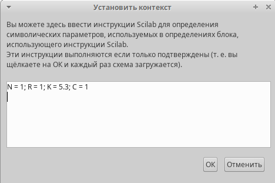
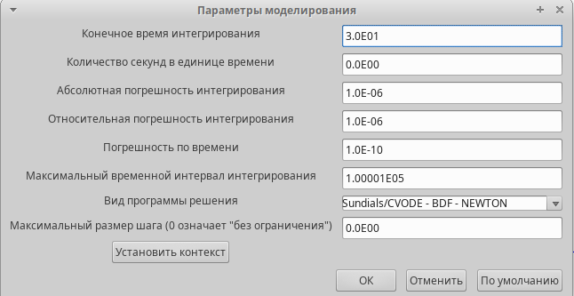
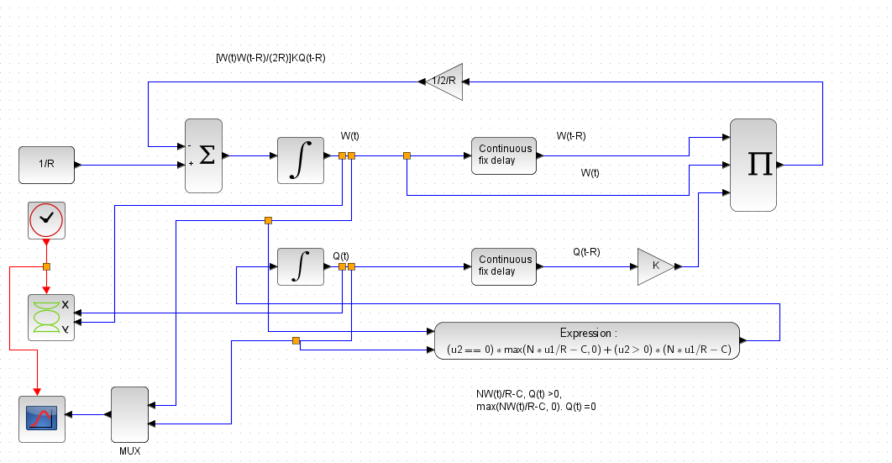
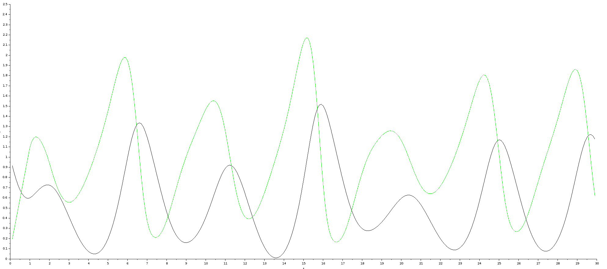
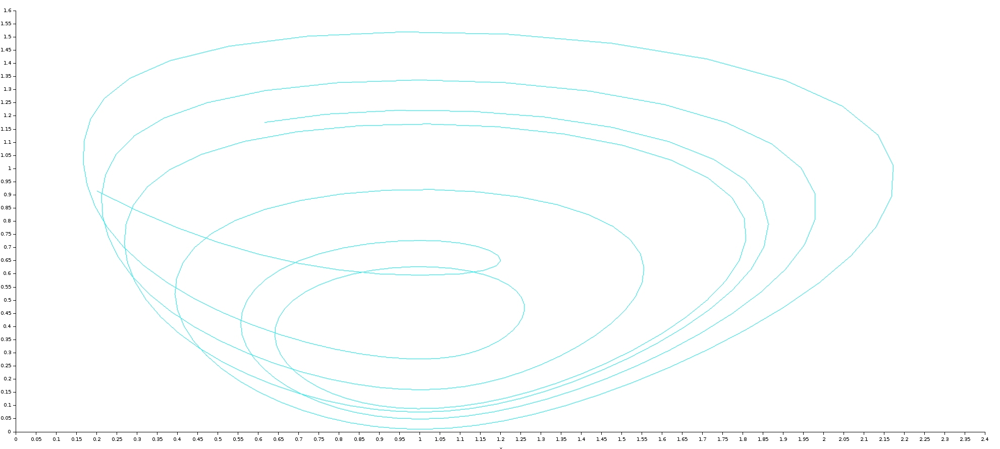
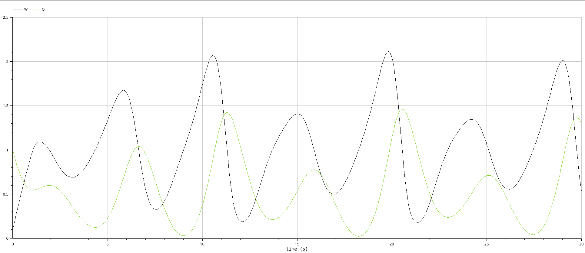
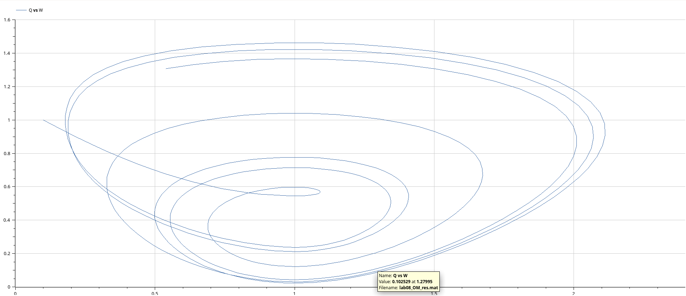
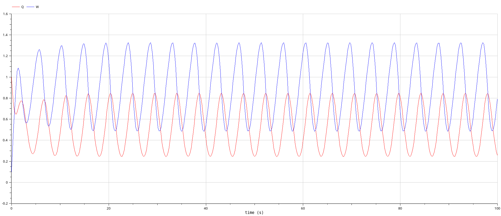
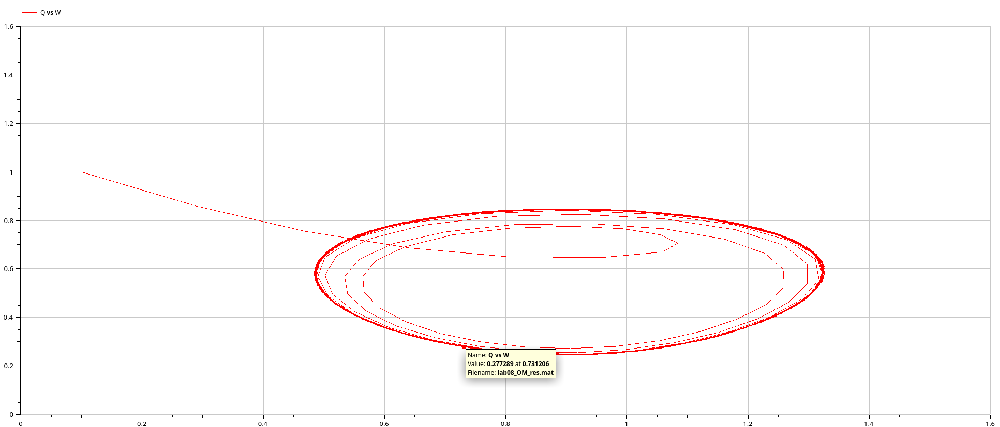

---
## Front matter
lang: ru-RU
title: Лабораторная работа 8
subtitle: Модель TCP/AQM
author:
  - Абу Сувейлим Мухаммед Мунивочи
institute:
  - Российский университет дружбы народов, Москва, Россия
date: 12 мая 2024

## i18n babel
babel-lang: russian
babel-otherlangs: english
##mainfont: Arial
##monofont: Courier New
##fontsize: 8pt

## Formatting pdf
toc: false
toc-title: Содержание
slide_level: 2
aspectratio: 169
section-titles: true
theme: metropolis
header-includes:
 - \metroset{progressbar=frametitle,sectionpage=progressbar,numbering=fraction}
 - '\makeatletter'
 - '\beamer@ignorenonframefalse'
 - '\makeatother'
---

# Информация

## Докладчик

::::::::::::::: {.columns align=center}
::: {.column width="70%"}

  * Абу Сувейлим Мухаммед Мунифович
  * студент, НКНбд-01-21
  * Российский университет дружбы народов
  * [1032215135@pfur.ru](mailto:1032215135@pfur.ru)
:::
::: {.column width="30%"}

:::
::::::::::::::

# Вводная часть

## Цели 

Цели: 

- Приобретение навыков моделирования в Xcos.

## Задачи

Требуется:
   
Реализовать модель (8.4)–(8.5) с использованием языка Modelica в среде
OpenModelica. Для реализации задержки используйте оператор delay(). Постройте график динамики изменения размера TCP окна W(t) и размера очереди Q(t) и фазовый портрет (W; Q).

## Материалы и методы

1. Королькова, А. В. Моделирование информационных процессов : учебное пособие / А. В. Королькова, Д. С. Кулябов. - М. : РУДН, 2014. -- 191 с. : ил.

2. Плескунов М.А. Теория массового обслуживания : учебное пособие / подред. Сесекин А.Н. Издательство Уральского университета, 2022. С. 264.

# Теоретическое введение

Рассмотрим упрощённую модель поведения TCP-подобного трафика с регулируемой
некоторым AQM алгоритмом динамической интенсивностью потока:
   $$
      \dot{W}(t) = \frac{1}{R} - \frac{W(t)W(t-R)}{2R} KQ(t-R), 
   $$
   $$
      \dot{Q}(t) = 
      \begin{cases}
      \frac{NW(t)}{R} - C, Q(t) > 0,\\
      \max(\frac{NW(t)}{R} - C, 0), Q(t) = 0\\
      \end{cases}
   $$ 
где $W(t)$ — средний размер TCP-окна (в пакетах), $Q(t)$ — средний размер очереди (в пакетах), $R(t)$ — время двойного оборота (Round Trip Time, сек.), C — скорость обработки пакетов в очереди (пакетов в секунду), $N(t)$ — число TCP-сессий, $p(·)$ —вероятностная функция сброса (отметки на сброс) пакета (значения функции p(·) лежат на интервале $[0; 1]$).

# Выполнение работы

## Реализация модели в xcos

  1. В меню Моделирование, Задать переменные окружения зададим значения коэффициентов N, R, K, C (рис. 1):


   {#fig:001 width=50%}

## Реализация модели в xcos

   2. В меню Моделирование, Установка необходимо задать конечное время интегрирования, равным времени моделирования: 30.
   
   {#fig:002 width=50%}

## Реализация модели в xcos

   5. Схема  модели TCP/AQM в Xcos рис. 3:

   {#fig:003 width=50%}
   

## Реализация модели в xcos

   6. Результат моделирования представлен на рис. 4 и 5:

   {#fig:004 width=50%}

## Реализация модели в xcos

   {#fig:005 width=50%}


## Реализация модели в OpenModelica

7. Код программы:

   ```modelica
      model lab08_OM
      parameter Real N = 1, R = 1, K = 5.3, C = 0.9;
      Real W(start=0.1), Q(start=1);
      equation
      der(W) = 1/R - (W*delay(W,R)) / (2*R) * K*delay(Q,R);
      if (Q==0) then
         der(Q) = max(N*W/R - C, 0);
      else
         der(Q) = N*W/R - C;
      end if;
      end lab08_OM;
   ```
   
## Реализация модели в OpenModelica

8. Результат моделирования представлен на рис. 6 и 7:

   {#fig:006 width=50%}

## Реализация модели в OpenModelica

   {#fig:007 width=50%}

## Реализация модели в OpenModelica

9. Результат моделирования при $C = 0.9$ представлен на рис. 8 и 9:

   {#fig:008 width=50%}

## Реализация модели в OpenModelica

   {#fig:009 width=50%}


## Вывод

- Изучали как работать с xcos.
[1]