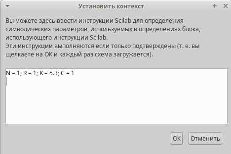
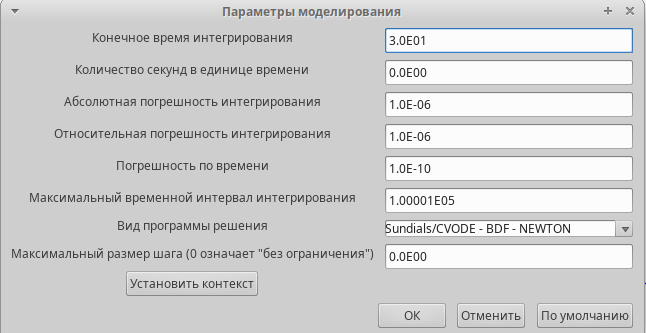
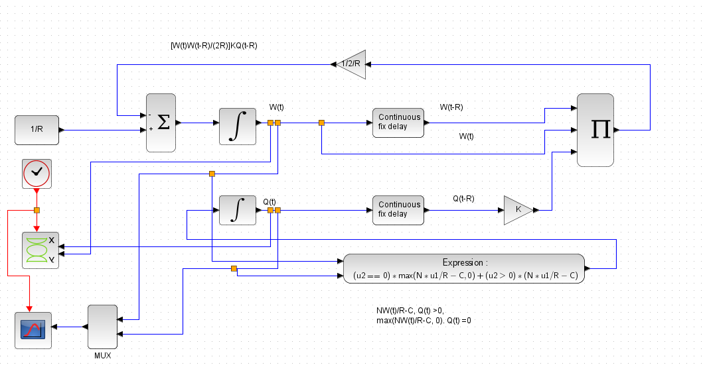
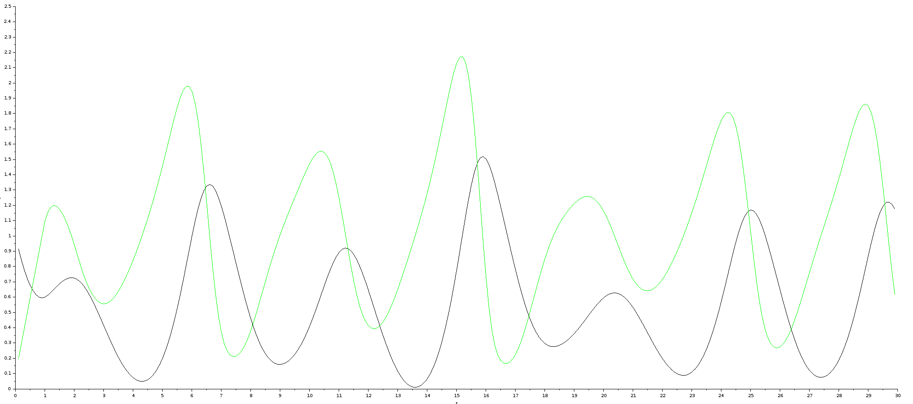
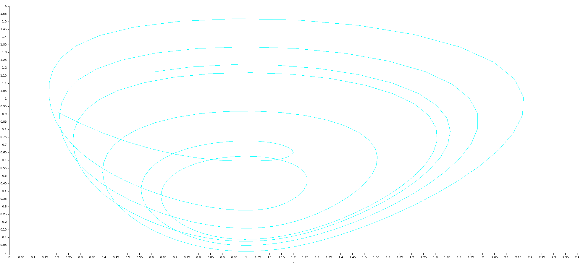
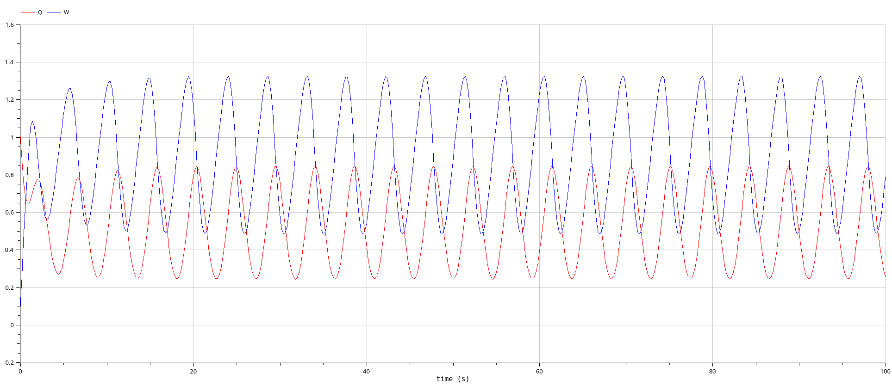
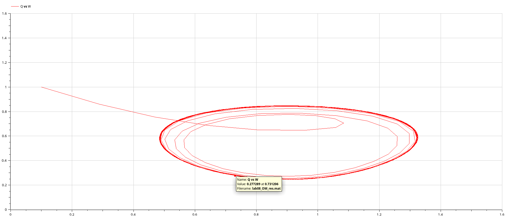

# Цель работы

- Приобретение навыков моделирования в Xcos.

# Задание

Требуется:
   
Реализовать  модель (8.4)–(8.5) с использованием языка Modelica в среде
OpenModelica. Для реализации задержки используйте оператор delay(). Постройте график динамики изменения размера TCP окна W(t) и размера очереди Q(t) и фазовый портрет (W; Q).

# Теоретическое введение

Рассмотрим упрощённую модель поведения TCP-подобного трафика с регулируемой
некоторым AQM алгоритмом динамической интенсивностью потока:

   $$
   \dot{W}(t) = \frac{1}{R} - \frac{W(t)W(t-R)}{2R} KQ(t-R), 
   $$
   $$
   \dot{Q}(t) = 
   \begin{cases}
   \frac{NW(t)}{R} - C, Q(t) > 0,\\
   \max(\frac{NW(t)}{R} - C, 0), Q(t) = 0\\
   \end{cases}
   $$ 
где $W(t)$ — средний размер TCP-окна (в пакетах), $Q(t)$ — средний размер очереди (в пакетах), $R(t)$ — время двойного оборота (Round Trip Time, сек.), C — скорость обработки пакетов в очереди (пакетов в секунду), $N(t)$ — число TCP-сессий, $p(·)$ —вероятностная функция сброса (отметки на сброс) пакета (значения функции p(·) лежат на интервале $[0; 1]$).

# Выполнение лабораторной работы

## Реализация модели в xcos

1. В меню Моделирование, Задать переменные окружения зададим значения коэффициентов N, R, K, C (рис. 1):


   {#fig:001 width=50%}

2. В меню Моделирование, Установка необходимо задать конечное время интегрирования, равным времени моделирования: 30.
   
   {#fig:002 width=50%}

5. Схема  модели TCP/AQM в Xcos рис. 3:

   {#fig:003 width=50%}
   
6. Результат моделирования представлен на рис. 4 и 5:

   {#fig:004 width=50%}

   {#fig:005 width=50%}

## Реализация модели в OpenModelica

7. Код программы:

   ```modelica
      model lab08_OM
      parameter Real N = 1, R = 1, K = 5.3, C = 0.9;
      Real W(start=0.1), Q(start=1);
      equation
      der(W) = 1/R - (W*delay(W,R)) / (2*R) * K*delay(Q,R);
      if (Q==0) then
         der(Q) = max(N*W/R - C, 0);
      else
         der(Q) = N*W/R - C;
      end if;
      end lab08_OM;
   ```
8. Результат моделирования представлен на рис. 4 и 5:

   {#fig:006 width=50%}

   {#fig:007 width=50%}

9. Результат моделирования при $C = 0.9$ представлен на рис. 6 и 7:

   {#fig:008 width=50%}

   {#fig:009 width=50%}

# Вывод

- Изучали как работать с xcos. [@book]

# Библиография

::: {#refs}
:::