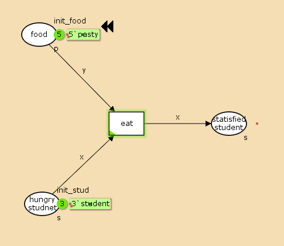
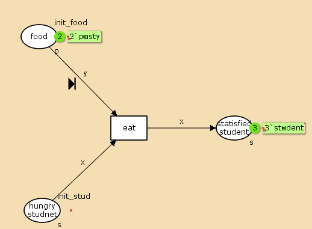
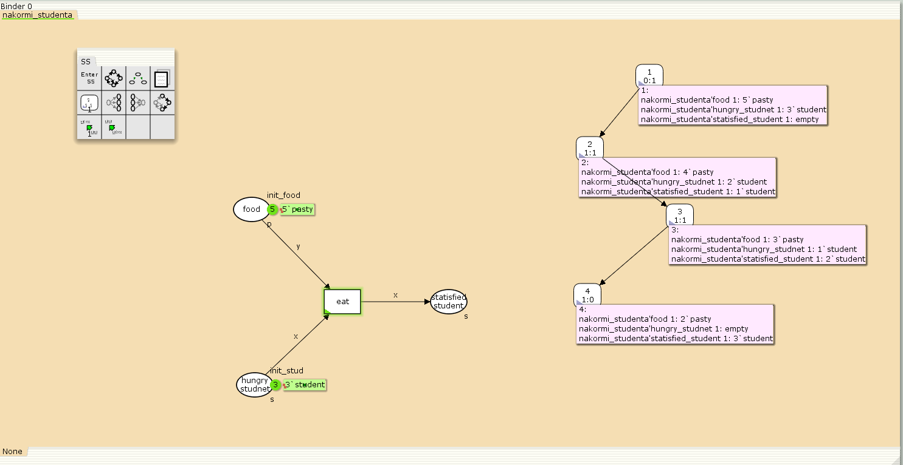
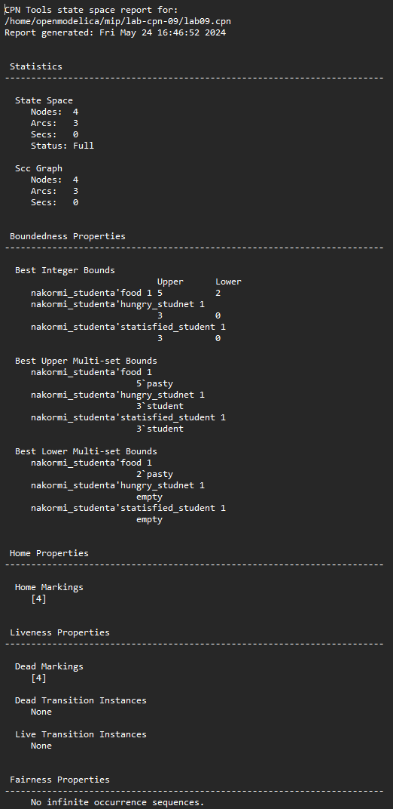

---
## Front matter
lang: ru-RU
title: Лабораторная работа 9
subtitle: Модель «накорми студентов»
author:
  - Абу Сувейлим Мухаммед Мунивочи
institute:
  - Российский университет дружбы народов, Москва, Россия
date: 24 мая 2024

## i18n babel
babel-lang: russian
babel-otherlangs: english
##mainfont: Arial
##monofont: Courier New
##fontsize: 8pt

## Formatting pdf
toc: false
toc-title: Содержание
slide_level: 2
aspectratio: 169
section-titles: true
theme: metropolis
header-includes:
 - \metroset{progressbar=frametitle,sectionpage=progressbar,numbering=fraction}
 - '\makeatletter'
 - '\beamer@ignorenonframefalse'
 - '\makeatother'
---

# Информация

## Докладчик

::::::::::::::: {.columns align=center}
::: {.column width="70%"}

  * Абу Сувейлим Мухаммед Мунифович
  * студент, НКНбд-01-21
  * Российский университет дружбы народов
  * [1032215135@pfur.ru](mailto:1032215135@pfur.ru)
:::
::: {.column width="30%"}

:::
::::::::::::::

# Вводная часть

## Цели 

Цели: 

Приобретение навыков моделирования в CPN tools.

## Задачи

Требуется:
   
Реализовать модель «накорми студентов» и вычислите пространство состояний в среде CPN tools.

## Материалы и методы

1. Королькова, А. В. Моделирование информационных процессов : учебное пособие / А. В. Королькова, Д. С. Кулябов. - М. : РУДН, 2014. -- 191 с. : ил.


# Теоретическое введение

Рассмотрим пример студентов, обедающих пирогами. Голодный студент становится сытым после того, как съедает пирог.
Таким образом, имеем:
- два типа фишек: «пироги» и «студенты»;
- три позиции: «голодный студент», «пирожки», «сытый студент»;
- один переход: «съесть пирожок».

# Выполнение работы

## Реализация модели в CPN tools

1. Рисуем граф сети. Для этого с помощью контекстного меню создаём новую сеть, добавляем позиции, переход и дуги :


   {#fig:001 width=50%}

## Реализация модели в CPN tools

2. В меню задаём новые декларации модели: типы фишек, начальные значения позиций, выражения для дуг. Для этого наведя мышку на меню Standart declarations, правой кнопкой вызываем контекстное меню и выбираем New Decl:

   ```colset s=unit with student;
   colset p=unit with pasty;
   var x:s;
   var y:p;
   val init_stud = 3`student;
   val init_food = 5`pasty;
   ```

## Реализация модели в CPN tools

3. В результате получаем работающую модель (рис. 1).

## Реализация модели в CPN tools

4. После запуска фишки типа «пирожки» из позиции «еда» и фишки типа «студенты» из позиции «голодный студент», пройдя через переход «кушать», попадают в позицию «сытый студент» и преобразуются в тип «студенты»:

   {#fig:002 width=50%}

## Реализация модели в CPN tools

5. Для анализа пространтсва состояний построенной модели используется панель пространства состояний (State Space). Сначала необходимо сформировать код пространства состояний. Для этого используется инструмент «вычислить пространство состояний» Calculate Space State, применённый к листу, содержащему страницу модели.


   {#fig:003 width=50%}

## Реализация модели в CPN tools
   
6. Вычисленное пространство состояний сохраняется во временных файлах CPN Tools. Его можно сохранить в отдельный файл, воспользовавшись инструментом «сохранить отчёт» (Save Report).
   
   {#fig:004 width=40%}

## Вывод

- Изучали как работать с CPN tools. [1]