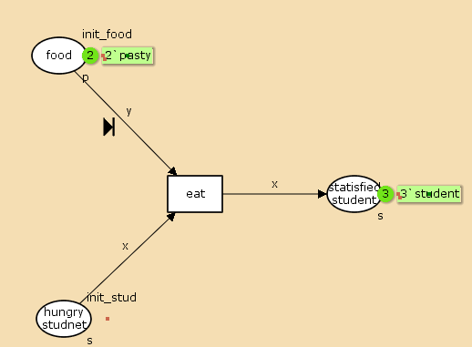
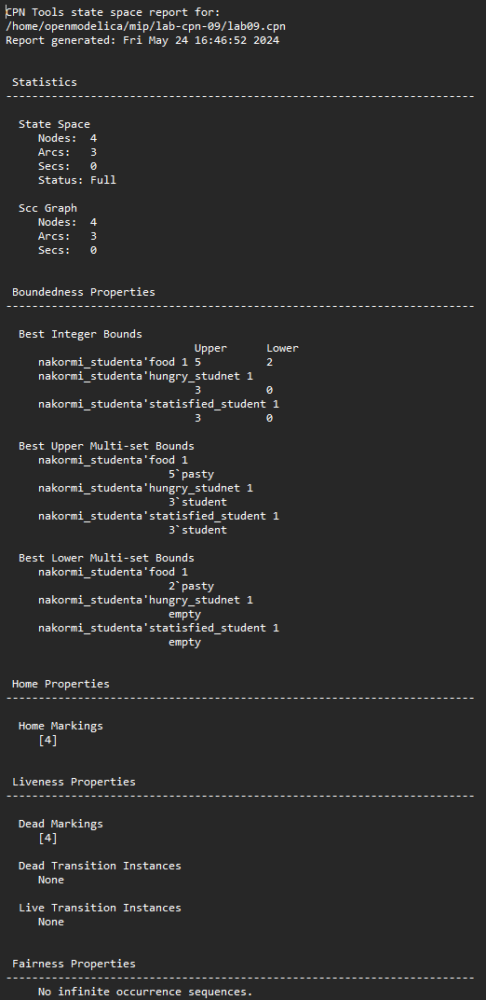

# Цель работы

- Приобретение навыков моделирования в CPN tools.

# Задание

Требуется:
   
Реализовать модель «накорми студентов» и вычислите пространство состояний в среде CPN tools.

# Теоретическое введение

Рассмотрим пример студентов, обедающих пирогами. Голодный студент становится сытым после того, как съедает пирог.
Таким образом, имеем:
- два типа фишек: «пироги» и «студенты»;
- три позиции: «голодный студент», «пирожки», «сытый студент»;
- один переход: «съесть пирожок».

# Выполнение лабораторной работы

## Реализация модели в CPN tools

1. Рисуем граф сети. Для этого с помощью контекстного меню создаём новую сеть, добавляем позиции, переход и дуги :


  {#fig:001 width=50%}

2. В меню задаём новые декларации модели: типы фишек, начальные значения позиций, выражения для дуг. Для этого наведя мышку на меню Standart declarations, правой кнопкой вызываем контекстное меню и выбираем New Decl:

   ```colset s=unit with student;
   colset p=unit with pasty;
   var x:s;
   var y:p;
   val init_stud = 3`student;
   val init_food = 5`pasty;
   ```

3. В результате получаем работающую модель (рис. 1).
4. После запуска фишки типа «пирожки» из позиции «еда» и фишки типа «студенты» из позиции «голодный студент», пройдя через переход «кушать», попадают в позицию «сытый студент» и преобразуются в тип «студенты»:

  {#fig:002 width=50%}

5. Для анализа пространтсва состояний построенной модели используется панель пространства состояний (State Space). Сначала необходимо сформировать код пространства состояний. Для этого используется инструмент «вычислить пространство состояний» Calculate Space State, применённый к листу, содержащему страницу модели.


  {#fig:003 width=50%}
   
6. Вычисленное пространство состояний сохраняется во временных файлах CPN Tools. Его можно сохранить в отдельный файл, воспользовавшись инструментом «сохранить отчёт» (Save Report).

  {#fig:004 width=50%}


# Вывод

- Изучали как работать с CPN tools. [@book]

# Библиография

::: {#refs}
:::