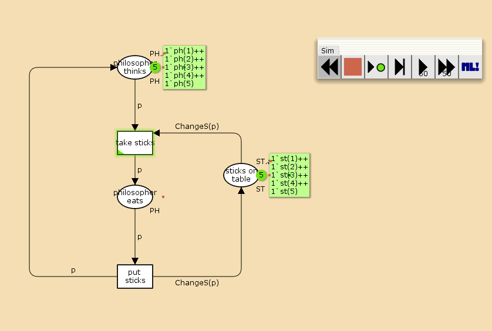
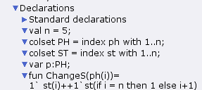
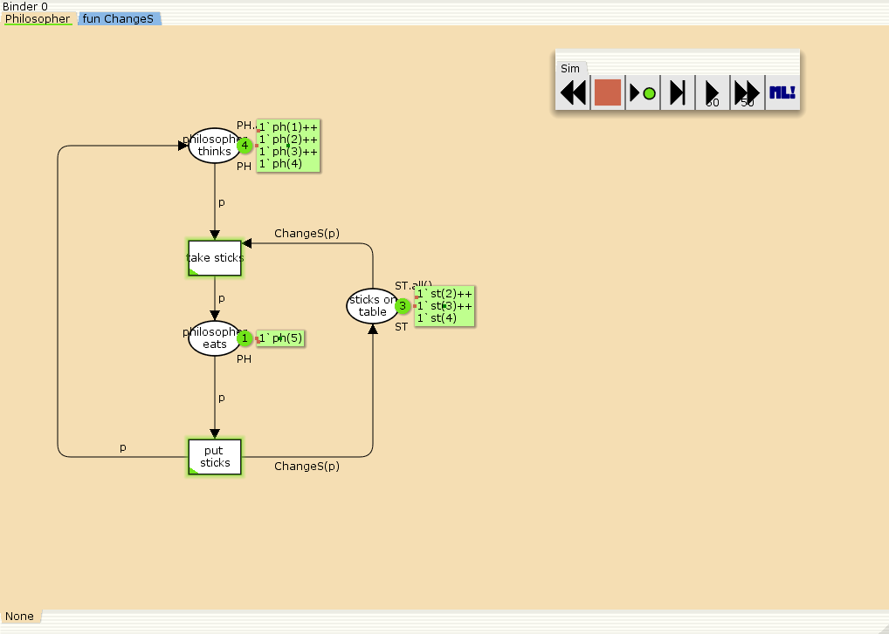
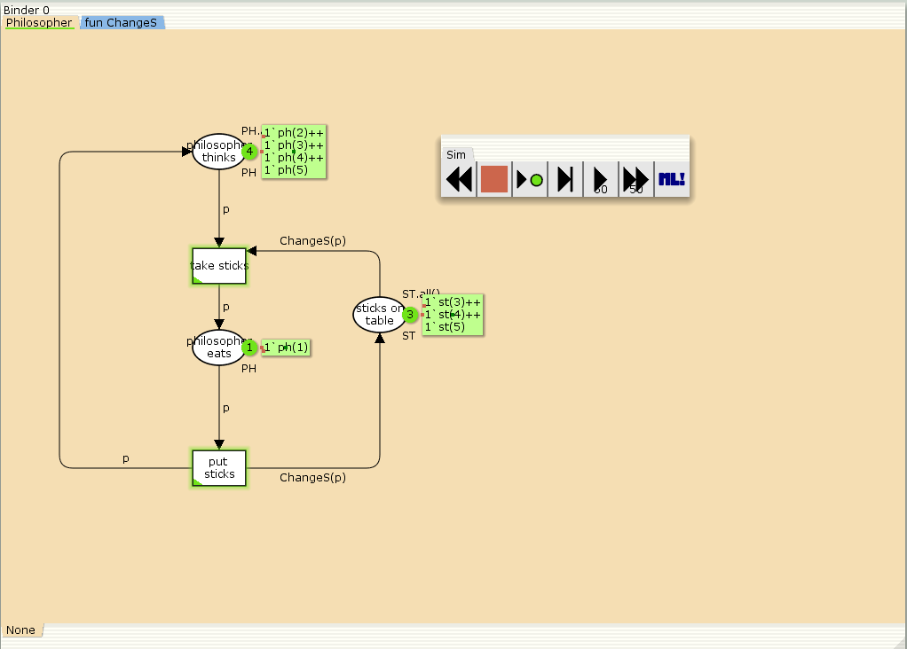
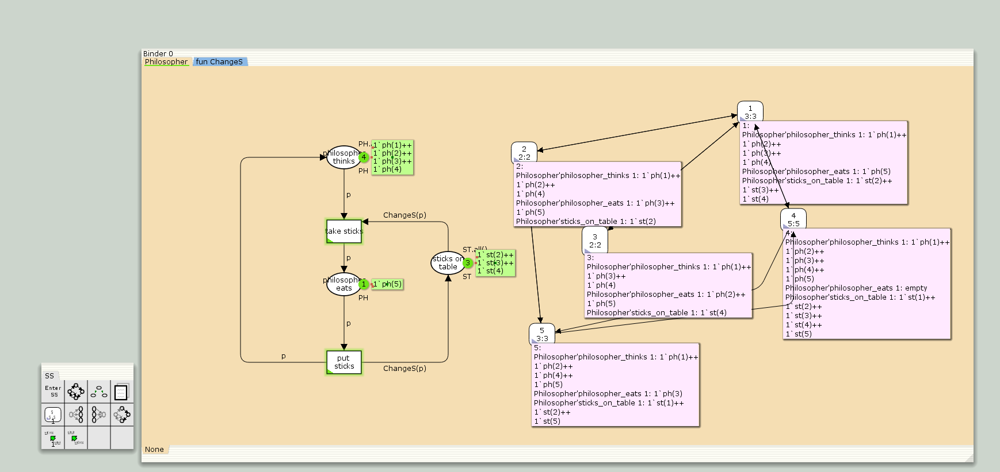
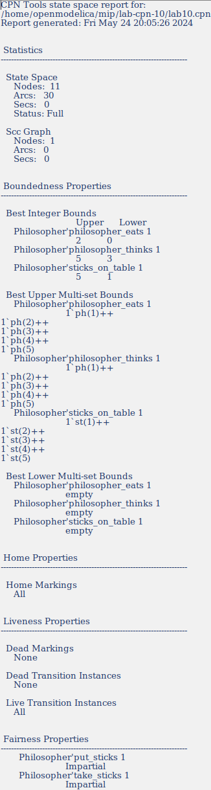

---
## Front matter
lang: ru-RU
title: Лабораторная работа 10
subtitle: Задача об обедающих мудрецах
author:
  - Абу Сувейлим Мухаммед Мунивочи
institute:
  - Российский университет дружбы народов, Москва, Россия
date: 24 мая 2024

## i18n babel
babel-lang: russian
babel-otherlangs: english
##mainfont: Arial
##monofont: Courier New
##fontsize: 8pt

## Formatting pdf
toc: false
toc-title: Содержание
slide_level: 2
aspectratio: 169
section-titles: true
theme: metropolis
header-includes:
 - \metroset{progressbar=frametitle,sectionpage=progressbar,numbering=fraction}
 - '\makeatletter'
 - '\beamer@ignorenonframefalse'
 - '\makeatother'
---

# Информация

## Докладчик

::::::::::::::: {.columns align=center}
::: {.column width="70%"}

  * Абу Сувейлим Мухаммед Мунифович
  * студент, НКНбд-01-21
  * Российский университет дружбы народов
  * [1032215135@pfur.ru](mailto:1032215135@pfur.ru)
:::
::: {.column width="30%"}

:::
::::::::::::::

# Вводная часть

## Цели 

Цели: 

Приобретение навыков моделирования в CPN tools.

## Задачи

Требуется:
   
Решить задачу об обедающих мудрецах и вычислите пространство состояний в среде CPN tools.

## Материалы и методы

1. Королькова, А. В. Моделирование информационных процессов : учебное пособие / А. В. Королькова, Д. С. Кулябов. - М. : РУДН, 2014. -- 191 с. : ил.


# Постановка задачи

Пять мудрецов сидят за круглым столом и могут пребывать в двух состояниях - думать и есть. Между соседями лежит одна палочка для еды. Для приёма пищи необходимы две палочки. Палочки - пересекающийся ресурс. Необходимо синхронизировать процесс еды так, чтобы мудрецы не умерли с голода.

# Выполнение работы

## Реализация модели в CPN tools

1. Рисуем граф сети. Для этого с помощью контекстного меню создаём новую сеть, добавляем позиции, переходы и дуги. Начальные данные:

   - позиции: мудрец размышляет (philosopher thinks), мудрец ест (philosopher eats),
   палочки находятся на столе (sticks on the table)

   - переходы: взять палочки (take sticks), положить палочки (put sticks)

## Реализация модели в CPN tools

   {#fig:001 width=50%}

## Реализация модели в CPN tools

2. В меню задаём новые декларации модели: типы фишек, начальные значения позиций, выражения для дуг:
- n — число мудрецов и палочек (n = 5);
- p — фишки, обозначающие мудрецов, имеют перечисляемый тип PH от 1 до n;
- s — фишки, обозначающие палочки, имеют перечисляемый тип ST от 1 до n;
- функция ChangeS(p) ставит в соответствие мудрецам палочки (возвращает номера палочек, используемых мудрецами); по условию задачи мудрецы сидят по кругу и мудрец p(i) может взять i и i + 1 палочки, поэтому функция ChangeS(p) определяется следующим образом:

   ```
    fun ChangeS (ph(i))=
    1`st(i)++st(if = n then 1 else i+1)
   ```

## Реализация модели в CPN tools

  {#fig:002 width=50%}

## Реализация модели в CPN tools

3. В результате получаем работающую модель (рис. 3).

  {#fig:003 width=50%}

## Реализация модели в CPN tools

4. После запуска модели наблюдаем, что одновременно палочками могут воспользоваться только два из пяти мудрецов (рис. 4):

 {#fig:004 width=50%}

## Реализация модели в CPN tools

5. ля анализа пространтсва состояний построенной модели используется панель пространства состояний (State Space). Сначала необходимо сформировать код пространства состояний. Для этого используется инструмент «вычислить пространство состояний» Calculate Space State, применённый к листу, содержащему страницу модели.

## Реализация модели в CPN tools

{#fig:005 width=50%}


## Реализация модели в CPN tools
   
6.  Вычисленное пространство состояний сохраняется во временных файлах CPN Tools. Его можно сохранить в отдельный файл, воспользовавшись инструментом «сохранить отчёт» (Save Report).

  {#fig:006 width=50%}

## Вывод

- Изучали как работать с CPN tools. [1]