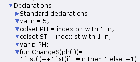
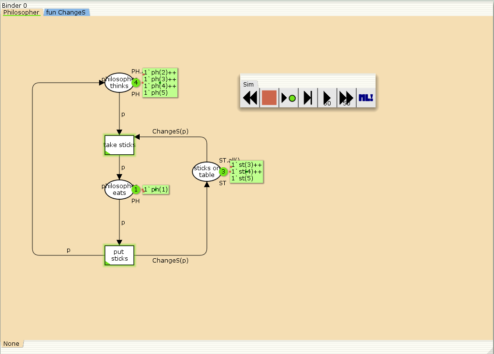

# Цель работы

Приобретение навыков моделирования в CPN tools.

# Задание

Требуется:
   
Решить задачу об обедающих мудрецах и вычислите пространство состояний в среде CPN tools.

# Постановка задачи

Пять мудрецов сидят за круглым столом и могут пребывать в двух состояниях - думать и есть. Между соседями лежит одна палочка для еды. Для приёма пищи необходимы две палочки. Палочки - пересекающийся ресурс. Необходимо синхронизировать процесс еды так, чтобы мудрецы не умерли с голода.

# Выполнение лабораторной работы

## Реализация модели в CPN tools

1. Рисуем граф сети. Для этого с помощью контекстного меню создаём новую сеть, добавляем позиции, переходы и дуги:


  {#fig:001 width=50%}

Начальные данные:
- позиции: мудрец размышляет (philosopher thinks), мудрец ест (philosopher eats),
палочки находятся на столе (sticks on the table)
- переходы: взять палочки (take sticks), положить палочки (put sticks)

2. В меню задаём новые декларации модели: типы фишек, начальные значения
позиций, выражения для дуг:
- n — число мудрецов и палочек (n = 5);
- p — фишки, обозначающие мудрецов, имеют перечисляемый тип PH от 1 до n;
- s — фишки, обозначающие палочки, имеют перечисляемый тип ST от 1 до n;
- функция ChangeS(p) ставит в соответствие мудрецам палочки (возвращает номера палочек, используемых мудрецами); по условию задачи мудрецы сидят по кругу и мудрец p(i) может взять i и i + 1 палочки, поэтому функция ChangeS(p) определяется следующим образом:

   ```
    fun ChangeS (ph(i))=
    1`st(i)++st(if = n then 1 else i+1)
   ```

  {#fig:002 width=50%}

3. В результате получаем работающую модель (рис. 3).

  {#fig:003 width=50%}

4. После запуска модели наблюдаем, что одновременно палочками могут воспользоваться только два из пяти мудрецов (рис. 4):

 {#fig:004 width=50%}


5. Для анализа пространтсва состояний построенной модели используется панель пространства состояний (State Space). Сначала необходимо сформировать код пространства состояний. Для этого используется инструмент «вычислить пространство состояний» Calculate Space State, применённый к листу, содержащему страницу модели.


  {#fig:005 width=50%}
   
6. Вычисленное пространство состояний сохраняется во временных файлах CPN Tools. Его можно сохранить в отдельный файл, воспользовавшись инструментом «сохранить отчёт» (Save Report).

  {#fig:006 width=50%}


# Вывод

- Изучали как работать с CPN tools. [@book]

# Библиография

::: {#refs}
:::