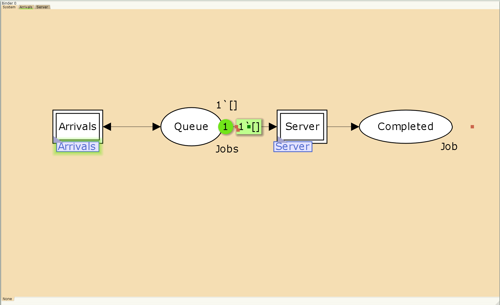
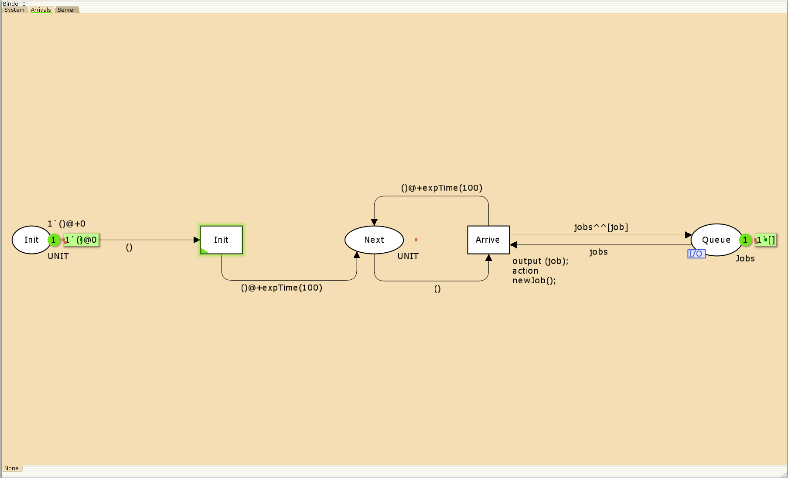
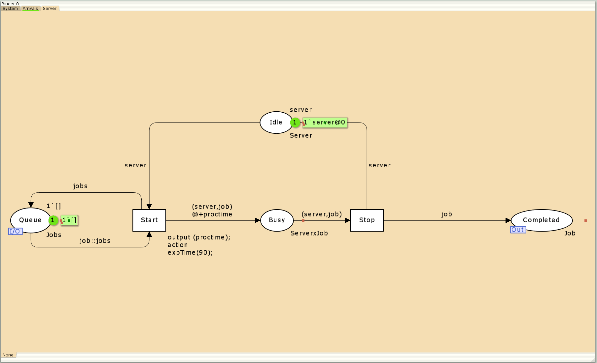
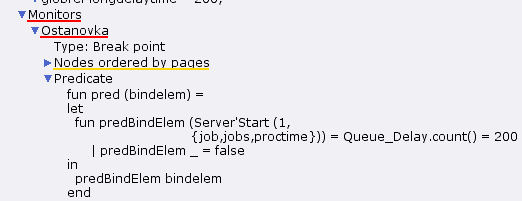
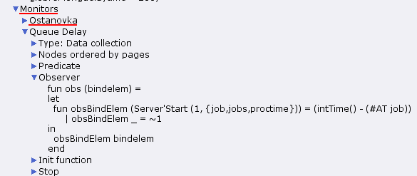
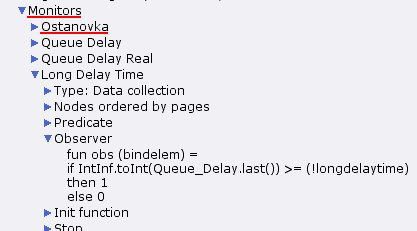
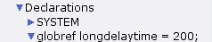

---
## Front matter
lang: ru-RU
title: Лабораторная работа 11
subtitle: Модель системы массового обслуживания $M|M|1$
author:
  - Абу Сувейлим Мухаммед Мунивочи
institute:
  - Российский университет дружбы народов, Москва, Россия
date: 25 мая 2024

## i18n babel
babel-lang: russian
babel-otherlangs: english
##mainfont: Arial
##monofont: Courier New
##fontsize: 8pt

## Formatting pdf
toc: false
toc-title: Содержание
slide_level: 2
aspectratio: 169
section-titles: true
theme: metropolis
header-includes:
 - \metroset{progressbar=frametitle,sectionpage=progressbar,numbering=fraction}
 - '\makeatletter'
 - '\beamer@ignorenonframefalse'
 - '\makeatother'
---

# Информация

## Докладчик

::::::::::::::: {.columns align=center}
::: {.column width="70%"}

  * Абу Сувейлим Мухаммед Мунифович
  * студент, НКНбд-01-21
  * Российский университет дружбы народов
  * [1032215135@pfur.ru](mailto:1032215135@pfur.ru)
:::
::: {.column width="30%"}

:::
::::::::::::::

# Вводная часть

## Цели 

Цели: 

Приобретение навыков моделирования в CPN tools.

## Материалы и методы

1. Королькова, А. В. Моделирование информационных процессов : учебное пособие / А. В. Королькова, Д. С. Кулябов. - М. : РУДН, 2014. -- 191 с. : ил.

# Постановка задачи

В систему поступает поток заявок двух типов, распределённый по пуассоновскому закону. Заявки поступают в очередь сервера на обработку. Дисциплина очереди - FIFO. Если сервер находится в режиме ожидания (нет заявок на сервере), то заявка поступает на обработку сервером.

# Выполнение работы

## Реализация модели в CPN tools

1. Будем использовать три отдельных листа: на первом листе опишем граф системы (рис. 1), на втором — генератор заявок (рис. 2), на третьем — сервер обработки заявок (рис. 3).

  {#fig:001 width=50%}

## Реализация модели в CPN tools

  {#fig:002 width=50%}

## Реализация модели в CPN tools

 {#fig:003 width=50%}

## Реализация модели в CPN tools

2. Зададим декларации системы:

 {#fig:004 width=50%}

## Реализация модели в CPN tools

3. Зададим параметры модели на графах сети (см. рис 1-3).

## Реализация модели в CPN tools

4. Для мониторинга параметров очереди системы $M|M|1$ потребуется палитра Monitoring. Выбираем Break Point (точка останова) и устанавливаем её на переход Start. После этого в разделе меню Monitor появится новый подраздел, который назовём Ostanovka. В этом подразделе необходимо внести изменения в функцию Predicate, которая будет выполняться при запуске монитора:

## Реализация модели в CPN tools

  {#fig:005 width=70%}

## Реализация модели в CPN tools

  {#fig:006 width=70%}

## Реализация модели в CPN tools

  {#fig:007 width=50%}

## Реализация модели в CPN tools
   
  {#fig:008 width=50%}

## Реализация модели в CPN tools

{#fig:009 width=70%}

## Реализация модели в CPN tools

 {#fig:010 width=70%}

## Реализация модели в CPN tools

  {#fig:011 width=50%}

## Вывод

- Изучали как работать с CPN tools. [1]