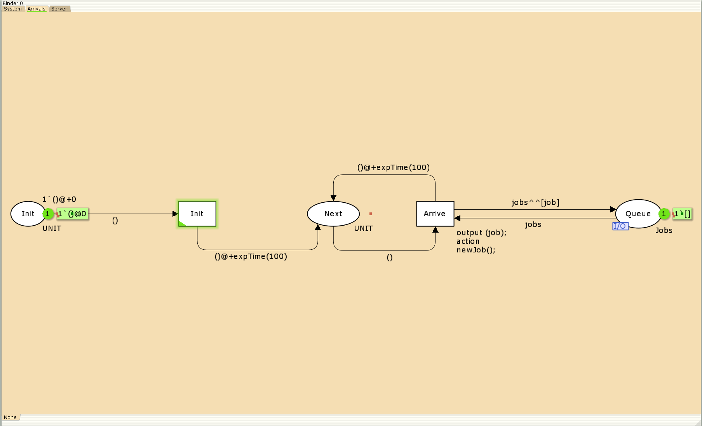
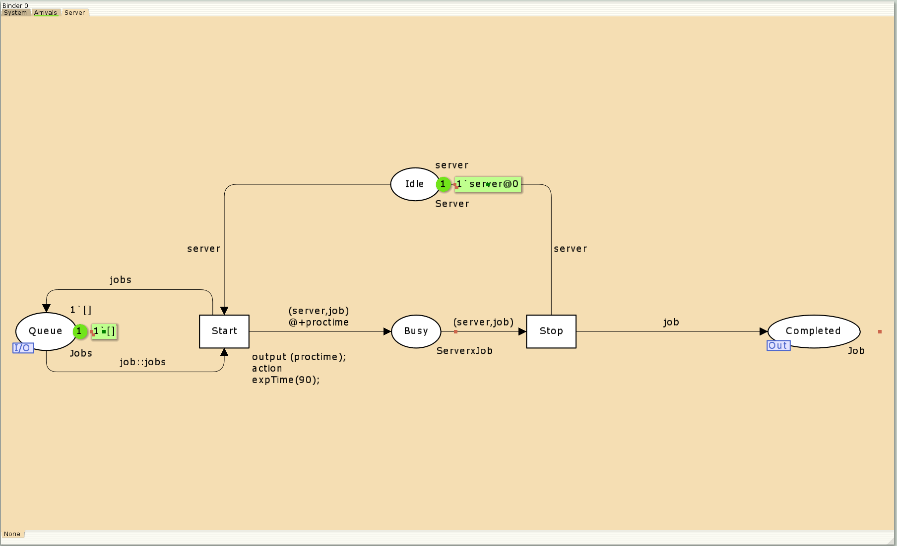
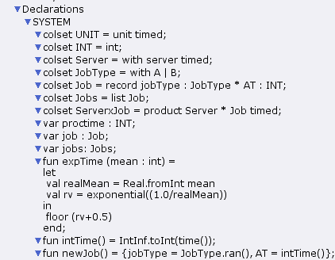
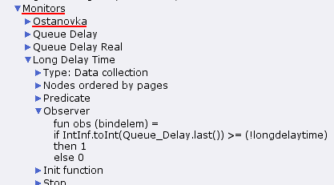

# Цель работы

Приобретение навыков моделирования в CPN tools.

# Постановка задачи

В систему поступает поток заявок двух типов, распределённый по пуассоновскому закону. Заявки поступают в очередь сервера на обработку. Дисциплина очереди - FIFO. Если сервер находится в режиме ожидания (нет заявок на сервере), то заявка поступает на обработку сервером.

# Выполнение лабораторной работы

## Реализация модели в CPN tools

1. Будем использовать три отдельных листа: на первом листе опишем граф системы (рис. 1), на втором — генератор заявок (рис. 2), на третьем — сервер обработки заявок (рис. 3).

    1.1. Сеть имеет 2 позиции (очередь — Queue, обслуженные заявки — Complеted) и два перехода (генерировать заявку — Arrivals, передать заявку на обработку серверу — Server). Переходы имеют сложную иерархическую структуру, задаваемую на отдельных листах модели (с помощью соответствующего инструмента меню — Hierarchy).

    {#fig:001 width=70%}

    Между переходом Arrivals и позицией Queue, а также между позицией Queue и переходом Server установлена дуплексная связь. Между переходом Server и позицией Completed — односторонняя связь.

    1.2. Граф генератора заявок имеет 3 позиции (текущая заявка — Init, следующая заявка — Next, очередь — Queue из листа System) и 2 перехода (Init — определяет распределение поступления заявок по экспоненциальному закону с интенсивностью 100 заявок в единицу времени, Arrive — определяет поступление заявок в очередь).

    {#fig:002 width=70%}
    
    1.3. Граф процесса обработки заявок на сервере имеет 4 позиции (Busy — сервер занят, Idle — сервер в режиме ожидания, Queue и Complited из листа System) и 2 перехода (Start — начать обработку заявки, Stop — закончить обработку заявки).

    {#fig:003 width=70%}

2. Зададим декларации системы:

  Определим множества цветов системы (colorset):
  - фишки типа UNIT определяют моменты времени;
  - фишки типа INT определяют моменты поступления заявок в систему.
  - фишки типа JobType определяют 2 типа заявок — A и B;
  - кортеж Job имеет 2 поля: jobType определяет тип работы (соответственно имеет тип JobType, поле AT имеет тип INT и используется для хранения времени нахождения заявки в системе);
  - фишки Jobs — список заявок;
  - фишки типа ServerxJob — определяют состояние сервера, занятого обработкой заявок.

  ```
    colset UNIT = unit timed;
    colset INT = int;
    colset Server = with server timed;
    colset JobType = with A | B;
    colset Job = record jobType : JobType *
    AT : INT;
    colset Jobs = list Job;
    colset ServerxJob = product Server * Job timed;
  ```

  Переменные модели:
  - proctime — определяет время обработки заявки;
  - job — определяет тип заявки;
  - jobs — определяет поступление заявок в очередь.

  ```
    var proctime : INT;
    var job: Job;
    var jobs: Jobs;
  ```
  Определим функции системы:
  - функция expTime описывает генерацию целочисленных значений через интервалы времени распределённые по экспоненциальному закону;
  - функция intTime преобразует текущее модельное время в целое число;
  - функция newJob возвращает значение из набора Job — случайный выбор типа заявки (A или B).

  ```
    fun expTime (mean: int) =
    let
    val realMean = Real.fromInt mean
    val rv = exponential((1.0/realMean))
    in
    floor (rv+0.5)
    end;
    fun intTime() = IntInf.toInt (time());
    fun newJob() = {jobType = JobType.ran(),
    AT = intTime()}
  ```  
  {#fig:004 width=70%}

3. Зададим параметры модели на графах сети (см. рис 1-3).

4. Для мониторинга параметров очереди системы $M|M|1$ потребуется палитра Monitoring. Выбираем Break Point (точка останова) и устанавливаем её на переход Start. После этого в разделе меню Monitor появится новый подраздел, который назовём Ostanovka. В этом подразделе необходимо внести изменения в функцию Predicate, которая будет выполняться при запуске монитора:

  ```
    fun pred (bindelem) =
    let
    fun predBindElem (Server'Start (1, {job,jobs,proctime}))
    = true
    | predBindElem _ = false
    in
    predBindElem bindelem
    end
  ```
Изначально, когда функция начинает работать, она возвращает значение true, в противном случае —  false. В теле функции вызывается процедура predBindElem, которую определяем в предварительных декларациях. Зададим число шагов, через которое будем останавливать мониторинг. Для этого true заменим на Queue_Delay.count()=200 (рис. 8):

  ```
    fun pred (bindelem) =
    let
    fun predBindElem (Server'Start (1, {job,jobs,proctime}))
    = Queue_Delay.count()=200
    | predBindElem _ = false
    in
    predBindElem bindelem
    end
  ```

{#fig:005 width=70%}

  ```
    fun obs (bindelem) =
    let
    fun obsBindElem (Server'Start (1, {job, jobs, proctime}))
    = (intTime() - (#AT job))
    | obsBindElem _ = ~1
    in
    obsBindElem bindelem
    end
  ```

  {#fig:006 width=70%}

После запуска программы на выполнение в каталоге с кодом программы появится файл Queue_Delay log, содержащий в первой колонке — значение задержки очереди, во второй — счётчик, в третьей — шаг, в четвёртой — время. С помощью gnuplot можно построить график значений задержки в очереди (рис. 7), выбрав по оси x время, а по оси y — значения задержки:

  ```gnuplot
    gnuplot
    plot "Queue_Delay.log" using ($4):($1) with lines
    quit
  ```
  {#fig:007 width=70%}

Посчитаем задержку в действительных значениях. С помощью палитры Monitoring выбираем Data Call и устанавливаем на переходе Start. Появившийся в меню монитор называем Queue Delay Real. Функцию Observer изменим следующим образом (рис. 8):

  ```
    fun obs (bindelem) =
    let
    fun obsBindElem (Server'Start (1, {job, jobs, proctime}))
    = Real.fromInt(intTime() - (#AT job))
    | obsBindElem _ = ~1.0
    in
    obsBindElem bindelem
    end
  ```

  {#fig:008 width=70%}

По сравнению с предыдущим описанием функции добавлено преобразование значения функции из целого в действительное, при этом obsBindElem _ принимает значение ~1.0. После запуска программы на выполнение в каталоге с кодом программы появится файл Queue_Delay_Real.log с содержимым, аналогичным содержимому файла Queue_Delay.log, но значения задержки имеют действительный тип.
Посчитаем, сколько раз задержка превысила заданное значение. С помощью палитры Monitoring выбираем Data Call и устанавливаем на переходе Start. Монитор называем Long Delay Time.
Функцию Observer изменим следующим образом (рис. 9):

  ```
    fun obs (bindelem) =
    if IntInf.tiInt(Queue_Delay.last())>=(!longdelaytime)
    then 1
    else 0
  ```

 {#fig:009 width=70%}

Если значение монитора Queue Delay превысит некоторое заданное значение, то функция выдаст 1, в противном случае — 0. Восклицательный знак означает разыменование ссылки. При этом необходимо в декларациях (рис. 10) задать глобальную переменную (в форме ссылки на число 200): longdelaytime:

  ```
    globref longdelaytime = 200;
  ```

 {#fig:010 width=70%}

С помощью gnuplot можно построить график (рис. 11), демонстрирующий, в какие периоды времени значения задержки в очереди превышали заданное значение 200:

  ```gnuplot
    gnuplot
    plot [0:][0:1.2] "Long_Delay_Time.log" using ($4):($1) with lines
    quit
  ```

 {#fig:011 width=70%}

# Вывод

- Изучали как работать с CPN tools. [@book]

# Библиография

::: {#refs}
:::