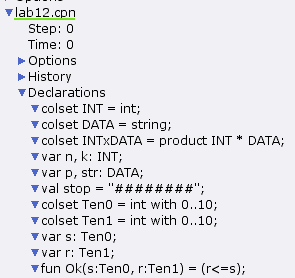
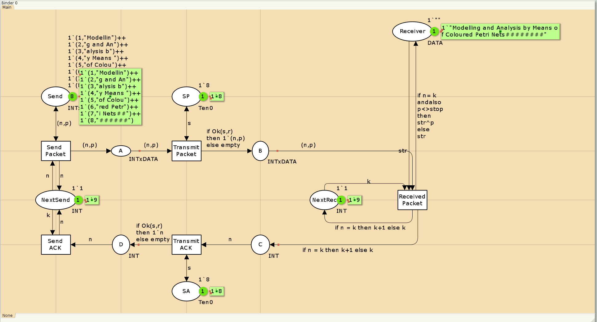

---
## Front matter
lang: ru-RU
title: Лабораторная работа 12
subtitle: Пример моделирования простого протокола передачи данных
author:
  - Абу Сувейлим Мухаммед Мунивочи
institute:
  - Российский университет дружбы народов, Москва, Россия
date: 25 мая 2024

## i18n babel
babel-lang: russian
babel-otherlangs: english
##mainfont: Arial
##monofont: Courier New
##fontsize: 8pt

## Formatting pdf
toc: false
toc-title: Содержание
slide_level: 2
aspectratio: 169
section-titles: true
theme: metropolis
header-includes:
 - \metroset{progressbar=frametitle,sectionpage=progressbar,numbering=fraction}
 - '\makeatletter'
 - '\beamer@ignorenonframefalse'
 - '\makeatother'
---

# Информация

## Докладчик

::::::::::::::: {.columns align=center}
::: {.column width="70%"}

  * Абу Сувейлим Мухаммед Мунифович
  * студент, НКНбд-01-21
  * Российский университет дружбы народов
  * [1032215135@pfur.ru](mailto:1032215135@pfur.ru)
:::
::: {.column width="30%"}

:::
::::::::::::::

# Вводная часть

## Цели 

Цели: 

Приобретение навыков моделирования в CPN tools.

## Материалы и методы

1. Королькова, А. В. Моделирование информационных процессов : учебное пособие / А. В. Королькова, Д. С. Кулябов. - М. : РУДН, 2014. -- 191 с. : ил.

# Постановка задачи

Рассмотрим ненадёжную сеть передачи данных, состоящую из источника, получателя. Перед отправкой очередной порции данных источник должен получить от получателя подтверждение о доставке предыдущей порции данных Считаем, что пакет состоит из номера пакета и строковых данных. Передавать будем сообщение «Modelling and Analysis by Means of Coloured Petry Nets», разбитое по 8 символов.

# Выполнение работы

## Реализация модели в CPN tools

1. Зададим декларации системы:

  {#fig:001 width=40%}

## Реализация модели в CPN tools

  {#fig:002 width=70%}

## Реализация модели в CPN tools

2. Модель простого протокола передачи данных в исходном состоянии:

{#fig:003 width=70%}

## Реализация модели в CPN tools

3. Модель простого протокола передачи данных в конечном состоянии:

  {#fig:004 width=70%}

## Реализация модели в CPN tools

4. Граф пространства состояний:

  {#fig:005 width=70%}

## Реализация модели в CPN tools

  Отчёт о пространстве состояний:

## Вывод

- Изучали как работать с CPN tools. [1]