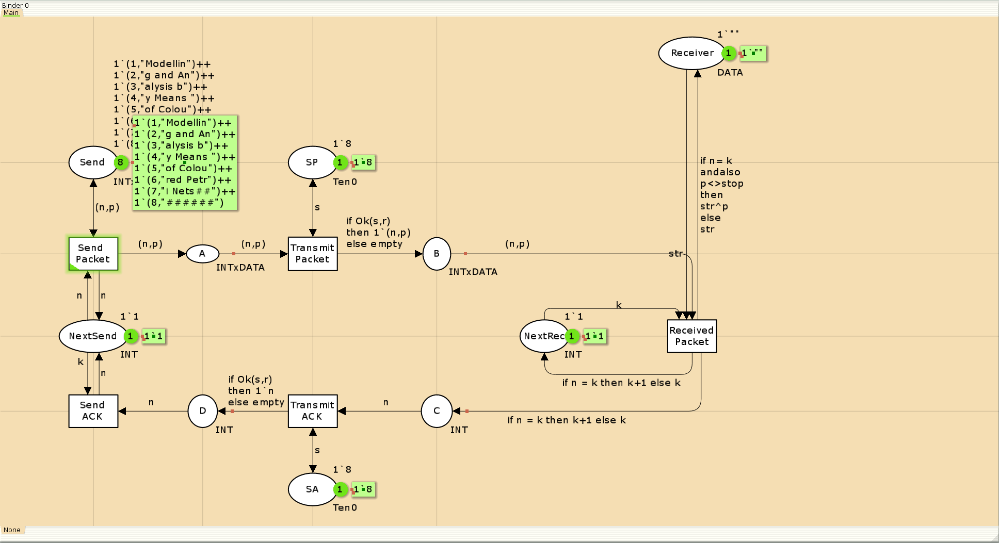

# Цель работы

Приобретение навыков моделирования в CPN tools.

# Постановка задачи

Рассмотрим ненадёжную сеть передачи данных, состоящую из источника, получателя. Перед отправкой очередной порции данных источник должен получить от получателя подтверждение о доставке предыдущей порции данных Считаем, что пакет состоит из номера пакета и строковых данных. Передавать будем сообщение «Modelling and Analysis by Means of Coloured Petry Nets», разбитое по 8 символов.

# Выполнение лабораторной работы

## Реализация модели в CPN tools

1. Основные состояния: источник (Send), получатель (Receiver). Действия (переходы): отправить пакет (Send Packet), отправить подтверждение (Send ACK).
Промежуточное состояние: следующий посылаемый пакет (NextSend). Зададим декларации модели:
  ```
    colset INT = int;
    colset DATA = string;
    colset INTxDATA = product INT * DATA;
    var n, k: INT;
    var p, str: DATA;
    val stop = "########";
  ```
2. Состояние Send имеет тип INTxDATA и следующую начальную маркировку (в
соответствии с передаваемой фразой):

  ```
    1`(1,"Modellin")++
    1`(2,"g and An")++
    1`(3,"alysis b")++
    1`(4,"y Means ")++
    1`(5,"of Colou")++
    1`(6,"red Petr")++
    1`(7,"y Nets##")++
    1`(8,"########")
  ```

Стоповый байт ("########") определяет, что сообщение закончилось. Состояние Receiver имеет тип DATA и начальное значение 
  ```
    1`""
  ```
(т.е. пустая строка, поскольку состояние собирает данные и номер пакета его не интересует). Состояние NextSend имеет тип INT и начальное значение 1`1. Поскольку пакеты представляют собой кортеж, состоящий из номера пакета и строки, то выражение у двусторонней дуги будет иметь значение (n,p). Кроме того, необходимо взаимодействовать с состоянием, которое будет сообщать номер следующего посылаемого пакета данных. Поэтому переход Send Packet соединяем с состоянием NextSend двумя дугами с выражениями n. Также необходимо получать информацию с подтверждениями о получении данных. От перехода Send Packet к состоянию NextSend дуга с выражением n, обратно — k.

3. Зададим промежуточные состояния (A, B с типом INTxDATA, C, D с типом INTxDATA) для переходов (рис. 12.2): передать пакет Transmit Packet (передаём (n,p)), передать подтверждение Transmit ACK (передаём целое число k). Добавляем переход получения пакета (Receive Packet). От состояния Receiver идёт дуга к переходу Receive Packet со значением той строки (str), которая находится в состоянии Receiver. Обратно: проверяем, что номер пакета новый и строка не равна стоп-биту. Если это так, то строку добавляем к полученным данным. Кроме того, необходимо знать, каким будет номер следующего пакета. Для этого
добавляем состояние NextRec с типом INT и начальным значением 1`1 (один пакет), связываем его дугами с переходом Receive Packet. Причём к переходу идёт дуга с выражением k, от перехода — if n=k then k+1 else k. Связываем состояния B и C с переходом Receive Packet. От состояния B к переходу Receive Packet — выражение (n,p), от перехода Receive Packet к состоянию C — выражение if n=k then k+1 else k. От перехода Receive Packet к состоянию Receiver: if n=k andalso p<>stop then str^p else str

(если n=k и мы не получили стоп-байт, то направляем в состояние строку и к ней
прикрепляем p, в противном случае посылаем толко строку).
На переходах Transmit Packet и Transmit ACK зададим потерю пакетов. Для
этого на интервале от 0 до 10 зададим пороговое значение и, если передаваемое значение превысит этот порог, то считаем, что произошла потеря пакета, если нет, то передаём пакет дальше. Для этого задаём вспомогательные состояния SP и SA с типом Ten0 и начальным значением 1`8, соединяем с соответствующими переходами. В декларациях задаём:

  ```
    colset Ten0 = int with 0..10;
    colset Ten1 = int with 0..10;
    var s: Ten0;
    var r: Ten1;
  ```
и определяем функцию (если нет превышения порога, то истина, если нет — ложь): fun Ok(s:Ten0, r:Ten1)=(r<=s); 

{#fig:001 width=70%}

Задаём выражение от перехода Transmit Packet к состоянию B:  if Ok(s,r) then 1`(n,p) else empty

Задаём выражение от перехода Transmit ACK к состоянию D: if Ok(s,r) then 1`n else empty

4. Таким образом, получим модель простого протокола передачи данных (рис. 12.3). Пакет последовательно проходит: состояние Send, переход Send Packet, состояние A, с некоторой вероятностью переход Transmit Packet, состояние B, попадает на переход Receive Packet, где проверяется номер пакета и если нет совпадения, то пакет направляется в состояние Received, а номер пакета передаётся последовательно в состояние C, с некоторой вероятностью в переход Transmit ACK, далее в состояние D, переход Receive ACK, состояние NextSend (увеличивая на 1 номер следующего пакета), переход Send Packet. Так продолжается до тех пор, пока не будут переданы все части сообщения. Последней будет передана стоппоследовательность.

{#fig:002 width=70%}

5. Модель простого протокола передачи данных в исходном состоянии:

{#fig:003 width=70%}

6. Модель простого протокола передачи данных в конечном состоянии:

{#fig:004 width=70%}


7. Граф пространства состояний:

{#fig:005 width=70%}

8. Отчёт о пространстве состояний: 

  ```
    CPN Tools state space report for:
    /home/openmodelica/mip/lab-cpn-12/lab12.cpn
    Report generated: Sat May 25 18:12:49 2024


    Statistics
    ------------------------------------------------------------------------

      State Space
        Nodes:  29332
        Arcs:   483293
        Secs:   300
        Status: Partial

      Scc Graph
        Nodes:  15439
        Arcs:   405564
        Secs:   10


    Boundedness Properties
    ------------------------------------------------------------------------

      Best Integer Bounds
                                Upper      Lower
        Main'A 1                21         0
        Main'B 1                10         0
        Main'C 1                7          0
        Main'D 1                5          0
        Main'NextRec 1          1          1
        Main'NextSend 1         1          1
        Main'Receiver 1         1          1
        Main'SA 1               1          1
        Main'SP 1               1          1
        Main'Send 1             8          8

      Best Upper Multi-set Bounds
        Main'A 1            21`(1,"Modellin")++
    17`(2,"g and An")++
    12`(3,"alysis b")++
    7`(4,"y Means ")++
    2`(5,"of Colou")
        Main'B 1            10`(1,"Modellin")++
    8`(2,"g and An")++
    6`(3,"alysis b")++
    3`(4,"y Means ")++
    1`(5,"of Colou")
        Main'C 1            7`2++
    5`3++
    4`4++
    2`5
        Main'D 1            5`2++
    4`3++
    3`4++
    1`5
        Main'NextRec 1      1`1++
    1`2++
    1`3++
    1`4++
    1`5
        Main'NextSend 1     1`1++
    1`2++
    1`3++
    1`4++
    1`5
        Main'Receiver 1     1`""++
    1`"Modellin"++
    1`"Modelling and An"++
    1`"Modelling and Analysis b"++
    1`"Modelling and Analysis by Means "
        Main'SA 1           1`8
        Main'SP 1           1`8
        Main'Send 1         1`(1,"Modellin")++
    1`(2,"g and An")++
    1`(3,"alysis b")++
    1`(4,"y Means ")++
    1`(5,"of Colou")++
    1`(6,"red Petr")++
    1`(7,"i Nets##")++
    1`(8,"######")

      Best Lower Multi-set Bounds
        Main'A 1            empty
        Main'B 1            empty
        Main'C 1            empty
        Main'D 1            empty
        Main'NextRec 1      empty
        Main'NextSend 1     empty
        Main'Receiver 1     empty
        Main'SA 1           1`8
        Main'SP 1           1`8
        Main'Send 1         1`(1,"Modellin")++
    1`(2,"g and An")++
    1`(3,"alysis b")++
    1`(4,"y Means ")++
    1`(5,"of Colou")++
    1`(6,"red Petr")++
    1`(7,"i Nets##")++
    1`(8,"######")


    Home Properties
    ------------------------------------------------------------------------

      Home Markings
        None


    Liveness Properties
    ------------------------------------------------------------------------

      Dead Markings
        10378 [29332,29331,29330,29329,29328,...]

      Dead Transition Instances
        None

      Live Transition Instances
        None


    Fairness Properties
    ------------------------------------------------------------------------
          Main'Received_Packet 1 No Fairness
          Main'Send_ACK 1        No Fairness
          Main'Send_Packet 1     Impartial
          Main'Transmit_ACK 1    No Fairness
          Main'Transmit_Packet 1 Impartial
  ```


# Вывод

- Изучали как работать с CPN tools. [@book]

# Библиография

::: {#refs}
:::