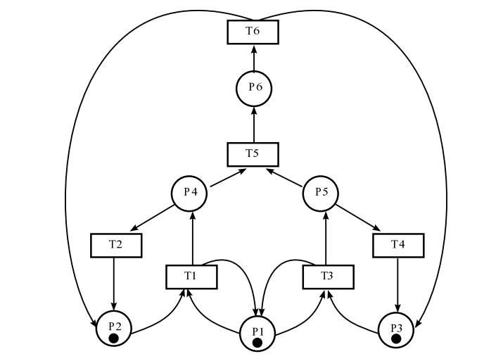
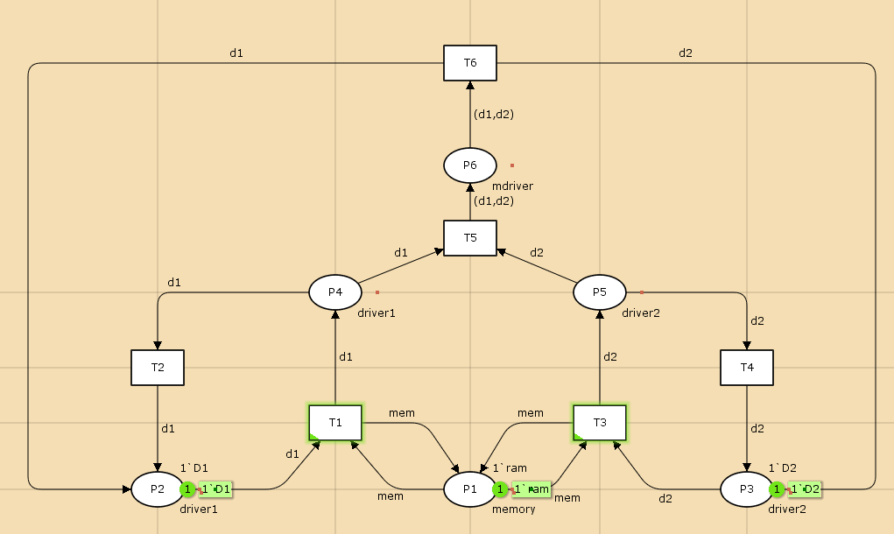

---
## Front matter
lang: ru-RU
title: Лабораторная работа 13
subtitle: Задание для самостоятельного выполнения
author:
  - Абу Сувейлим Мухаммед Мунивочи
institute:
  - Российский университет дружбы народов, Москва, Россия
date: 1 июня 2024

## i18n babel
babel-lang: russian
babel-otherlangs: english
##mainfont: Arial
##monofont: Courier New
##fontsize: 8pt

## Formatting pdf
toc: false
toc-title: Содержание
slide_level: 2
aspectratio: 169
section-titles: true
theme: metropolis
header-includes:
 - \metroset{progressbar=frametitle,sectionpage=progressbar,numbering=fraction}
 - '\makeatletter'
 - '\beamer@ignorenonframefalse'
 - '\makeatother'
---

# Информация

## Докладчик

::::::::::::::: {.columns align=center}
::: {.column width="70%"}

  * Абу Сувейлим Мухаммед Мунифович
  * студент, НКНбд-01-21
  * Российский университет дружбы народов
  * [1032215135@pfur.ru](mailto:1032215135@pfur.ru)
:::
::: {.column width="30%"}

:::
::::::::::::::

# Вводная часть

## Цели 

Цели: 

Приобретение навыков моделирования в CPN tools.

## Материалы и методы

1. Королькова, А. В. Моделирование информационных процессов : учебное пособие / А. В. Королькова, Д. С. Кулябов. - М. : РУДН, 2014. -- 191 с. : ил.

# Постановка задачи

1. Используя теоретические методы анализа сетей Петри, проведите анализ сети, изображённой на рис. 1 (с помощью построения дерева достижимости). Определите, является ли сеть безопасной, ограниченной, сохраняющей, имеются ли тупики.
2. Промоделируйте сеть Петри (см. рис. 1) с помощью CPNTools.
3. Вычислите пространство состояний. Сформируйте отчёт о пространстве состояний и проанализируйте его. Постройте граф пространства состояний.

# Постановка задачи

{#fig:001 width=40%}

# Выполнение работы

## Схема модели

Заявка (команды программы, операнды) поступает в оперативную память (ОП), затем
передается на прибор (центральный процессор, ЦП) для обработки. После этого
заявка может равновероятно обратиться к оперативной памяти или к одному из двух
внешних запоминающих устройств (driver1 и driver2). Прежде чем записать информацию на
внешний накопитель, необходимо вторично обратиться к центральному процессору,
определяющему состояние накопителя и выдающему необходимую управляющую
информацию. Накопители (driver1 и driver2) могут работать в 3-х режимах:

1) driver1 — занят, driver2 — свободен;
2) driver2 — свободен, driver1 — занят;
3) driver1 — занят, driver2 — занят.

## Реализация модели в CPN tools

**Основные состояния позицие:** 

P1 — состояние оперативной памяти (свободна / занята);
P2 — состояние внешнего запоминающего устройства driver1 (свободно / занято);
P3 — состояние внешнего запоминающего устройства driver2 (свободно / занято);
P4 — работа на ОП и driver1 закончена;
P5 — работа на ОП и driver2 закончена;
P6 — работа на ОП, driver1 и driver2 закончена;э

## Реализация модели в CPN tools

**Множество переходов:**

T1 — ЦП работает только с RAM и driver1;
T2 — обрабатываются данные из RAM и с driver1 переходят на устройство вывода;
T3 — CPU работает только с RAM и driver2;
T4 — обрабатываются данные из RAM и с driver2 переходят на устройство вывода;
T5 — CPU работает только с RAM и с driver1, driver2;
T6 — обрабатываются данные из RAM, driver1, driver2 и переходят на устройство вывода.

## Реализация модели в CPN tools

1. Зададим декларации системы:

  {#fig:002 width=40%}

## Реализация модели в CPN tools

  {#fig:003 width=70%}

## Реализация модели в CPN tools

2. Сеть является безопасной, так как в позициях неможеть быть более одной фишки. Сеть не сохраняющаяся потому, что колисчество входящих и исходящих переходов изменяется. Сеть К-ограниченая и в ней нет тупиков, так как все перехрды доступны.

.jpg){#fig:004 width=70%}

## Реализация модели в CPN tools

3. Граф пространства состояний:

  {#fig:005 width=70%}

## Реализация модели в CPN tools

  Отчёт о пространстве состояний:

## Вывод

- Изучали как работать с CPN tools. [1]