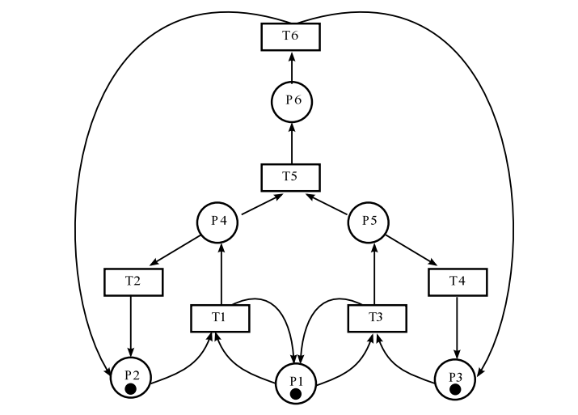
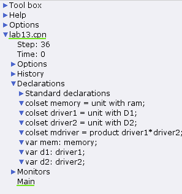
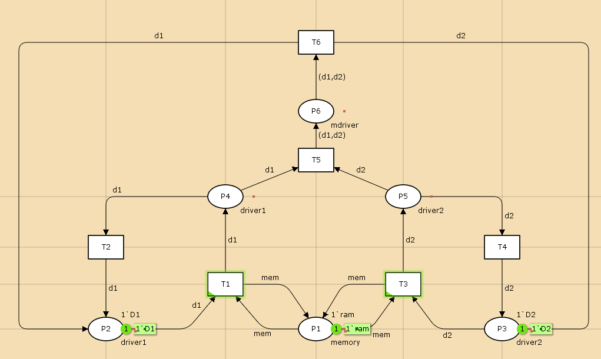
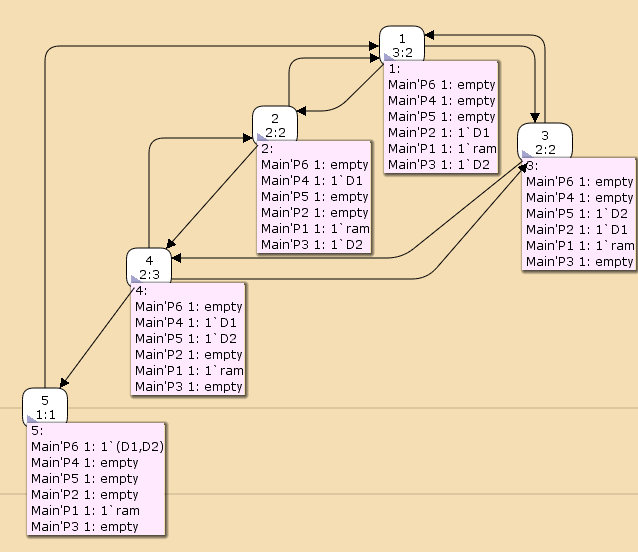

# Цель работы

Приобретение навыков моделирования в CPN tools.

# Постановка задачи

1. Используя теоретические методы анализа сетей Петри, проведите анализ сети, изображённой на рис. 1 (с помощью построения дерева достижимости). Определите, является ли сеть безопасной, ограниченной, сохраняющей, имеются ли тупики.
2. Промоделируйте сеть Петри (см. рис. 1) с помощью CPNTools.
3. Вычислите пространство состояний. Сформируйте отчёт о пространстве состояний и проанализируйте его. Постройте граф пространства состояний.

{#fig:001 width=70%}

# Выполнение лабораторной работы

## Схема модели

Заявка (команды программы, операнды) поступает в оперативную память (ОП), затем
передается на прибор (центральный процессор, ЦП) для обработки. После этого
заявка может равновероятно обратиться к оперативной памяти или к одному из двух
внешних запоминающих устройств (driver1 и driver2). Прежде чем записать информацию на
внешний накопитель, необходимо вторично обратиться к центральному процессору,
определяющему состояние накопителя и выдающему необходимую управляющую
информацию. Накопители (driver1 и driver2) могут работать в 3-х режимах:
1) driver1 — занят, driver2 — свободен;
2) driver2 — свободен, driver1 — занят;
3) driver1 — занят, driver2 — занят. [@book]

## Реализация модели в CPN tools

**Основные состояния позицие:**

P1 — состояние оперативной памяти (свободна / занята);
P2 — состояние внешнего запоминающего устройства driver1 (свободно / занято);
P3 — состояние внешнего запоминающего устройства driver2 (свободно / занято);
P4 — работа на ОП и driver1 закончена;
P5 — работа на ОП и driver2 закончена;
P6 — работа на ОП, driver1 и driver2 закончена;

**Множество переходов:**

T1 — ЦП работает только с RAM и driver1;
T2 — обрабатываются данные из RAM и с driver1 переходят на устройство вывода;
T3 — CPU работает только с RAM и driver2;
T4 — обрабатываются данные из RAM и с driver2 переходят на устройство вывода;
T5 — CPU работает только с RAM и с driver1, driver2;
T6 — обрабатываются данные из RAM, driver1, driver2 и переходят на устройство вывода.

1. Зададим декларации модели:

{#fig:002 width=70%}


2. Состояние P1 имеет тип memory и следующую начальную маркировку

```
1`ram
```
Состояние P2 имеет тип driver1 и следующую начальную маркировку

```
1`D1
```

Состояние P3 имеет тип driver2 и следующую начальную маркировку

```
1`D2
```
Состояния P4 и P5 имеют тип driver1 и driver2, соотвественно. Состояние P6 имеет тип mdriver.

3. От состояния P1 идут дуги к переходам T1 и T3 и обратно со значением mem. От состояния P2 идёт дуга к переходу T1 со значением d1. От состояния P3 идёт дуга к переходу T3 со значением d2. От состояния P4 идёт дуга к переходу T5 со значением d1. От состояния P5 идёт дуга к переходу T5 со значением d2. От состояния P6 идёт дуга к переходу T6 со значением (d1,d2). От перехода T1 к состояниам P1 и P4 идут дуги со значенями mem и d1, соотвественно. От перехода T2 к состоянию P2 идёт дуга со значением d1. От перехода T3 к состояниам P1, P5 идут дуги со значенями mem, d2, соотвественно. От перехода T4 к состоянию P3 идёт дуга со значением d2. От перехода T5 к состоянию P5 идёт дуга со значением (d1,d2). От перехода T6 к состояниам P2, P3 идут дуги со значенями d1, d2, соотвественно. Модель сети петри на рис. 3

{#fig:003 width=70%}

4. Сеть является безопасной, так как в позициях неможеть быть более одной фишки. Сеть не сохраняющаяся потому, что колисчество входящих и исходящих переходов изменяется. Сеть К-ограниченая и в ней нет тупиков, так как все перехрды доступны.

.jpg){#fig:004 width=70%}


5. Граф пространства состояний:

{#fig:005 width=70%}

6. Отчёт о пространстве состояний: 

  ```
    CPN Tools state space report for:
    /home/openmodelica/mip/lab-cpn-13/lab13.cpn
    Report generated: Sat Jun  1 01:59:27 2024


    Statistics
    ------------------------------------------------------------------------

      State Space
        Nodes:  5
        Arcs:   10
        Secs:   0
        Status: Full

      Scc Graph
        Nodes:  1
        Arcs:   0
        Secs:   0


    Boundedness Properties
    ------------------------------------------------------------------------

      Best Integer Bounds
                                Upper      Lower
        Main'P1 1               1          1
        Main'P2 1               1          0
        Main'P3 1               1          0
        Main'P4 1               1          0
        Main'P5 1               1          0
        Main'P6 1               1          0

      Best Upper Multi-set Bounds
        Main'P1 1           1`ram
        Main'P2 1           1`D1
        Main'P3 1           1`D2
        Main'P4 1           1`D1
        Main'P5 1           1`D2
        Main'P6 1           1`(D1,D2)

      Best Lower Multi-set Bounds
        Main'P1 1           1`ram
        Main'P2 1           empty
        Main'P3 1           empty
        Main'P4 1           empty
        Main'P5 1           empty
        Main'P6 1           empty


    Home Properties
    ------------------------------------------------------------------------

      Home Markings
        All


    Liveness Properties
    ------------------------------------------------------------------------

      Dead Markings
        None

      Dead Transition Instances
        None

      Live Transition Instances
        All


    Fairness Properties
    ------------------------------------------------------------------------
          Main'T1 1              No Fairness
          Main'T2 1              No Fairness
          Main'T3 1              No Fairness
          Main'T4 1              No Fairness
          Main'T5 1              Just
          Main'T6 1              Fair
  ```


# Вывод

- Изучали как работать с CPN tools. [@book]

# Библиография

::: {#refs}
:::